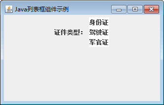
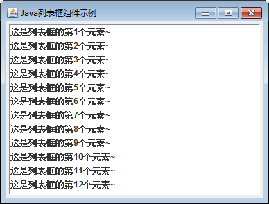

# Java Swing JList：列表框组件

列表框与下拉列表的区别不仅仅表现在外观上，当激活下拉列表时，会出现下拉列表框中的内容。但列表框只是在窗体系上占据固定的大小，如果需要列表框具有滚动效果，可以将列表框放到滚动面板中。当用户选择列表框中的某一项时，按住 Shift 键并选择列表框中的其他项目，可以连续选择两个选项之间的所有项目，也可以按住 Ctrl 键选择多个项目。

Swing 中使用 JList 类来表示列表框，该类的常用构造方法如下。

*   JList()：构造一个空的只读模型的列表框。
*   JList(ListModel dataModel)：根据指定的非 null 模型对象构造一个显示元素的列表框。
*   JList(Object[] listData)：使用 listData 指定的元素构造—个列表框。
*   JList(Vector<?> listData)：使用 listData 指定的元素构造一个列表框。

上述的第一个构造方法没有参数，使用此方法创建列表框后可以使用 setListData() 方法对列表框的元素进行填充，也可以调用其他形式的构造方法在初始化时对列表框的元素进行填充。常用的元素类型有 3 种，分别是数组、Vector 对象和 ListModel 模型。

#### 例 1

使用 JFmme 组件创建一个窗口，然后使用 JList 类创建一个包含 3 个选项的列表框。具体实现代码如下：

```
package ch17;
import javax.swing.JFrame;
import javax.swing.JLabel;
import javax.swing.JList;
import javax.swing.JPanel;
public class JListDemo
{
    public static void main(String[] args)
    {
        JFrame frame=new JFrame("Java 列表框组件示例");
        JPanel jp=new JPanel();    //创建面板
        JLabel label1=new JLabel("证件类型：");    //创建标签
        String[] items=new String[]{"身份证","驾驶证","军官证"};
        JList list=new JList(items);    //创建 JList
        jp.add(label1);
        jp.add(list);
        frame.add(jp);
        frame.setBounds(300,200,400,100);
        frame.setVisible(true);
        frame.setDefaultCloseOperation(JFrame.EXIT_ON_CLOSE);
    }
}
```

上述代码创建一个包含 3 个元素的字符串数组 items，然后将 items 作为参数来创建列表框。图 1 所示为实例运行后在列表框中的单选和多选效果。


图 1 列表框运行效果

#### 例 2

JList 组件在默认情况下支持单选和多选，可以通过 setSelectionMode() 方法来限制选择行为。例如，下面的代码将限制只能在列表框中进行单选操作。

```
package ch17;
import java.awt.BorderLayout;
import javax.swing.JFrame;
import javax.swing.JList;
import javax.swing.JPanel;
import javax.swing.JScrollPane;
import javax.swing.ListSelectionModel;
import javax.swing.border.EmptyBorder;
public class JListDemo1 extends JFrame
{
    public JListDemo1()
    {
        setTitle("Java 列表框组件示例");
        setDefaultCloseOperation(JFrame.EXIT_ON_CLOSE);    //设置窗体退出时操作
        setBounds(100,100,300,200);    //设置窗体位置和大小
        JPanel contentPane=new JPanel();    //创建内容面板
        contentPane.setBorder(new EmptyBorder(5, 5, 5, 5));    //设置面板的边框
        contentPane.setLayout(new BorderLayout(0, 0));    //设置内容面板为边界布局
        setContentPane(contentPane);    //应用内容面板
        JScrollPane scrollPane=new JScrollPane();    //创建滚动面板
        contentPane.add(scrollPane,BorderLayout.CENTER);    //将面板增加到边界布局中央
        JList list=new JList();
        //限制只能选择一个元素
        list.setSelectionMode(ListSelectionModel.SINGLE_SELECTION);
        scrollPane.setViewportView(list);    //在滚动面板中显示列表
        String[] listData=new String[12];    //创建一个含有 12 个元素的数组
        for (int i=0;i<listData.length;i++)
        {
            listData[i]="这是列表框的第"+(i+1)+"个元素~";    //为数组中各个元素赋值
        }
        list.setListData(listData);    //为列表填充数据
    }
    public static void main(String[] args)
    {
        JListDemo1 frame=new JListDemo1();
        frame.setVisible(true);
    }
}
```

上述代码调用了 setSelectionMode() 方法，并指定 ListSelectionModel.SINGLE_SELECTION 常量来限制列表框一次只能选择一项。该方法还支持如下两个常量。

1.  `ListSelectionModel.SINGLE_INTERVAL_SELECTION`：允许选择一个或多个连续的元素。
2.  `ListSelectionModel.MULTIPLE_INTERVAL_SELECTION`：允许选择一个连续的元素。

最终程序的运行效果如图 2 所示。


图 2 限制列表框单选运行效果