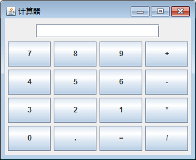

# Java Swing 计算器界面的实现

在本节之前已经详细介绍了 Swing 中容器、布局管理器以及常用的基本组件。本案例将综合运用这些知识实现一个计算器的布局。在本实例中使用两种布局管理器来进行界面设计。

计算器界面可以分成两部分，即显示区和键盘区。显示区可以使用文本框组件，键盘区则是由很多按钮组成，可以使用网格布局管理器。详细的实现过程如下。

(1) 新建一个继承自 JFrame 的 CalculatorDemo 类。

(2) 为类添加构造方法和 main() 方法，主要代码如下所示。

```
package ch17;
import java.awt.BorderLayout;
import java.awt.GridLayout;
import javax.swing.JButton;
import javax.swing.JFrame;
import javax.swing.JPanel;
import javax.swing.JTextField;
import javax.swing.SwingConstants;
import javax.swing.border.EmptyBorder;
public class CalculatorDemo extends JFrame
{
    private JPanel contentPane;    //内容面板
    private JTextField textField;    //文本框
    public CalculatorDemo(){};    //构造方法
    public static void main(String[] args)
    {
        CalculatorDemo frame=new CalculatorDemo();
        frame.setVisible(true);
    }
}
```

(3) 在构造方法中设置窗口的标题和大小等属性，然后使用边界面板向北部添加一个 JTextField 组件，主要代码如下所示。

```
public CalculatorDemo()
{
    setTitle("计算器");    //设置窗体的标题
    setDefaultCloseOperation(JFrame.EXIT_ON_CLOSE);    //设置窗体退出时操作
    setBounds(100, 100, 250, 200);    //设置窗体位置和大小
    contentPane=new JPanel();    //创建内容面板
    contentPane.setBorder(new EmptyBorder(5,5,5,5));    //设置面板的边框
    contentPane.setLayout(new BorderLayout(0,0));    //设置内容面板为边界布局
    setContentPane(contentPane);    //应用内容面板
    JPanel panel1=new JPanel();    //新建面板用于保存文本框
    contentPane.add(panel1,BorderLayout.NORTH);    //将面板放置在边界布局的北部
    textField=new JTextField();    //新建文本框
    textField.setHorizontalAlignment(SwingConstants.RIGHT);    //文本框中的文本使用右对齐
    panel1.add(textField);    //将文本框增加到面板中
    textField.setColumns(18);    //设置文本框的列数是 18
}
```

(4) 接下来使用网格布局管理器添加多个按钮作为计算器的键盘区，主要代码如下所示。

```
JPanel panel2=new JPanel();    //新建面板用于保存按钮
contentPane.add(panel2, BorderLayout.CENTER);    //将面板放置在边界布局的中央
panel2.setLayout(new GridLayout(4,4,5,5));    //面板使用网格 4X4 布局
JButton button01=new JButton("7");    //新建按钮
panel2.add(button01);    //应用按钮
JButton button02=new JButton("8");    //新建按钮
panel2.add(button02);    //应用按钮
JButton button03=new JButton("9");    //新建按钮
panel2.add(button03);    //应用按钮
JButton button04=new JButton("+");    //新建按钮
panel2.add(button04);    //应用按钮
JButton button05=new JButton("4");    //新建按钮
panel2.add(button05);    //应用按钮
JButton button06=new JButton("5");    //新建按钮
panel2.add(button06);    //应用按钮
JButton button07=new JButton("6");    //新建按钮
panel2.add(button07);    //应用按钮
JButton button08=new JButton("-");    //新建按钮
panel2.add(button08);    //应用按钮
JButton button09=new JButton("3");    //新建按钮
panel2.add(button09);    //应用按钮
JButton button10=new JButton("2");    //新建按钮
panel2.add(button10);    //应用按钮
JButton button11=new JButton("1");    //新建按钮
panel2.add(button11);    //应用按钮
JButton button12=new JButton("*");    //新建按钮
panel2.add(button12);    //应用按钮
JButton button13=new JButton("0");    //新建按钮
panel2.add(button13);    //应用按钮
JButton button14=new JButton(".");    //新建按钮
panel2.add(button14);    //应用按钮
JButton button15=new JButton("=");    //新建按钮
panel2.add(button15);    //应用按钮
JButton button16=new JButton("/");    //新建按钮
panel2.add(button16);    //应用按钮
```

(5) 最终程序的运行效果如图 1 所示。


图 1 计算器布局效果