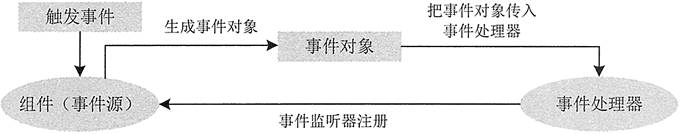
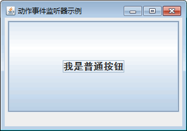
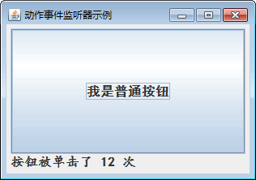
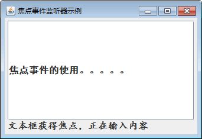
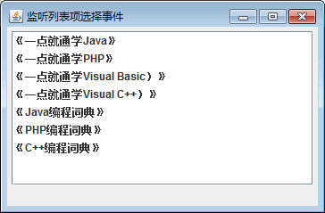
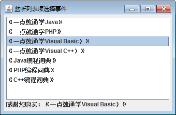

# Java Swing 事件监听：事件处理模型和事件监听器

事件表示程序和用户之间的交互，例如在文本框中输入，在列表框或组合框中选择，选中复选框和单选框，单击按钮等。事件处理表示程序对事件的响应，对用户的交互或者说对事件的处理是事件处理程序完成的。

当事件发生时，系统会自动捕捉这一事件，创建表示动作的事件对象并把它们分派给程序内的事件处理程序代码。这种代码确定了如何处理此事件以使用户得到相应的回答。

## 事件处理模型

前面我们讲解了如何放置各种组件，使图形界面更加丰富多彩，但是还不能响应用户的任何操作。若使图形界面能够接收用户的操作，必须给各个组件加上事件处理机制。在事件处理的过程中，主要涉及三类对象。

*   Event（事件）：用户对组件的一次操作称为一个事件，以类的形式出现。例如，键盘操作对应的事件类是 KeyEvent。
*   Event Source（事件源）：事件发生的场所，通常就是各个组件，例如按钮 Button。
*   Event Handler（事件处理者）：接收事件对象并对其进行处理的对象事件处理器，通常就是某个 Java 类中负责处理事件的成员方法。

例如，如果鼠标单击了按钮对象 Button，则该按钮 Button 就是事件源，而 Java 运行时系统会生成 ActionEvent 类的对象 ActionEvent，该对象中描述了单击事件发生时的一些信息。之后，事件处理者对象将接收由 Java 运行时系统传递过来的事件对象 ActionEvent，并进行相应的处理。事件处理模型如图 1 所示。


图 1 事件处理模型
由于同一个事件源上可能发生多种事件，因此，Java 采取了授权模型（Delegation Model），事件源可以把在其自身上所有可能发生的事件分别授权给不同的事件处理者来处理。例如，在 Panel 对象上既可能发生鼠标事件，也可能发生键盘事件，该 Panel 对象可以授权给事件处理者 a 来处理鼠标事件，同时授权给事件处理者 b 来处理键盘事件。

有时也将事件处理者称为监听器，主要原因在于监听器时刻监听事件源上所有发生的事件类型，一旦该事件类型与自己所负责处理的事件类型一致，就马上进行处理。授权模型把事件的处理委托给外部的处理实体进行处理，实现了将事件源和监听器分开的机制。

事件处理者（监听器）通常是一个类，该类如果能够处理某种类型的事件，就必须实现与该事件类型相对的接口。例如，一个 ButtonHandler 类之所以能够处理 ActionEvent 事件，原因在于它实现了与 ActionEvent 事件对应的接口 ActionListener。每个事件类都有一个与之相对应的接口。

## 动作事件监听器

动作事件监听器是 Swing 中比较常用的事件监听器，很多组件的动作都会使用它监听，像按钮被里击、列表框中选择一项等。与动作事件监听器有关的信息如下。

*   事件名称：ActionEvent。
*   事件监听接口: ActionListener。
*   事件相关方法：addActionListener() 添加监听，removeActionListener() 删除监听。
*   涉及事件源：JButton、JList、JTextField 等。

#### 例 1

下面以按钮的单击事件为例来说明动作单击事件监听器的应用。在此案例中统计了窗口内按钮被单击的次数。

本案例的核心代码如下：

```
package ch17;
import java.awt.BorderLayout;
import java.awt.Font;
import java.awt.event.ActionEvent;
import java.awt.event.ActionListener;
import javax.swing.JButton;
import javax.swing.JFrame;
import javax.swing.JLabel;
import javax.swing.JList;
import javax.swing.JPanel;
import javax.swing.border.EmptyBorder;
public class ActionListenerDemo extends JFrame
{
    JList list;
    JLabel label;
    JButton button1;
    int clicks=0;
    public ActionListenerDemo()
    {
        setTitle("动作事件监听器示例");
        setDefaultCloseOperation(JFrame.EXIT_ON_CLOSE);
        setBounds(100,100,400,200);
        JPanel contentPane=new JPanel();
        contentPane.setBorder(new EmptyBorder(5,5,5,5));
        contentPane.setLayout(new BorderLayout(0,0));
        setContentPane(contentPane);
        label=new JLabel(" ");
        label.setFont(new Font("楷体",Font.BOLD,16));    //修改字体样式
        contentPane.add(label, BorderLayout.SOUTH);
        button1=new JButton("我是普通按钮");    //创建 JButton 对象
        button1.setFont(new Font("黑体",Font.BOLD,16));    //修改字体样式
        button1.addActionListener(new ActionListener()
        {
            public void actionPerformed(ActionEvent e)
            {
                label.setText("按钮被单击了 "+(clicks++)+" 次");
            }
        });
        contentPane.add(button1);
    }
    //处理按钮单击事件的匿名内部类
    class button1ActionListener implements ActionListener
    {
        @Override
        public void actionPerformed(ActionEvent e)
        {
            label.setText("按钮被单击了 "+(clicks++)+" 次");
        }
    }
    public static void main(String[] args)
    {
        ActionListenerDemo frame=new ActionListenerDemo();
        frame.setVisible(true);
    }
}
```

上述代码调用 addActionListener() 方法为 button1 添加了单击动作的事件监听器，该监听器由 button1ActionListener 类来实现。button1ActionListener 类必须继承 ActionListener 类，并重写父类的 actionPerformed() 方法。在 actionPerformed() 方法内编写按钮被单击后执行的功能。

图 2 所示为程序运行后，没有单击和单击后的效果。




图 2 处理按钮的单击事件
在本例中使用的是内部类形式，当然也可以写成如下形式的代码：

```
//为按钮 buttonl 添加 ActionEvent 事件的处理程序
buttonl.addActionListener(new ActionListener()
{
    public void action Performed(Action Event e)
    {
        //具体代码编写在这里
        label.setTextC 按钮被单击了 "+(ciicks++)+1 次");
    }
}
```

## 焦点事件监听器

除了单击事件外，焦点事件监听器在实际项目中应用也比较广泛，例如将光标离开文本框时弹出对话框，或者将焦点返回给文本框等。

与焦点事件监听器有关的信息如下。

*   事件名称：FocusEvent。
*   事件监听接口： FocusListener。
*   事件相关方法：addFocusListener() 添加监听，removeFocusListener() 删除监听。
*   涉及事件源：Component 以及派生类。

FocusEvent 接口定义了两个方法，分别为 focusGained() 方法和 focusLost() 方法，其中 focusGained() 方法是在组件获得焦点时执行，focusLost() 方法是在组件失去焦点时执行。

#### 例 2

下面以文本框的焦点事件为例来说明焦点单击事件监听器的应用。本案例的核心代码如下：

```
package ch17;
import java.awt.BorderLayout;
import java.awt.Font;
import java.awt.event.FocusEvent;
import java.awt.event.FocusListener;
import javax.swing.JButton;
import javax.swing.JFrame;
import javax.swing.JLabel;
import javax.swing.JList;
import javax.swing.JPanel;
import javax.swing.JTextField;
import javax.swing.border.EmptyBorder;
public class FocusListenerDemo extends JFrame
{
    JList list;
    JLabel label;
    JButton button1;
    JTextField txtfield1;
    public FocusListenerDemo()
    {
        setTitle("焦点事件监听器示例");
        setDefaultCloseOperation(JFrame.EXIT_ON_CLOSE);
        setBounds(100,100,400,200);
        JPanel contentPane=new JPanel();
        contentPane.setBorder(new EmptyBorder(5,5,5,5));
        contentPane.setLayout(new BorderLayout(0,0));
        setContentPane(contentPane);       
        label=new JLabel(" ");
        label.setFont(new Font("楷体",Font.BOLD,16));    //修改字体样式
        contentPane.add(label, BorderLayout.SOUTH);
        txtfield1=new JTextField();    //创建文本框
        txtfield1.setFont(new Font("黑体", Font.BOLD, 16));    //修改字体样式
        txtfield1.addFocusListener(new FocusListener()
        {
            @Override
            public void focusGained(FocusEvent arg0)
            {
                // 获取焦点时执行此方法
                label.setText("文本框获得焦点，正在输入内容");
            }
            @Override
            public void focusLost(FocusEvent arg0)
            {
                // 失去焦点时执行此方法
                label.setText("文本框失去焦点，内容输入完成");
            }
        });
        contentPane.add(txtfield1);
    }
    public static void main(String[] args)
    {
        FocusListenerDemo frame=new FocusListenerDemo();
        frame.setVisible(true);
    }
}
```

上述代码为 txtfield1 组件调用 addFocusListener() 方法添加了焦点事件监听器，并且监听器使用匿名的实现方式。在实现 FocusListener 接口的代码中编写 focusGained() 方法和 focusLost() 方法的代码。最终程序运行效果如图 3 所示。


图 3 处理文本框的焦点事件

## 监听列表项选择事件

列表框控件 JList 会显示很多项供用户选择，通常在使用时会根据用户选择的列表项完成不同的操作。

本案例将介绍如何监听列表项的选择事件，以及事件监听器的处理方法，实现过程如下。

(1) 创建一个继承自 JFrame 的 JListDemo2 类。

(2) 在 JListDemo2 类中添加 JList 组件和 JLabel 组件的声明，并创建空的构造方法，代码如下所示。

```
package ch17;
import java.awt.BorderLayout;
import javax.swing.JFrame;
import javax.swing.JLabel;
import javax.swing.JList;
import javax.swing.JPanel;
import javax.swing.JScrollPane;
import javax.swing.border.EmptyBorder;
import javax.swing.event.ListSelectionEvent;
import javax.swing.event.ListSelectionListener;
public class JListDemo2 extends JFrame
{
    JList list;
    JLabel label;
    public JListDemo2(){};
    public static void main(String[] args)
    {
        JListDemo2 frame=new JListDemo2();
        frame.setVisible(true);
    }
}
```

(3) 在构造方法中为列表框填充数据源，主要代码如下：

```
public JListDemo2()
{
    setTitle("监听列表项选择事件");
    setDefaultCloseOperation(JFrame.EXIT_ON_CLOSE);
    setBounds(100,100,400,200);
    JPanel contentPane=new JPanel();
    contentPane.setBorder(new EmptyBorder(5,5,5,5));
    contentPane.setLayout(new BorderLayout(0,0));
    setContentPane(contentPane);
    label=new JLabel(" ");
    contentPane.add(label,BorderLayout.SOUTH);
    JScrollPane scrollPane=new JScrollPane();
    contentPane.add(scrollPane,BorderLayout.CENTER);

    list=new JList();
    scrollPane.setViewportView(list);
    String[] listData=new String[7];
    listData[0]="《一点就通学 Java》";
    listData[1]="《一点就通学 PHP》";
    listData[2]="《一点就通学 Visual Basic）》";
    listData[3]="《一点就通学 Visual C++）》";
    listData[4]="《Java 编程词典》";
    listData[5]="《PHP 编程词典》";
    listData[6]="《C++编程词典》";
    list.setListData(listData);
}
```

(4) 为列表框组件 list 添加选择事件监听，代码如下所示。

```
list.addListSelectionListener(new ListSelectionListener()
{
    public void valueChanged(ListSelectionEvent e)
    {
        do_list_valueChanged(e);
    }
});
```

如上述代码所示，list 组件绑定了 ListSelectionListener 事件监听器，在触发该事件后又会调用 do_list_valueChanged() 方法进行实际的业务逻辑处理。

(5) 创建 do_liSt_ValueChanged() 方法将用户选择的列显示到标签中，具体代码如下：

```
protected void do_list_valueChanged(ListSelectionEvent e)
{
    label.setText("感谢您购买："+list.getSelectedValue());
}
```

(6) 运行程序，列表框选择前后的效果如图 4 所示。



图 4 选择事件触发前后运行效果