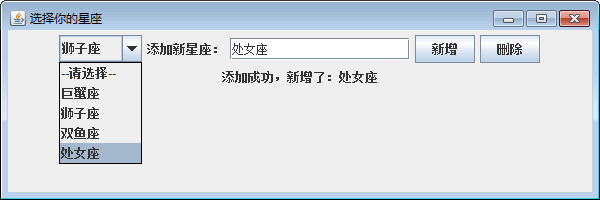
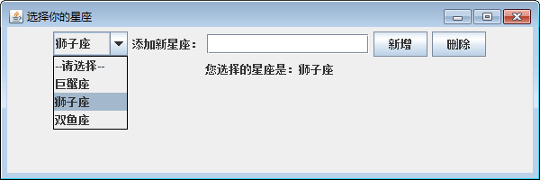
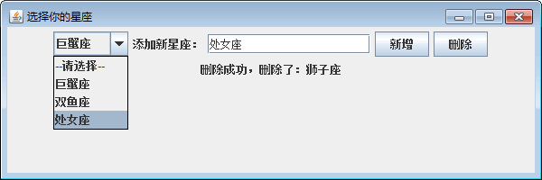

# Java Swing 星座选择器界面的实现

在了解各种基本组件的使用，以及常见事件的处理之后，本案例将综合文本框、按钮和下拉列表组件，实现一个星座选择器程序。程序允许用户在下拉列表中选择一个自己的星座，如果不在列表中还可以增加星座，也可以删除星座。实现过程如下。

(1) 创建一个 SampeDemo 类，在 main() 方法中调用它的构造方法。代码如下：

```
package ch17;
import java.awt.event.ActionEvent;
import java.awt.event.ActionListener;
import java.awt.event.ItemEvent;
import java.awt.event.ItemListener;
import javax.swing.JButton;
import javax.swing.JComboBox;
import javax.swing.JFrame;
import javax.swing.JLabel;
import javax.swing.JPanel;
import javax.swing.JTextField;
public class SampeDemo
{
    public static void main(String[] args)
    {
        new SampeDemo();    //调用构造方法
    }
}
```

(2) 创建 SampeDemo  构造方法完成窗口的创建，按钮和下拉列表的添加，以及相应事件的监听。具体代码如下：

```
private JPanel panel=new JPanel();
private JComboBox cmb=new JComboBox();    //创建 JComboBox
private JLabel label=new JLabel("添加新星座：");
private JLabel showInfo=new JLabel();    //用于显示信息
private JTextField jtf=new JTextField(16);    //用于输入信息
private JButton buttonAdd=new JButton("新增");
private JButton buttonDel=new JButton("删除");
public SampeDemo()
{
    JFrame frame=new JFrame("选择你的星座");
    cmb.addItem("--请选择--");    //向下拉列表中添加一项
    cmb.addItem("巨蟹座");
    cmb.addItem("狮子座");
    cmb.addItem("双鱼座");
    panel.add(cmb);
    panel.add(label);
    panel.add(jtf);
    panel.add(buttonAdd);
    panel.add(buttonDel);
    frame.add(panel);
    buttonAdd.addActionListener(new MyActionListener());    //“添加”按钮的事件
    buttonDel.addActionListener(new MyActionListener());    //“删除”按钮的事件
    cmb.addItemListener(new MyItemListener());    //下拉列表的事件
    frame.setBounds(300,200,600,200);
    frame.setVisible(true);
    frame.setDefaultCloseOperation(JFrame.EXIT_ON_CLOSE);
}
```

上述程序创建的下拉列表为 cmb，调用它的 addItem() 方法向其中添加了两个选项。程序分别监听了按下“新增”按钮和“删除”按钮时的单击事件，以及从下拉列表中选择项时的选中事件。

(3) 创建 MyItemListener 类，实现 ItemListener 接口对选中事件进行处理，此时将选中项显示到文本框中。实现代码如下：

```
// 监听选中事件
class MyItemListener implements ItemListener
{
    @Override
    public void itemStateChanged(ItemEvent e)
    {
        String str=e.getItem().toString();
        panel.add(showInfo);
        showInfo.setText("您选择的星座是："+str);
    }
}
```

(4) 创建 MyActionListener 类，实现 ActionListener 接口对按钮的单击事件进行处理。实现代码如下：

```
// 监听添加和删除按钮事件
class MyActionListener implements ActionListener
{
    @Override
    public void actionPerformed(ActionEvent e)
    {
        String command=e.getActionCommand();
        //添加按钮处理
        if(command.equals("新增"))
        {
            if(jtf.getText().length()!=0)
            {
                cmb.addItem(jtf.getText());    //添加项
                panel.add(showInfo);
                showInfo.setText("添加成功，新增了："+jtf.getText());
            }
            else
            {
                panel.add(showInfo);
                showInfo.setText("请输入要添加星座");
            }
        }
        //删除按钮处理
        if(command.equals("删除"))
        {
            if(cmb.getSelectedIndex()!=-1)
            {
                //先获得要删除的项的值
                String strDel=cmb.getSelectedItem().toString();
                cmb.removeItem(strDel);    //删除项
                panel.add(showInfo);
                showInfo.setText("删除成功，删除了："+strDel);
            }
            else
            {
                panel.add(showInfo);
                showInfo.setText("请选择要删除的星座");
            }
        }
    }
}
```

(5) 运行程序，在下拉列表中会出现 4 个选项，选择其中的“狮子座”项，此时显示效果如图 1 所示。


图 1 添加项
(6) 从下拉列表中选择“狮子座”项，再单击“删除”按钮即可删除该项，如图 2 所示。


图 2 显示选中项
(7) 在文本框中输入要添加的项并单击“新增”按钮，在下拉列表中将出现添加的项。图 3 所示为添加“处女座”后的效果。


图 3 删除项