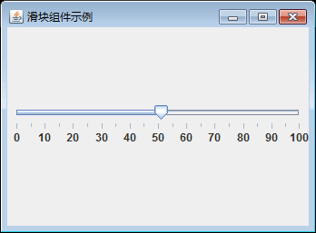

# Java Swing JSlider：滑块组件

在前面的章节中，我们介绍了 Swing 设计简单界面所需的窗口、布局组件以及如何响应事件。Swing 还提供了很多高级组件，如菜单栏、工具栏、文件选择器、表格以及树等。使用这些高级组件可以实现更为复杂的布局，也可以使程序界面更加人性化，以提高程序的灵活性。在之后的章节中，我们将开始详细介绍这些高级组件。

在学习其他高级组件之前，我们先来介绍一些布局组件，包括滑块、进度条、计时器、菜单栏和工具栏，本节我们首先来介绍滑块。

滑块（JSlider）是一个允许用户在有限区间内通过移动滑块来选择值的组件。JSlider 类的常用构造方法如表 1 所示。

表 1 JSIider 类的常用构造方法

| 构造方法 | 说明 |
| JSlider() | 创建一个范围在 0~100 且初始值为 50 的水平滑块 |
| JSlider(BoundedRangeModel brm) | 使用指定的 BoundedRangeModel 创建一个水平滑块 |
| JSlider(int orientation) | 使用指定的方向创建一个滑块，范围在 0~100 且初始值为 50 |
| JSlider(int min,int max) | 使用指定的最小值和最大值来创建一个水平滑块，初始值等于最小值加上最大值的平均值 |
| JSlider(int min,int max,int value) | 用指定的最小值、最大值和初始值创建一个水平滑块 |

例如，创建一个最小值为 30，最大值为 120，初始值为 55 的水平滑块的语句如下所示。

```
JSIider slider=new JSIider(30,120,55);
```

滑块可以显示主刻度标记以及主刻度之间的次刻度标记。刻度标记之间的值的个数由 setMajorTickSpacing() 方法和 setMinorTickSpacing() 方法来控制。刻度标记的绘制由 setPaintTicks() 方法控制。

滑块也可以在固定时间间隔（或在任意位置）沿滑块刻度打印文本标签，标签的绘制由 setLabelTable() 方法和 setPaintLabels() 方法控制。

JSIider 类常用方法如表 2 所示。

表 2 JSIider 类常用方法

| 方法名称 | 说明 |
| createStandardLabels(int increment) | 创建一个数字文本标签的 Hashtable，从滑块最小值处开始增加，并使用指定的增量 |
| getLabelTable() | 返回哪些标签在哪些刻度绘制的字典 |
| getMaj orTickSpacing() | 返回主刻度标记的间隔 |
| getMaximum() | 从 BoundedRangeModel 返回滑块所支持的最大值 |
| getMinimum() | 从 BoundedRangeModel 返回滑块所支持的最小值 |
| getMinorTickSpacing() | 返回次刻度标记的间隔 |
| getSnapToTicks() | 如果滑块（及其所表示的值）解析为最靠近用户放置滑块处的刻度标记的值，则返回为 true |
| getValue() | 从 BoundedRangeModel 返回滑块的当前值 |
| setLabelTable(Dictionary labels) | 用于指定将在给定值处绘制哪个标签 |
| setMaj orTickSpacing(int n) | 此方法设置主刻度标记的间隔 |
| setMaximum(int maximum) | 将滑块的最大值设置为 maximum |
| setMinimum(int minimum) | 将滑块的最小值设置为 minimum |
| setMinorTickSpacing(int n) | 设置次刻度标记的间隔 |
| setOrientation(int orientation) | 将滑块的方向设置为 SwingConstants.VERTICAL 或 SwingConstants.HORIZONTAL |
| setPaintLabels(boolean b) | 确定是否在滑块上绘制标签 |
| setPaintTicks(boolean b) | 确定是否在滑块上绘制刻度标记 |
| setPaintTrack(boolean b) | 确定是否在滑块上绘制滑道 |
| setSnapToTicks(boolean b) | 指定为 true，则滑块（及其所表示的值）解析为最靠近用户放置滑块处的刻度标记的值 |
| setValue(int n) | 将滑块的当前值设置为 n |

#### 例 1

在了解 JSIider 类的基础语法之后，下面创建一个滑块实例。实例非常简单，仅仅包含一个滑块，实例源代码如下所示。

```
package ch18;
import java.awt.Container;
import javax.swing.JFrame;
import javax.swing.JSlider;
public class JSliderDemo
{
    public static void main(String[] agrs)
    {
        JFrame frame=new JFrame("滑块组件示例");
        frame.setSize(100,100);
        frame.setDefaultCloseOperation(JFrame.EXIT_ON_CLOSE);
        Container contentPane=frame.getContentPane();
        JSlider slider=new JSlider(0,100);
        slider.setMajorTickSpacing(10);
        slider.setMinorTickSpacing(5);
        slider.setPaintLabels(true);   
        slider.setPaintTicks(true);
        contentPane.add(slider);
        frame.setVisible(true);       
    }
}
```

上述代码首先创建一个 JFrame 窗口并进行必要属性设置，接着创建一个 JSIider 对象，设置最小值为 0，最大值为 100，然后设置滑块对象的刻度值。运行此时的实例程序，效果如图 1 所示。


图 1 无刻度和标签的滑块
如果需要在滑块上添加刻度或标签，可以在“contentPane.add(slider);”前添加下面两行语句：

```
slider.setPaintLabels(true);
slider.setPaintTicks(true);
```

再次运行程序，此时滑块的运行效果如图 2 所示。


图 2 具有刻度和标签的滑块