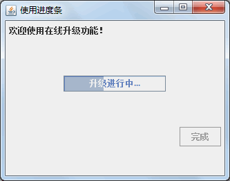
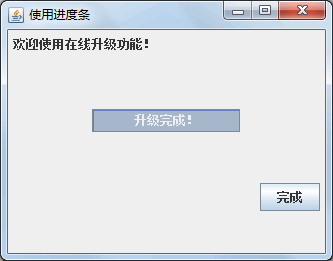
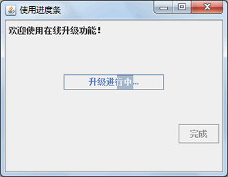
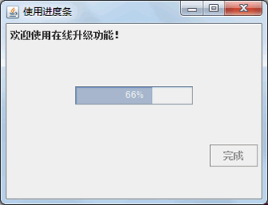

# Java Swing JProgressBar：进度条组件

进度条（JProgressBar）是一种以可视化形式显示某些任务进度的组件。JProgressBar 类实现了一个用于为长时间的操作提供可视化指示器的 GUI 进度条。在任务的完成进度中，进度条显示该任务完成的百分比。此百分比通常由一个矩形以可视化形式表示，该矩形开始是空的，随着任务的完成逐渐被填充。此外，进度条可显示此百分比的文本表示形式。

JProgressBar 类的常用构造方法和 JSlider 类的常用构造方法一样，这里不再重复。如下示例代码演示了如何创建一个 JProgressBar 类实例。

```
//创建一个最小值是 0，最大值是 100 的进度条
JProgressBar pgbar=new JProgressBar(0,100);
//创建一个最小值是 0，最大值是 60，当前值是 20 的进度条
JProgressBar pgbar=new JProgressBar(0,60,20);
```

JProgressBar 类的常用方法如表 1 所示。

表 1 JProqressBar 类的常用方法

| 方法名称 | 说明 |
| getMaximum() | 返回进度条的最大值 |
| getMinimum() | 返回进度条的最小值 |
| getPercentComplete() | 返回进度条的完成百分比 |
| getString() | 返回当前进度的 String 表示形式 |
| getValue() | 返回进度条的当前 value |
| setBorderPainted(boolean b) | 设置 borderPainted 属性，如果进度条应该绘制其边框，则此属性为 true |
| setIndeterminate(boolean newValue) | 设置进度条的 indeterminate 属性，该属性确定进度条处于确定模式中还 是处于不确定模式中 |
| setMaximum(int n) | 将进度条的最大值设置为 n |
| setMinimum(int n) | 将进度条的最小值设置为 n |
| setOrientation(int newOrientation) | 将进度条的方向设置为 newOrientation |
| setString(String s) | 设置进度字符串的值 |
| setStringPainted(boolean b) | 设置 stringPainted 属性的值，该属性确定进度条是否应该呈现进度字符串 |
| setValue(int n) | 将进度条的当前值设置为 n |
| updateUI() | 将 UI 属性重置为当前外观对应的值 |

其中，setOrientation() 方法的参数值必须为 SwingConstants.VERTICAL 或 SwingConstants.HORIZONTAL。JProgressBar 使用 BoundedRangeModel 作为其数据模型，以 value 属性表示该任务的“当前”状态，minimum 和 maximum 属性分别表示开始点和结束点。

技巧：如果要执行一个未知长度的任务，可以调用 setlndeterminate(true) 将进度条设置为不确定模式。不确定模式的进度条将持续地显示动画来表示正进行的操作。一旦可以确定任务长度和进度量，则应该更新进度条的值，将其切换到确定模式。

#### 例 1

使用 JProgressBar 类创建一个进度条模拟程序升级过程，实现过程如下。

(1) 创建一个继承自 JFrame 的 JProgressBarDemo 类。

(2) 在构造方法中添加一个空的进度条，然后设置它的显示属性。主要代码如下:

```
package ch18;
import java.awt.Container;
import java.awt.FlowLayout;
import java.awt.GridLayout;
import java.awt.event.ActionEvent;
import java.awt.event.ActionListener;
import javax.swing.JButton;
import javax.swing.JFrame;
import javax.swing.JLabel;
import javax.swing.JPanel;
import javax.swing.JProgressBar;
public class JProgressBarDemo extends JFrame
{
    //static JProgressBarDemo frame;
    public JProgressBarDemo()
    {
        setTitle("使用进度条");
        JLabel label=new JLabel("欢迎使用在线升级功能！");
        //创建一个进度条
        JProgressBar progressBar=new JProgressBar();
        JButton button=new JButton("完成");
        button.setEnabled(false);
        Container container=getContentPane();
        container.setLayout(new GridLayout(3,1));
        JPanel panel1=new JPanel(new FlowLayout(FlowLayout.LEFT));
        JPanel panel2=new JPanel(new FlowLayout(FlowLayout.CENTER));
        JPanel panel3=new JPanel(new FlowLayout(FlowLayout.RIGHT));
        panel1.add(label);    //添加标签
        panel2.add(progressBar);    //添加进度条
        panel3.add(button);    //添加按钮
        container.add(panel1);
        container.add(panel2);
        container.add(panel3);
        progressBar.setStringPainted(true);
        //如果不需要进度上显示“升级进行中...”，可注释此行
        progressBar.setString("升级进行中...");
        //如果需要使用不确定模式，可使用此行
        //progressBar.setIndeterminate(true);
        //开启一个线程处理进度
        new Progress(progressBar, button).start();
        //单机“完成”按钮结束程序
        button.addActionListener(new ActionListener()
        {
            @Override
            public void actionPerformed(ActionEvent e)
            {
                dispose();
                System.exit(0);
            }
        });
    }
    /**
     * @param args
     */
    public static void main(String[] args)
    {
        // TODO Auto-generated method stub
        JProgressBarDemo frame=new JProgressBarDemo();
        //frame.setBounds(300,200,300,150);    //设置容器的大小
        frame.setVisible(true);
        frame.setDefaultCloseOperation(JFrame.EXIT_ON_CLOSE);
        frame.pack();
    }
}
```

(3) 创建 Progress 线程并实现对进度条进度的控制，实现代码如下。

```
private class Progress extends Thread
{
    JProgressBar progressBar;
    JButton button;
    //进度条上的数字
    int[] progressValues={6,18,27,39,51,66,81,100};
    Progress(JProgressBar progressBar,JButton button)
    {
        this.progressBar=progressBar;
        this.button=button;
    }
    public void run()
    {
        for(int i=0;i<progressValues.length;i++)
        {
            try
            {
                Thread.sleep(3000);
            }
            catch(InterruptedException e)
            {
                e.printStackTrace();
            }
            //设置进度条的值
            progressBar.setValue(progressValues[i]);
        }
        progressBar.setIndeterminate(false);
        progressBar.setString("升级完成！");
        button.setEnabled(true);
    }
}
```

上述代码定义了一个进度条的进度数组 progressValues。线程每隔 1000 毫秒从数组中取一个数字作为当前进度，并使用 JProgressBar 类的 setValue() 方法更新到进度条。最后使进度条显示“升级完成！”字符串，并使“完成”按钮可用。

图 1 为程序的运行效果。图 2 为调用 Setlndeterminate(true) 方法后进度条使用不确定模式的运行效果。图 3 为默认的数字进度条运行效果。

     图 1 进度条运行效果

图 2 不确定模式进度条效果

图 3 数字进度条运行效果