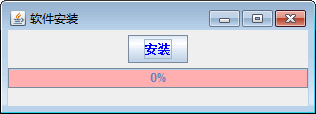
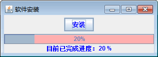

# Java Swing Timer：计时器组件

计时器（Timer）组件可以在指定时间间隔触发一个或多个 ActionEvent。设置计时器的过程包括创建一个 Timer 对象，在该对象上注册一个或多个动作侦听器，以及使用 start() 方法启动该计时器。

例如，以下代码创建并启动一个每秒（该时间由 Timer 构造方法的第一个参数指定）触发一次动作事件的计时器。Timer 构造方法的第二个参数指定接收计时器动作事件的监听器。

```
int delay=1000;    //时间间隔，单位为毫秒
ActionListener taskPerformer=new ActionListener()
{
    public void afrfcionPerformed(ActionEvent evt)
    {
        //具体的任务
    }
};
new Timer(delay,taskPerformer).start();
```

创建 Timer 类时要指定一个延迟参数和一个 ActionListener。延迟参数用于设置初始延迟和事件触发之间的延迟（以毫秒为单位）。启动计时器后，它将在向已注册监听器触发第一个 ActionEvent 之前等待初始延迟。第一个事件之后，每次超过事件间延迟时它都继续触发事件，直到被停止。

创建 Timer 类之后，可以单独更改初始延迟和事件间延迟，并且可以添加其他 ActionListener。如果希望计时器只在第一次时触发然后停止，可以对计时器调用 setRepeats(false)。Timer 类的常用方法如表 1 所示。

表 1 Timer 类的常用方法

| 方法名称 | 说明 |
| addActionListener(ActionListener 1) | 将一个动作监听器添加到 Timer |
| getDelay() | 返回两次触发动作事件间延迟，以毫秒为单位 |
| isCoalesce() | 如果 Timer 组合多个挂起的动作事件，则返回 true |
| isRunning() | 如果 Timer 正在运行，则返回 true |
| restart() | 重新启动 Timer，取消所有挂起的触发并使它按初始延迟触发 |
| setCoalesce(boolean flag) | 设置 Timer 是否组合多个挂起的 ActionEvent |
| setDelay(int delay) | 设置 Timer 的事件间延迟，两次连续的动作事件之间的毫秒数 |
| setLogTimers(boolean flag) | 启用/禁用计时器日志 |
| setRepeats(boolean flag) | 如果 flag 为 false，则指示 Timer 只向其监听器发送一次动作事件 |
| start() | 启动 Timer，使它开始向其监听器发送动作事件 |
| stop() | 停止 Timer，使它停止向其监听器发送动作事件 |

#### 例 1

编写一个实例，模拟软件安装过程中显示安装进度信息的进度条。该实例中使用 Timer 类模拟安装软件的实际过程，JProgressBar 类显示相应的进度信息，主要实现过程如下。

(1) 创建一个 JProgressBarDemo1 类并实现 ActionListener 接口和 ChangeListener 接口。

```
package ch18;
import java.awt.BorderLayout;
import java.awt.Color;
import java.awt.Container;
import java.awt.Dimension;
import java.awt.event.ActionEvent;
import java.awt.event.ActionListener;
import javax.swing.JButton;
import javax.swing.JFrame;
import javax.swing.JLabel;
import javax.swing.JPanel;
import javax.swing.JProgressBar;
import javax.swing.Timer;
import javax.swing.event.ChangeEvent;
import javax.swing.event.ChangeListener;
public class JProgressBarDemo1 implements ActionListener,ChangeListener
{
    JFrame frame=null;
    JProgressBar progressbar;
    JLabel label;
    Timer timer;
    JButton b;
    public static void main(String[] agrs)
    {
        new JProgressBarDemo1();    //创建一个实例化对象
    }
}
```

(2) 在构造方法中对进度条和计时器进行设置。主要代码如下：

```
public JProgressBarDemo1()
{
    frame=new JFrame("软件安装");
    frame.setDefaultCloseOperation(JFrame.EXIT_ON_CLOSE);
    Container contentPane=frame.getContentPane();
    label=new JLabel(" ",JLabel.CENTER);    //创建显示进度信息的文本标签
    progressbar=new JProgressBar();    //创建一个进度条
    progressbar.setOrientation(JProgressBar.HORIZONTAL);
    progressbar.setMinimum(0);
    progressbar.setMaximum(100);
    progressbar.setValue(0);
    progressbar.setStringPainted(true);
    progressbar.addChangeListener(this);    //添加事件监听器
    //设置进度条的几何形状
    progressbar.setPreferredSize(new Dimension(300,20));
    progressbar.setBorderPainted(true);
    progressbar.setBackground(Color.pink);
    //添加启动按钮
    JPanel panel=new JPanel();
    b=new JButton("安装");
    b.setForeground(Color.blue);
    //添加事件监听器
    b.addActionListener(this);
    panel.add(b);
    timer=new Timer(100, this);    //创建一个计时器，计时间隔为 100 毫秒
    //把组件添加到 frame 中
    contentPane.add(panel,BorderLayout.NORTH);
    contentPane.add(progressbar,BorderLayout.CENTER);
    contentPane.add(label,BorderLayout.SOUTH);
    frame.pack();
    frame.setVisible(true);
}
```

(3) 实现 ActionListener 接口中的 actionPerformed() 方法，在这里控制计时器的开始，以及进度条值的变化。具体代码如下：

```
//实现事件监听器接口中的方法
public void actionPerformed(ActionEvent e)
{
    if(e.getSource()==b)
        timer.start();
    if(e.getSource()==timer)
    {
        int value=progressbar.getValue();
        if(value<100)
        {
            progressbar.setValue(++value);
        }
        else
        {
            timer.stop();
            frame.dispose();
        }
    }
}
```

(4) 实现 ChangeListener 接口中的 stateChange() 方法，具体代码如下：

```
public void stateChanged(ChangeEvent e1)    //实现事件监听器接口中的方法
{
    int value=progressbar.getValue();
    if(e1.getSource()==progressbar)
    {
        label.setText("目前已完成进度："+Integer.toString(value)+" %");
        label.setForeground(Color.blue);
    }
}
```

(5) 运行程序，默认情况下进度条是 0%，如图 1 所示。


图 1 初始效果单击“安装”按钮后进度会一直发生变化，如图 2 所示。


图 2 进度变化效果