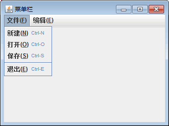
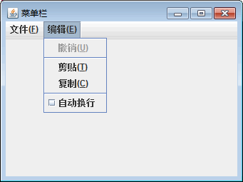
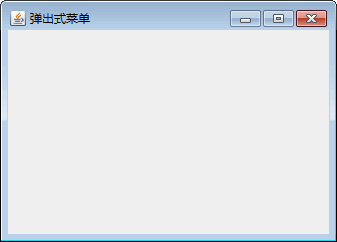
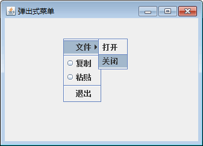

# Java Swing JMenu 和 JPopupMenu：菜单和弹出式菜单

菜单由 Swing 中的 JMenu 类实现，可以包含多个菜单项和带分隔符的菜单。在菜单中，菜单项由 JMenuItem 类表示，分隔符由 JSeparator 类表示。

菜单本质上是带有关联 JPopupMenu 的按钮。当按下“按钮”时，就会显示 JPopupMenu。如果“按钮”位于 JMenuBar 上，则该菜单为顶层窗口。如果“按钮”是另一个菜单项，则 JPopupMenu 就是“下拉”菜单。

## JMenu 类的常用方法

创建菜单常用构造方法有两个：JMenu() 和 JMenu(String s)。第一个构造方法创建一个无文本的 JMenu 对象，第二个构造方法创建一个带有指定文本的 JMenu 对象。JMenu 类的常用方法如表 1 所示。

表 1 JMenu 类的常用方法

| 方法名称 | 说明 |
| add(Action a) | 创建连接到指定 Action 对象的新菜单项，并将其追加到此菜单的末尾 |
| add(Component c) | 将某个组件追加到此菜单的末尾 |
| add(Component c,int index) | 将指定组件添加到此容器的给定位置 |
| add(JMenuItem menultem) | 将某个菜单项追加到此菜单的末尾 |
| add(String s) | 创建具有指定文本的新菜单项，并将其追加到此菜单的末尾 |
| addSeparator() | 将新分隔符追加到菜单的末尾 |
| doCliclc(int pressTime) | 以编程方式执行“单击”操作 |
| getDelay() | 返回子菜单向上或向下弹出前建议的延迟（以毫秒为单位） |
| getltem(int pos) | 返回指定位置的 JMenuItem |
| getItemCount() | 返回菜单上的项数，包括分隔符 |
| getMenuComponent(int n) | 返回位于位置 n 的组件 |
| getMenuComponents() | 返回菜单子组件的 Component 数组 |
| getSubElements() | 返回由 MenuElement 组成的数组，其中包含此菜单组件的子菜单 |
| insert(JMenuItem mi,int pos) | 在给定位置插入指定的 JMenuitem |
| insert(String s,pos) | 在给定位置插入具有指定文本的新菜单项 |
| insertSeparator(int index) | 在指定的位置插入分隔符 |
| isMenuComponent(Component c) | 如果在子菜单层次结构中存在指定的组件，则返回 true |
| isPopupMenuVisible() | 如果菜单的弹出窗口可见，则返回 rue |
| isSelected() | 如果菜单是当前选择的（即高亮显示的）菜单，则返回 true |
| isTopLevelMenu() | 如果菜单是“顶层菜单”（即菜单栏的直接子级），则返回 true |
| setDelay(int d) | 设置菜单的 PopupMenu 向上或向下弹出前建议的延迟 |
| setMenuLocation(int x,int y) | 设置弹出组件的位置 |
| setPopupMenuVisible(boolean b) | 设置菜单弹出的可见性 |
| setSelected(boolean b) | 设置菜单的选择状态 |

#### 例 1

菜单如果依附到 JMenuBar 对象上，则此菜单就是菜单栏中的菜单。菜单如果依附在 JPopupMenu 对象上，此菜单就是弹出式菜单。实现菜单栏和弹出式菜单的原理是一样的，但在具体的实现方式上有一些区别。

下面编写一个案例，使用 JMenuBar 类创建一个包含“文件”菜单和“编辑”菜单的菜单窗口。主要实现代码如下：

```
package ch18;
import java.awt.event.ActionEvent;
import java.awt.event.KeyEvent;
import javax.swing.JCheckBoxMenuItem;
import javax.swing.JFrame;
import javax.swing.JMenu;
import javax.swing.JMenuBar;
import javax.swing.JMenuItem;
import javax.swing.KeyStroke;
public class JMenuDemo1 extends JMenuBar
{
    public JMenuDemo1()
    {
        add(createFileMenu());    //添加“文件”菜单
        add(createEditMenu());    //添加“编辑”菜单
        setVisible(true);
    }
    public static void main(String[] agrs)
    {
        JFrame frame=new JFrame("菜单栏");
        frame.setSize(300,200);
        frame.setJMenuBar(new JMenuDemo1());
        frame.setVisible(true);
    }
    //定义“文件”菜单
    private JMenu createFileMenu()
    {
        JMenu menu=new JMenu("文件(F)");
        menu.setMnemonic(KeyEvent.VK_F);    //设置快速访问符
        JMenuItem item=new JMenuItem("新建(N)",KeyEvent.VK_N);
        item.setAccelerator(KeyStroke.getKeyStroke(KeyEvent.VK_N,ActionEvent.CTRL_MASK));
        menu.add(item);
        item=new JMenuItem("打开(O)",KeyEvent.VK_O);
        item.setAccelerator(KeyStroke.getKeyStroke(KeyEvent.VK_O,ActionEvent.CTRL_MASK));
        menu.add(item);
        item=new JMenuItem("保存(S)",KeyEvent.VK_S);
        item.setAccelerator(KeyStroke.getKeyStroke(KeyEvent.VK_S,ActionEvent.CTRL_MASK));
        menu.add(item);
        menu.addSeparator();
        item=new JMenuItem("退出(E)",KeyEvent.VK_E);
        item.setAccelerator(KeyStroke.getKeyStroke(KeyEvent.VK_E,ActionEvent.CTRL_MASK));
        menu.add(item);
        return menu;
    }
    //定义“编辑”菜单
    private JMenu createEditMenu()
    {
        JMenu menu=new JMenu("编辑(E)");
        menu.setMnemonic(KeyEvent.VK_E);
        JMenuItem item=new JMenuItem("撤销(U)",KeyEvent.VK_U);
        item.setEnabled(false);
        menu.add(item);
        menu.addSeparator();
        item=new JMenuItem("剪贴(T)",KeyEvent.VK_T);
        menu.add(item);
        item=new JMenuItem("复制(C)",KeyEvent.VK_C);
        menu.add(item);
        menu.addSeparator();
        JCheckBoxMenuItem cbMenuItem=new JCheckBoxMenuItem("自动换行");
        menu.add(cbMenuItem);
        return menu;
    }
```

}

上述代码调用 JMenu 对象的 setMnemonic() 方法设置当前菜单的快速访问符。该符号必须对应键盘上的一个键，并且应该使用 java.awt.event.KeyEvent 中定义的 VK—XXX 键代码之一指定。

提示：快速访问符是一种快捷键，通常在按下 Alt 键和某个字母时激活。例如，常用的 Alt+F 是“文件” 菜单的快速访问符。

JMenuItem 类实现的是菜单中的菜单项。菜单项本质上是位于列表中的按钮。当用户单击“按钮”时，则执行与菜单项关联的操作。JMenuItem 的常用构造方法有以下三个。

1.  JMenuItem(String text)：创建带有指定文本的 JMenuItem。
2.  JMenuItem(String text,Icon icon)：创建带有指定文本和图标的 JMenuItem。
3.  JMenuItem(String text,int mnemonic)：创建带有指定文本和键盘助记符的 JMenuItem。

在该实例中，创建菜单项后调用 JMenuItem 对象的 setAccelerator(KeyStroke) 方法来设置修改键，它能直接调用菜单项的操作监听器而不必显示菜单的层次结构。在本实例中没有实现事件监听机制，所以使用快捷键时将得不到程序的任何响应，但是在菜单项中将出现快捷键。

运行该实例，图 1 所示是“文件”菜单展开效果，图 2 所示是“编辑”菜单展开的效果。


图 1 “文件”菜单

图 2 “编辑”菜单

## 弹出式菜单 JPopuMenu

弹出式菜单由 JPopupMenu 类实现，它是一个可弹出并显示一系列选项的小窗口。它还用于当用户选择菜单项并激活它时显示的“右拉式(pull-right)”菜单，可以在想让菜单显示的任何其他位置使用。例如，当用户在指定区域中右击时。

JPopupMenu 类的常用方法如表 2 所示。

表 2 JPopMenu 类的常用方法

| 方法名称 | 说明 |
| getInvoker() | 返回作为此弹出菜单的“调用者”的组件 |
| setInvoker(Component invoker) | 设置弹出菜单的调用者，即弹出菜单在其中显示的组件 |
| addPopupMenuListener(PopupMenuListener1) | 添加 PopupMenu 监听器 |
| removePopupMenuListener(PopupMenuListener1) | 移除 PopupMenu 监听器 |
| getPopupMenuListeners() | 返回利用 addPopupMenuListener()添加到此 JMenuitem 的所有 PopupMenuListener 组成的数组 |
| getLabel() | 返回弹出菜单的标签 |
| setLabel(String label) | 设置弹出菜单的标签 |
| show(Component invoker,int x,int y) | 在调用者的坐标空间中的位置 X、Y 处显示弹出菜单 |
| getComponentIndex(Component c) | 返回指定组件的索引 |

#### 例 2

使用 JPopupMenu 类创建一个弹出式菜单，并在菜单中使用子菜单。主要实现代码如下：

```
package ch18;
import java.awt.event.MouseAdapter;
import java.awt.event.MouseEvent;
import java.awt.event.MouseListener;
import javax.swing.ButtonGroup;
import javax.swing.JFrame;
import javax.swing.JMenu;
import javax.swing.JMenuItem;
import javax.swing.JPopupMenu;
import javax.swing.JRadioButtonMenuItem;
public class JPopupMenuDemo extends JFrame
{
    JMenu fileMenu;
    JPopupMenu jPopupMenuOne;
    JMenuItem openFile,closeFile,exit;
    JRadioButtonMenuItem copyFile,pasteFile;
    ButtonGroup buttonGroupOne;
    public JPopupMenuDemo()
    {
        jPopupMenuOne=new JPopupMenu();    //创建 jPopupMenuOne 对象
        buttonGroupOne=new ButtonGroup();
        //创建文件菜单及子菜单，并将子菜单添加到文件菜单中
        fileMenu=new JMenu("文件");
        openFile=new JMenuItem("打开");
        closeFile=new JMenuItem("关闭");
        fileMenu.add(openFile);
        fileMenu.add(closeFile);
        //将 fileMenu 菜单添加到弹出式菜单中
        jPopupMenuOne.add(fileMenu);
        //添加分割符
        jPopupMenuOne.addSeparator();
        //创建单选菜单项，并添加到 ButtonGroup 对象中
        copyFile=new JRadioButtonMenuItem("复制");
        pasteFile=new JRadioButtonMenuItem("粘贴");
        buttonGroupOne.add(copyFile);
        buttonGroupOne.add(pasteFile);
        //将 copyFile 添加到 jPopupMenuOne 中
        jPopupMenuOne.add(copyFile);
        //将 pasteFile 添加到 jPopupMenuOne 中
        jPopupMenuOne.add(pasteFile);
        jPopupMenuOne.addSeparator();
        exit=new JMenuItem("退出");
        //将 exit 添加到 jPopupMenuOne 中
        jPopupMenuOne.add(exit);
        //创建监听器对象
        MouseListener popupListener=new PopupListener(jPopupMenuOne);
        //向主窗口注册监听器
        this.addMouseListener(popupListener);
        this.setTitle("弹出式菜单");
        this.setBounds(100,100,250,150);
        this.setVisible(true);
        this.setDefaultCloseOperation(JFrame.EXIT_ON_CLOSE);
    }
    public static void main(String args[])
    {
        new JPopupMenuDemo();
    }
    //添加内部类，其扩展了 MouseAdapter 类，用来处理鼠标事件
    class PopupListener extends MouseAdapter
    {
        JPopupMenu popupMenu;
        PopupListener(JPopupMenu popupMenu)
        {
            this.popupMenu=popupMenu;
        }
        public void mousePressed(MouseEvent e)
        {
            showPopupMenu(e);
        }
        public void mouseReleased(MouseEvent e)
        {
            showPopupMenu(e);
        }
        private void showPopupMenu(MouseEvent e)
        {
            if(e.isPopupTrigger())
            {
                //如果当前事件与鼠标事件相关，则弹出菜单
                popupMenu.show(e.getComponent(),e.getX(),e.getY());
            }
        }
    }
}
```

在使用弹出菜单时一定要注意层次关系和菜单的位置。程序运行后由于菜单没有被激活所以窗口是空白的，如图 1 所示。单击鼠标右键即可查看弹出式菜单，如图 2 所示。


图 1 [初始界面](http://初始界面)

图 2 弹出式菜单