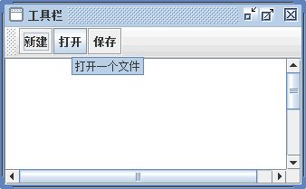

# Java Swing JToolBar：工具栏组件

工具栏提供了一个用来显示常用按钮和操作的组件。它可以把任意类型的组件附加到工具条上，但是通常是增加按钮。工具栏 JToolBar 类的常用构造方法如表 1 所示。

表 1 JToolBar 类的常用构造方法

| 构造方法 | 说明 |
| JToolBar() | 创建新的工具栏，默认的方向为 HORIZONTAL |
| JToolBar(int orientation) | 创建具有指定 orientation 的新工具栏 |
| JToolBar(String name) | 创建一个具有指定 name 的新工具栏 |
| JToolBar(String name,int orientation) | 创建一个具有指定 name 和 orientation 的新工具栏 |

与 JMenuBar 不一样，JToolBar 对象可以直接被添加到容器中。JTodBar 类的常用方法如表 2 所示。

表 2 JToolBar 类的常用方法

| 方法名称 | 说明 |
| add(Action a) | 添加一个指派动作的新的 JButton |
| addSeparator() | 将默认大小的分隔符添加到工具栏的末尾 |
| addSeparator(Dimension size) | 将指定大小的分隔符添加到工具栏的末尾 |
| getComponentAtIndex(int i) | 返回指定索引位置的组件 |
| getComponentIndex(Component c) | 返回指定组件的索引 |
| getMargin() | 返回工具栏边框和它的按钮之间的空白 |
| getOrientation() | 返回工具栏的当前方向 |
| isFloatable() | 获取 floatable 属性 |
| isRollover() | 返回 rollover 状态 |
| setBorderPainted(boolean b) | 设置 borderPainted 属性，如果需要绘制边框，则此属性为 true |
| setFloatable(boolean b) | 设置 floatable 属性，如果要移动工具栏，此属性必须设置为 true |
| setLayout(LayoutManager mgr) | 设置此容器的布局管理器 |
| setMargin(Insets m) | 设置工具栏边框和它的按钮之间的空白 |
| setOrientation(int o) | 设置工具栏的方向 |
| setRollover(boolean rollover) | 设置此工具栏的 rollover 状态 |

#### 例 1

下面通过实例来说明如何使用 JToolBar 创建工具栏，在该实例中给工具栏上的按钮添加了图片，当图片不存在时使用文字代替。主要实现步骤如下所示。

(1) 创建一个 ToolBarDemo 类，继承 JPanel 父类并实现 ActionListener 接口。

```
package ch18;
import javax.swing.*;
import java.awt.*;
import java.awt.event.*;
import java.net.URL;
import javax.swing.ImageIcon;
import javax.swing.JFrame;
import javax.swing.JPanel;
import javax.swing.JToolBar;
public class ToolBarDemo extends JPanel implements ActionListener
{
    protected JTextArea textArea;
    protected String newline="\n";
    static final private String OPEN="OPEN";
    static final private String SAVE="SAVE";
    static final private String NEW="NEW";   
    //事件监听器部分的代码省略，请查阅源文件
    protected void displayResult(String actionDescription)
    {
        textArea.append(actionDescription+newline);
    }
    public static void main(String[] args)
    {
        JFrame.setDefaultLookAndFeelDecorated(true);
        //定义窗体
        JFrame frame=new JFrame("工具栏");
        frame.setDefaultCloseOperation(JFrame.EXIT_ON_CLOSE);
        //定义面板
        ToolBarDemo newContentPane=new ToolBarDemo();
        newContentPane.setOpaque(true);
        frame.setContentPane(newContentPane);
        //显示窗体
        frame.pack();
        frame.setVisible(true);
    }
    @Override
    public void actionPerformed(ActionEvent e)
    {
        // TODO 自动生成的方法存根
    }
}
```

(2) 在构造方法中对工具栏进行设置，主要代码如下所示。

```
public ToolBarDemo()
{
    super(new BorderLayout());
    //创建工具栏
    JToolBar toolBar=new JToolBar();
    addButtons(toolBar);
    //创建一个文本域，用来输出一些信息
    textArea=new JTextArea(15, 30);
    textArea.setEditable(false);
    JScrollPane scrollPane=new JScrollPane(textArea);
    //把组件添加到面板中
    setPreferredSize(new Dimension(450, 110));
    add(toolBar,BorderLayout.PAGE_START);
    add(scrollPane,BorderLayout.CENTER);
}
```

(3) 构造方法中创建了一个工具栏 toolBar，然后调用 addButtons() 方法为工具栏设置按钮。addButtons() 方法的代码如下：

```
protected void addButtons(JToolBar toolBar)
{
    JButton button=null;
    button=makeNavigationButton("new1",NEW,"新建一个文件","新建");
    toolBar.add(button);
    button=makeNavigationButton("open1",OPEN,"打开一个文件","打开");
    toolBar.add(button);
    button=makeNavigationButton("save1",SAVE,"保存当前文件","保存");
    toolBar.add(button);
}
```

(4) 在 addButtons() 方法中调用 makeNavigationButton() 方法，实现对工具栏上的按钮指定图片、动作指令、提示信息和无图片时的文本。具体实现代码如下：

```
protected JButton makeNavigationButton(String imageName,String actionCommand,String toolTipText,String altText)
{
    //搜索图片
    String imgLocation=imageName+".jpg";
    URL imageURL=ToolBarDemo.class.getResource(imgLocation);
    //初始化工具按钮
    JButton button=new JButton();
    //设置按钮的命令
    button.setActionCommand(actionCommand);
    //设置提示信息
    button.setToolTipText(toolTipText);
    button.addActionListener(this);
    if(imageURL!=null)
    {
        //找到图像
        button.setIcon(new ImageIcon(imageURL));
    }
    else
    {
        //没有图像
        button.setText(altText);
        System.err.println("Resource not found: "+imgLocation);
    }
    return button;
}
```

(5) 运行程序，在窗口的顶部会看到包含 3 个按钮的工具栏。当鼠标指针放在工具按钮上时出现提示信息，如图 1 所示。


图 1 无图片工具栏