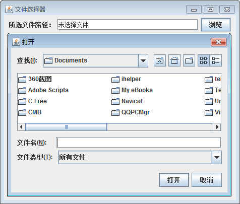
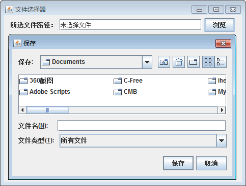
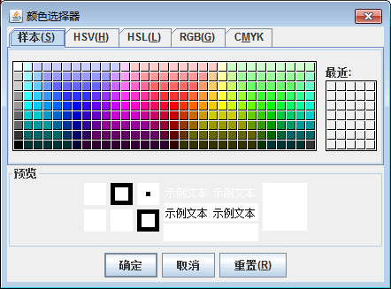

# Java Swing JFileChooser 和 JColorChooser：文件选择器和颜色选择器

在开发应用程序时经常需要选择文件和选择颜色的功能。例如，从选择的文件中导入数据，为窗体选择背景颜色等。本节详细介绍 Swing 中文件选择器和颜色选择器的使用。

## 文件选择器

文件选择器为用户能够操作系统文件提供了桥梁。swing 中使用 JFileChooser 类实现文件选择器，该类常用的构造方法如下。

*   JFileChooser()：创建一个指向用户默认目录的 JFileChooser。
*   JFileChooser(File currentDirectory)：使用指定 File 作为路径来创建 JFileChooser。
*   JFileChooser(String currentDirectoryPath)：创建一个使用指定路径的 JFileChooser。
*   JFileChooser(String currentDirectoryPath, FileSystemView fsv)：使用指定的当前目录路径和 FileSystem View 构造一个 JFileChooser。

JFileChooser 类的常用方法如下所示。

*   int showOpenDialog(Component parent)：弹出打开文件对话框。
*   int showSaveDialog(Component parent)：弹出保存文件对话框。

#### 例 1

编写一个程序允许用户从本地磁盘中选择一个文件，并将选中的文件显示到界面。实现代码如下：

```
package ch18;
import java.awt.event.ActionEvent;
import java.awt.event.ActionListener;
import javax.swing.JButton;
import javax.swing.JFileChooser;
import javax.swing.JFrame;
import javax.swing.JLabel;
import javax.swing.JPanel;
import javax.swing.JTextField;
public class JFileChooserDemo
{
    private JLabel label=new JLabel("所选文件路径：");
    private JTextField jtf=new JTextField(25);
    private JButton button=new JButton("浏览");
    public JFileChooserDemo()
    {
        JFrame jf=new JFrame("文件选择器");
        JPanel panel=new JPanel();
        panel.add(label);
        panel.add(jtf);
        panel.add(button);
        jf.add(panel);
        jf.pack();    //自动调整大小
        jf.setVisible(true);
        jf.setDefaultCloseOperation(JFrame.EXIT_ON_CLOSE);
        button.addActionListener(new MyActionListener());    //监听按钮事件
    }
    //Action 事件处理
    class MyActionListener implements ActionListener
    {
        @Override
        public void actionPerformed(ActionEvent arg0)
        {
            JFileChooser fc=new JFileChooser("F:\\");
            int val=fc.showOpenDialog(null);    //文件打开对话框
            if(val==fc.APPROVE_OPTION)
            {
                //正常选择文件
                jtf.setText(fc.getSelectedFile().toString());
            }
            else
            {
                //未正常选择文件，如选择取消按钮
                jtf.setText("未选择文件");
            }
        }
    }
    public static void main(String[] args)
    {
        new JFileChooserDemo();
    }
}
```

在上述程序中使用内部类的形式创建了一个名称为 MyActionListener 的类，该类实现了 ActionListener 接口。其中 showOpenDialog() 方法将返回一个整数，可能取值情况有 3 种：JFileChooser.CANCEL—OPTION、JFileChooser.APPROVE_OPTION 和 JFileChooser.ERROR_OPTION，分别用于表示单击“取消”按钮退出对话框，无文件选取、正常选取文件和发生错误或者对话框已被解除而退出对话框。因此在文本选择器交互结束后，应进行判断是否从对话框中选择了文件，然后根据返回值情况进行处理。

运行程序，单击“浏览”按钮，会弹出选择文件的对话框，如果取消选择，此时会显示未选择文件；否则就会显示选择的文件路径及文件名称，如图 1 所示。


图 1 文件选择对话框
使用 JFileChooser 对象调用 showSaveDialog() 方法会显示保存文件对话框，即将“`int val=fc.showOpenDialog(null);`”语句换成“`int val=fc.showSaveDialog(null);`”。在保存文件对话框中“保存”按钮对应的常量值是 JFileChooser.APPROVE_OPTION，“取消”按钮对应的常量值是 JFileChooser.CANCEL_ OPTION。图 2 所示为文件保存对话框效果。


图 2 文件保存对话框

## 颜色选择器

JColorChooser 类提供一个用于允许用户操作和选择颜色的控制器窗格。该类提供三个级别的 `API`：

1.  显示有模式颜色选取器对话框并返回用户所选颜色的静态便捷方法。
2.  创建颜色选取器对话框的静态方法，可以指定当用户单击其中一个对话框按钮时要调用的 ActionListener。
3.  能直接创建 JColorChooser 窗格的实例（在任何容器中），可以添加 PropertyChange 作为监听器以检测当前“颜色”属性的更改。

颜色选择器的常用构造方法如下。

*   JColorChooser()：创建初始颜色为白色的颜色选取器窗格。
*   JColorChooser(Color initialColor)：创建具有指定初始颜色的颜色选取器窗格。
*   JColorChooser(ColorSelectionModel model)：创建具有指定 ColorSelectionModel 颜色选取器窗格。

一般使用 JColorChooser 类的静态方法 showDialog(Component component,String title,Color initialColor) 创建一个颜色对话框，在隐藏对话框之前一直堵塞进程。其中 component 参数指定对话框所依赖的组件，title 参数指定对话框的标题，initialColor 参数指定对话框返回的初始颜色，即对话框消失后返回的默认值。

JColorChooser 类的其他常用方法如表 1 所示。

表 1 JColorChooser 类的常用方法

| 方法名称 | 说明 |
| getColor() | 获取颜色选取器的当前颜色值 |
| getDragEnabled() | 获取 dragEnabled 属性的值 |
| setColor(Color color) | 将颜色选取器的当前颜色设置为指定颜色 |
| setColor(int c) | 将颜色选取器的当前颜色设置为指定颜色 |
| setColor(int r,int g,int b) | 将颜色选取器的当前颜色设置为指定的 RGB 颜色 |
| setDragEnabled(boolean b) | 设置 dragEnabled 属性，该属性必须为 true 才能启用对 此组件的自动拖动处理（拖放操作的第一部分） |

#### 例 2

创建一个示例演示如何使用 JColorChooser 类显示颜色选择器。示例代码非常简单，如下所示。

```
package ch18;
import java.awt.Color;
import javax.swing.JColorChooser;
import javax.swing.JFrame;
public class JColorChooserDemo
{
    public static void main(String[] args)
    {
        JFrame frame=new JFrame("颜色选择器");
        JColorChooser cc=new JColorChooser();
        cc.showDialog(frame,"颜色选择器",Color.white);
        //JColorChooser.showDialog(frame,"颜色选择器",Color.white);
        //设置窗口的关闭动作、标题、大小位置以及可见性等
        frame.setDefaultCloseOperation(JFrame.EXIT_ON_CLOSE);
        frame.setBounds(100,100,400,200);
        frame.setVisible(true);
    }
}
```

使用 JFrame 作为容器，在该容器内显示一个标题是“颜色选择器”、使用白色作为默认色的颜色选择器。运行后的颜色选择器窗口如图 3 所示。


图 3 颜色选择器
也可以不创建 JColorChooser 类实例，直接调用其 showDialog() 方法显示颜色选择器。即将如下代码

```
JFrame frame=new JFrame("颜色选择器");
JColorChooser cc=new JColorChooser();
cc.showDialog(frame,"颜色选择器",Color.white);
```

换成：

```
JColorChooser.showDialog(frame,"颜色选择器",Color.white);
```