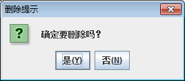
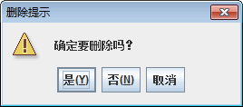
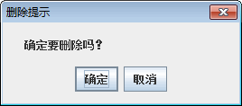
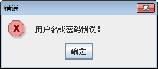
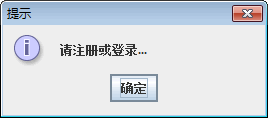
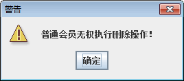
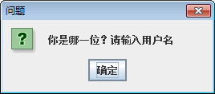
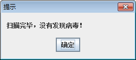
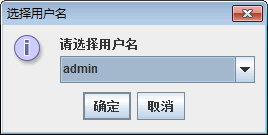
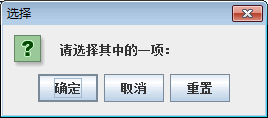

# Java Swing JOptionPane：对话框组件

对话框通常用作从用户处接收附加信息，或者提供发生了某种事件的通知。Java 提供了 JOptionPane 类，用来创建标准对话框，也可以通过扩展 JDialog 类创建自定义的对话框。JOptionPane 类可以用来创建 4 种类型的标准对话框：确认对话框、消息对话框、输入对话框和选项对话框。

## 确认对话框

确认对话框显示消息，并等待用户单击“确定”按钮来取消对话框，该对话框不返回任何值。而确认对话框询问一个问题，需要用户单击合适的按钮做出响应。确认对话框返回对应被选按钮的值。

创建确认对话框的方法如下：

```
public static int showConfirmDialog(Component parentComponent,Object message,String title,int optionType,int messageType,Icon icon)
```

参数 parentComponent、message、title、messageType 和 icon 与 showMessageDialog() 方法中的参数的含义相同。其中，只有 parentComponent 和 message 参数是必需的，title 的默认值为“选择一个选项”。messageType 的默认值是 QUESTION_MESSAGE。optionType 参数用于控制在对话框上显示的按钮，可选值如下：

*   0 或 JOptionPane.YES_NO_OPTIION。
*   1 或 JOptionPane.YES_NO_CANCEL_0PTII0N。
*   2 或 JOptionPane.OK_CANCEL_OPTIION。

例如，使用 showCon&mDialog() 方法创建 3 个确认对话框，该方法中指定的参数个数和参数值都是不同的，语句如下：

```
JOptionPane.showConfirmDialog(p,"确定要删除吗？","删除提示",0);
JOptionPane.showConfirmDialog(p,"确定要删除吗？","删除提示",1,2);
ImageIcon icon=new ImageIcon("F:\\pic\\n63.gif");
JOptionPane.showConfirmDialog(p,"确定要删除吗？","删除提示",2,1,icon);
```

这 3 条语句所实现的对话框分别如图 1 所示。

    
图 1 确认对话框
showConfirmDialog() 方法返回所选选项对应的值，这些值可以是整数或常量值，如下：

*   0 或 JOptionPane.YES_OPTIION。
*   1 或 JOptionPane.NO_OPTIION。
*   2 或 JOptionPane.CANCEL_OPTIION。
*   0 或 JOptionPane.OK_OPTIION。
*   -1 或 JOptionPane.CLOSED_OPTIION。

提示：除了 CLOSED_OPTIION 外，其他常量值都对应于激活的按钮。CLOSED_OPTIION 表示对话框在没有任何按钮激活的情况下关闭，例如单击对话框上的关闭图标按钮。

## 消息对话框

消息对话框显示一条提示或警告用户的信息，并等待用户单击 OK 或“确定”按钮以关闭对话框。创建消息对话框的方法如下：

```
public static void showMessageDialog(Component parentComponent,Object message,String title,int messageType,Icon icon)
```

其中，只有 parentComponent 参数和 message 参数是必须指定的。parentComponent 可以是任意组件或者为空；message 用来定义提示信息，它是一个对象，但是通常使用字符串表示；title 是设置对话框标题的字符串；messageType 是以下整型或常量中的一个。

*   0 或 JOptionPane.ERROR_MESSAGE。
*   1 或 JOptionPane.INFORMATION_MESSAGE。
*   JOptionPane.PLAIN_MESSAGE。
*   2 或 JOptionPane.WARNING_MESSAGE。
*   3 或 JOptionPane.QUESTION_MESSAGE。

默认情况下，messageType 的值是 JOptionPane.INFORMATION_MESSAGE。除类型 PLAIN_MESSAGE 外，每种类型都有相应的图标，也可以通过 icon 参数提供自己的图标。

例如，下面的代码演示了不同的 messageType 取值实现的效果。

```
JOptionPane.showMessageDialog(p,"用户名或密码错误！","错误 ",0);
JOptionPane.showMessageDialog(p,"请注册或登录...","提示",1);
JOptionPane.showMessageDialog(p,"普通会员无权执行删除操作！","警告",2);
JOptionPane.showMessageDialog(p,"你是哪一位？请输入用户名","问题",3);
JOptionPane.showMessageDialog(p,"扫描完毕，没有发现病毒！","提示",JOptionPane.PLAIN_MESSAGE);
```

第一行语句表示创建一个错误对话框。第二行语句表示创建一个提示对话框。第三行语句表示创建一个警告对话框。第四行语句表示创建一个问题对话框。第五行语句表示创建一个无图标对话框。这 5 条语句创建的对话框效果分别如图 2 所示。

    
  图 2 不同类型的消息对话框

## 输入对话框

输入对话框用于接收用户的输入。输入组件可以由文本框、下拉列表或者列表框进行实现。如果没有指定可选值，那么就使用文本框接收输入；如果指定了一组可选值，可选值的个数小于 20，那么将使用下拉列表显示；如果可选值的个数大于或等于 20，那么这些可选值将通过列表框显示。

创建输入对话框的方法如下：

```
public static String showInputDialog(Component parentComponent,Object message,String title,int messageType)
public static Object showInputDSalog(Component parentComponent,Object message,String title,int messageType,Icon icon,Object[] selectionValue,Object initValue)
```

其中，第一个 showInputDialog() 方法用于使用文本框输入，第二个 showInputDialog() 方法用于下拉列表或列表框的显示方式。参数 parentComponent 是必需的，message 默认为空，title 默认值为“输入”，messageType 的值默认为 3 或 JOptionPane.QUESTION_MESSAGE。

例如，使用 showInputDialog() 方法创建两个输入文本框，语句如下：

```
JOptionPane.showInputDialog(panel,"请输入用户名","输入用户名",1);
String[] str={"admin","maxianglin","calcl23456","adminl23"};
JOptionPane.showInputDialog(panel,"请选择用户名","选择用户名",1,null,str,str[0]);
```

第一个对话框没有指定列表值，那么将显示文本框；第二个对话框值显示为下拉列表的形式，如图 3 所示。

  
图 3 输入对话框
提示：showInputDialog() 方法中没有 optionType 参数，表示输入对话框的按钮是不可以设置的，通常显示“确定”和“取消”按钮。

## 选项对话框

选项对话框允许用户自己定制按钮内容。创建选项对话框的方法如下：

```
public static int showOptionDialog(Component parentComponent,Object message,String title,int optionType,int messageType,icon icon,Object[] options,Object initValue)
```

其中，使用 options 参数指定按钮，initValue 参数用于指定默认获得焦点的按钮。该方法返回表明激活的按钮的一个整型值。

例如，创建一个 JButton 按钮数组，然后使用 showOptionDialog() 方法创建一个选项对话框，根据这个 JButton 数组来显示对话框的按钮，如下：

```
JButton[] bs={new JButton("确定"),new JButton("取消"),new JButton("重置")};
JOptionPane.showOptionDialog(panel,"请选择其中的一项：","选择",1,3,null,bs,bs[0]);
```

显示效果如图 4 所示。


图 4 “选择”对话框