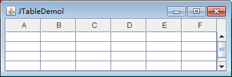
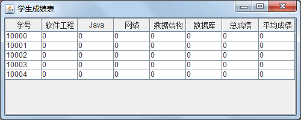
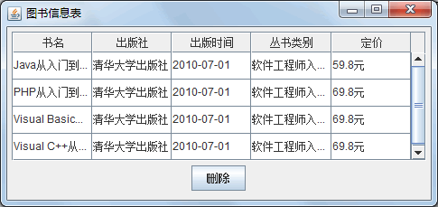
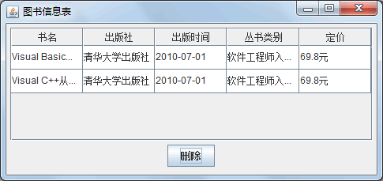

# Java Swing JTable：表格

表格是 Swing 新增加的组件，主要功能是把数据以二维表格的形式显示出来，并且允许用户对表格中的数据进行编辑。表格组件是最复杂的组件之一，它的表格模型功能非常强大、灵活而易于执行。由于篇幅有限，本节只介绍默认的表格模型。

Swing 使用 JTable 类实现表格，常用构造方法如下所示。

*   JTable()：构造一个默认的 JTable，使用默认的数据模型、默认的列模型和默认的选择模型对其进行初始化。
*   JTable(int numRows,int numColumns)：使用 DefaultTableModel 构造具有 numRows 行和 numColumns 列个空单元格的 JTable。
*   JTable(Object[][] rowData,Object[] columnNames)：构造一个 JTable 来显示二 维数组 rowData 中的值，其列名称为 columnNames。

创建一个带有滚动条的 JTable 对象非常简单，如下所示。

```
JTable table=new JTable(5,6);
JScrollPane pane=new JScrollPane(table);
```

第一条语句创建了一个 JTable 对象。第二条语句创建了一个存放 JTable 对象的 JScrollPane 对象，该对象是一个视图对象。JScrollPane 是一个垂直和水平滚动条，以及可设置行和列标题的容器。上面两行代码执行后的表格效果如图 1 所示。


图 1 表格
表格有很多的选项设置，因此 JTable 类常用方法也很多，这些常用方法如表 1 所示。

表 1 JTable 类的常用方法

| 方法名称 | 说明 |
| getColumnCount() | 返回列模型中的列数 |
| getColumnN ame(int column) | 返回出现在视图中 column 列位置处的列名称 |
| getRowCount() | 返回 JTable 中可以显示的行数（给定无限空间） |
| getRowSorter() | 返回负责排序的对象 |
| getSelectedColumn() | 返回第一个选定列的索引，如果没有选定的列， 则返回 -1 |
| getSelectedRow() | 返回第一个选定行的索引，如果没有选定的行， 则返回 -1 |
| getValueAt(int row,int column) | 返回 row 和 column 位置的单元格值 |
| isEditing() | 如果正在编辑单元格，则返回 true |
| selectAll() | 选择表中的所有行、列和单元格 |
| setColumnSelectionInterval(int index0,int index1) | 选择从 index0 到 index1 之间（包含两端）的列 |
| setRowSelectionInterval(int index0,int index1) | 选择从 index0 到 index1 之间（包含两端）的行 |
| setTableHeader(JTableHeader tableHeader) | 将此 JTable 所使用的 tableHeader 设置为 newHeader |
| setUpdateSelectionOnSort(boolean update) | 指定排序后是否应该更新选择 |
| setValueAt(Object a Value,int row,int column) | 设置表模型中 row 和 column 位置的单元格值 |

#### 例 1

使用 JTable 类创建一个包含 8 列的学生成绩表，并向表格中填充几行数据，具体实现代码如下所示。

```
package ch18;
import java.awt.Container;
import javax.swing.JFrame;
import javax.swing.JScrollPane;
import javax.swing.JTable;
public class JTableDemo
{
    public static void main(String[] agrs)
    {
        JFrame frame=new JFrame("学生成绩表");
        frame.setSize(500,200);
        frame.setDefaultCloseOperation(JFrame.EXIT_ON_CLOSE);
        Container contentPane=frame.getContentPane();
        Object[][] tableDate=new Object[5][8];
        for(int i=0;i<5;i++)
        {
            tableDate[i][0]="1000"+i;
            for(int j=1;j<8;j++)
            {
                tableDate[i][j]=0;
            }
        }
        String[] name={"学号","软件工程","Java","网络","数据结构","数据库","总成绩","平均成绩"};
        JTable table=new JTable(tableDate,name);
        contentPane.add(new JScrollPane(table));
        frame.setVisible(true);
    }
}
```

如上述代码所示，表格组件和其他组件类似，可以方便地创建一个 JTable 对象。 如果 JTbale 对象直接添加到 JFrame 中，则表头显示不出来，需要把表格对象放入 JScrollPane 对象中，之后把 JScrollPane 对象添加到 JFrame 中。实例的运行效果如图 2 所示。


图 2 学生成绩表运行效果

#### 例 2

Swing 中表格的数据可以根据需求动态变化，比如对于表格中不需要的数据，可以将其删除。本实例将演示如何从表格中删除用户选择的行，实现过程如下。

(1) 创建一个继承自 JFrame 的 RowDeleteDemo 类。

```
package ch18;
import java.awt.BorderLayout;
import java.awt.event.ActionEvent;
import java.awt.event.ActionListener;
import java.awt.event.WindowAdapter;
import java.awt.event.WindowEvent;
import javax.swing.JButton;
import javax.swing.JFrame;
import javax.swing.JPanel;
import javax.swing.JScrollPane;
import javax.swing.JTable;
import javax.swing.ListSelectionModel;
import javax.swing.border.EmptyBorder;
import javax.swing.table.DefaultTableModel;
public class RowDeleteDemo extends JFrame
{
    private JPanel contentPane;
    private JTable table;
    /**
     * Launch the application.
     */
    public static void main(String[] args)
    {
        RowDeleteDemo frame = new RowDeleteDemo();
        frame.setVisible(true);
    }
    /**
     * Create the frame.
     */
}
```

(2) 在构造方法中增加表格，设置表格的数据模型，添加“删除”按钮并监听单击事件。实现代码如下：

```
public RowDeleteDemo()
{
    addWindowListener(new WindowAdapter()
    {
        @Override
        public void windowActivated(WindowEvent e)
        {
            do_this_windowActivated(e);
        }
    });
    setTitle("图书信息表");
    setDefaultCloseOperation(JFrame.EXIT_ON_CLOSE);
    setBounds(100,100,450,200);
    contentPane=new JPanel();
    contentPane.setBorder(new EmptyBorder(5,5,5,5));
    contentPane.setLayout(new BorderLayout(0,0));
    setContentPane(contentPane);
    JPanel panel=new JPanel();
    contentPane.add(panel,BorderLayout.SOUTH);
    JButton button=new JButton("删除");
    button.addActionListener(new ActionListener()
    {
        public void actionPerformed(ActionEvent e)
        {
            do_button_actionPerformed(e);
        }
    });
    panel.add(button);
    JScrollPane scrollPane=new JScrollPane();
    contentPane.add(scrollPane,BorderLayout.CENTER);
    table=new JTable();
    table.setSelectionMode(ListSelectionModel.SINGLE_INTERVAL_SELECTION);
    scrollPane.setViewportView(table);
}
```

(3) 监听窗体激活事件，完成向表中增加数据的功能。这里使用了表格模型对象，它可以方便地处理表格中的数据。实现代码如下：

```
protected void do_this_windowActivated(WindowEvent e)
{
    DefaultTableModel tableModel=(DefaultTableModel) table.getModel();    //获得表格模型
    tableModel.setRowCount(0);    //清空表格中的数据
    tableModel.setColumnIdentifiers(new Object[]{"书名","出版社","出版时间","丛书类别","定价"});    //设置表头
    tableModel.addRow(new Object[]{"Java 从入门到精通（第 2 版）","清华大学出版社","2010-07-01","软件工程师入门丛书","59.8 元"});    //增加列
    tableModel.addRow(new Object[]{"PHP 从入门到精通（第 2 版）","清华大学出版社","2010-07-01","软件工程师入门丛书","69.8 元"});
    tableModel.addRow(new Object[]{"Visual Basic 从入门到精通（第 2 版）","清华大学出版社","2010-07-01","软件工程师入门丛书","69.8 元"});
    tableModel.addRow(new Object[]{"Visual C++从入门到精通（第 2 版）","清华大学出版社","2010-07-01","软件工程师入门丛书","69.8 元" });
    table.setRowHeight(30);
    table.setModel(tableModel);    //应用表格模型
}
```

(4) 监听用户单击“删除”按钮事件，这里通过 do_button_actionPerformed() 方法完成。在该方法中，首先获取表格模型，然后获得用户选择的行，再执行删除数据操作。实现代码如下：

```
protected void do_button_actionPerformed(ActionEvent e)
{
    DefaultTableModel model=(DefaultTableModel) table.getModel();    //获得表格模型
    int[] selectedRows=table.getSelectedRows();
    for(int i=selectedRows[0];i<selectedRows.length;i++)
    {
        model.removeRow(selectedRows[0]);
    }
    table.setModel(model);
}
```

(5) 运行程序，默认在表格中会显示所有数据，如图 3 所示。图 4 所示为删除两行后的表格效果。


图 3 删除前表格数据

图 4 删除后表格数据