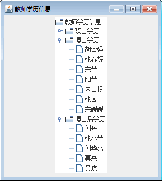

# Java Swing JTree：树组件

如果要显示一个层次关系分明的一组数据，用树结构是最合适的。树如同 Windows 资源管理器的左半部，可通过单击文件夹展开或者收缩内容。

Swing 使用 JTree 类实现树，它的主要功能是把数据按照树状进行显示，其数据来源于其他对象。JTree 树中最基本的对象叫作节点，表示在给定层次结构中的数据项。树以垂直方式显示数据，每行显示一个节点。树中只有一个根节点，所有其他节点从这里引出。除根节点外，其他节点分为两类：一类是代子节点的分支节点，另一类是不带子节点的叶节点。

JTree 类的常用构造方法如下表所示。

表 1 JTree 类的常用构造方法

| 构造方法 | 说明 |
| JTree() | 返回带有示例模型的 JTree |
| JTree(Object[] value) | 返回 JTree，指定数组的每个元素作为不被显示的新根节点的子节点 |
| JTree(TreeNode root) | 返回 JTree，使用指定的 root 作为其根节点 |
| JTree(TreeNode root,boolean aslcsAllowsChildren) | 返回 JTree，使用指定的 root 作为其根节点，asksAllowsChildren 用 于确定节点是否为叶节点 |

树节点由 javax.swing.tree 包中的接口 TreeNode 定义，该接口被 DefaultMutableTreeNode 类实现。

为了创建一个树，使用 DefaultMutableTreeNode 类为树创建节点，它的两个常用的构造方法如下。

1.  DefaultMutableTreeNode(Object userObject)：创建没有父节点和子节点，但允许有子节点的树节点，并使用指定的用户对象对它进行初始化。
2.  DefaultMutableTreeNode(Object userObject,boolean allowsChildren)：创建没有父节点和子节点的树节点，使用指定的用户对象对它进行初始化，仅在指定时才允许有子节点。

#### 例 1

节点是树结构中最主要的元素，因此对节点操作是树结构最重要的操作。下面这个实例将介绍如何使用树 JTree 对象和节点对象创建简单的树型界面。该实例代码如下：

```
package ch18;
import javax.swing.JFrame;
import javax.swing.JPanel;
import javax.swing.JTree;
import javax.swing.tree.DefaultMutableTreeNode;
public class JTreeDemo
{
    public static void main(String[] agrs)
    {
        JFrame frame=new JFrame("教师学历信息");
        frame.setSize(330,300);
        frame.setDefaultCloseOperation(JFrame.EXIT_ON_CLOSE);
        frame.getContentPane().add(new JTreeDemo().createComponent());
        frame.pack();
        frame.setVisible(true);
    }
    private JPanel createComponent()
    {
        JPanel panel=new JPanel();
        DefaultMutableTreeNode root=new DefaultMutableTreeNode("教师学历信息");
        String Teachers[][]=new String[3][];
        Teachers[0]=new String[]{"王鹏","李曼","韩小国","穆保龄","尚凌云","范超峰"};
        Teachers[1]=new String[]{"胡会强","张春辉","宋芳","阳芳","朱山根","张茜","宋媛媛"};
        Teachers[2]=new String[]{"刘丹","张小芳","刘华亮","聂来","吴琼"};
        String gradeNames[]={"硕士学历","博士学历","博士后学历"};
        DefaultMutableTreeNode node=null;
        DefaultMutableTreeNode childNode=null;
        int length=0;
        for(int i=0;i<3;i++)
        {
            length=Teachers[i].length;
            node=new DefaultMutableTreeNode(gradeNames[i]);
            for (int j=0;j<length;j++)
            {
                childNode=new DefaultMutableTreeNode(Teachers[i][j]);
                node.add(childNode);
            }
            root.add(node);
        }
        JTree tree=new JTree(root);
        panel.add(tree);
        panel.setVisible(true);
        return panel;
    }
}
```

在该实例中，创建树型界面的具体工作是由 createComponent() 私有方法完成的。在该方法中，首先创建一个根节点 root，接着定义两个数组来存放节点中的文本信息，然后通过嵌套 for 循环语句来创建除根节点外的所有节点并添加到对应的父节点上。最后把这些父节点添加到根节点中，该实例的运行效果如图 1 所示。


图 1 教师学历信息运行效果