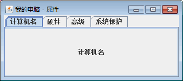

# Java Swing JTabbedPane：选项卡组件

使用选项卡可以在有限的布局空间内展示更多的内容。Swing 使用 JTabbedPane 类实现选项卡。

JTabbedPane 类创建的选项卡可以通过单击标题或者图标在选项卡之间进行切换。JTabbedPane 类的常用构造方法如下所示。

*   JTabbedPane()：创建一个具有默认 JTabbedPane.TOP 布局的空 TabbedPane。
*   JTabbedPane(int tabPlacement)：创建一个空的 TabbedPane，使其具有以下指定选项卡布局中的一种：JTabbedPane.TOP、JTabbedPane.BOTTOM、JTabbedPane.LEFT 或 JTabbedPane.RIGHT。

创建了 JTabbedPane 实例之后，可使用 addTab() 方法和 insertTab() 方法将选项卡/组件添加到 TabbedPane 对象中。选项卡通过对应于添加位置的索引来表示，其中第一个选项卡的索引为 0，最后一个选项卡的索引为选项卡数量减 1。

TabbedPane 使用 SingleSelectionModel 属性来表示选项卡索引集和当前所选择的索引。如果选项卡数量大于 0，则总会有一个被选定的索引，此索引默认被初始化为第一个选项卡；如果选项卡数量为 0，则所选择的索引为 -1。

JTabbedPane 类的常用方法如表 1 所示。

表 1 JTabbedPane 类的常用方法

| 方法名称 | 说明 |
| add(Component component,int index) | 在指定的选项卡索引位置添加一个 component，默认的选项卡 标题为组件名称 |
| addTab(String title, Component component) | 添加一个使用 title 作为标题，且没有图标的组件 |
| getComponentAt(int index) | 返回 index 位置的组件 |
| getSelectedComponent() | 返回此选项卡窗格当前选择的组件 |
| getSelectedIndex() | 返回当前选择的此选项卡窗格的索引 |
| getTabCount() | 返回此 tabbedPane 的选项卡数 |
| insertTab(String title,Icon icon,Component component, String tip,int index) | 在 index 位置插入一个组件，该组件通过 title 或 icon（任意一个 都可以为 null）来表示 |
| isEnabledAt(int index) | 返回当前是否启用了 index 位置的选项卡 |
| remove(int index) | 移除对应于指定索引的选项卡和组件 |
| setEnabledAt(int index,boolean enabled) | 设置是否启用 index 位置的选项卡 |
| setMnemonicAt(int tablndex,int mnemonic) | 设置用于访问指定选项卡的键盘助记符 |
| setTitleAt(int index,String title) | 将 index 位置的标题设置为 title，它可以为 null |
| setToolTipTextAt(int index,String toolTipText) | 将 index 位置的工具提示文本设置为 toolTipText，它可以为 null |

选项卡面板和卡片布局不同的是，选项卡面板可以有标签。下面的示例代码创建了一个选项卡面板，并在选项卡面板中添加了一个 JPand 面板。

```
JTabbedPane tabbedPane=new JTabbedPane();
ImageIcon icon=new ImageIcon("temp.gif");
JComponent panel1=makeTextPanel("Panel#1");    //创建一个 jPanel 容器，容纳其他组件
tabbedPane.addTab("Tab 1",icon,panel1,"Does nothing");
tabbedPane.setMnemonicAt(0,KeyEvent.VK_1);    //设置快捷键
```

该代码段中的第三条语句向选项卡面板 tabbedPane 中添加了一个 panel1 组件（该组件是一个 JPanel 对象），该方法中的第一个参数是选项卡标签文本；第二个参数是 Icon 对象，它作为选项卡标签上的图标；第三个参数是添加到选项卡上的组件；第四个参数是当鼠标指针放在选项卡标签上时出现的提示信息。

#### 例 1

使用 JTabbedPane 类创建一个包含 4 个标签的选项卡面板，并分别为每个选项卡填充内容，主要实现过程如下。

(1) 创建一个 TabbedPaneDemo 类并继承 JPanel 父类。

```
package ch18;
import javax.swing.JPanel;
import javax.swing.*;
import java.awt.*;
import java.awt.event.KeyEvent;
public class TabbedPaneDemo extends JPanel
{
    public static void main(String[] args)
    {
        JFrame frame=new JFrame("我的电脑 - 属性");
        frame.setDefaultCloseOperation(JFrame.EXIT_ON_CLOSE);
        frame.add(new TabbedPaneDemo(),BorderLayout.CENTER);
        frame.pack();
        frame.setVisible(true);
    }
}
```

(2) 在构造方法中创建空白选项卡，新建标签，指定标签的文本和图片，以及标签对应的内容面板和快捷访问符。这些代码如下：

```
public TabbedPaneDemo()
{
    super(new GridLayout(1,1));
    JTabbedPane tabbedPane=new JTabbedPane();
    ImageIcon icon=createImageIcon("tab.jp1g");
    JComponent panel1=makeTextPanel("计算机名");
    tabbedPane.addTab("计算机名",icon, panel1,"Does nothing");
    tabbedPane.setMnemonicAt(0,KeyEvent.VK_1);
    JComponent panel2=makeTextPanel("硬件");
    tabbedPane.addTab("硬件",icon,panel2,"Does twice as much nothing");
    tabbedPane.setMnemonicAt(1,KeyEvent.VK_2);
    JComponent panel3=makeTextPanel("高级");
    tabbedPane.addTab("高级",icon,panel3,"Still does nothing");
    tabbedPane.setMnemonicAt(2,KeyEvent.VK_3);
    JComponent panel4=makeTextPanel("系统保护");
    panel4.setPreferredSize(new Dimension(410,50));
    tabbedPane.addTab("系统保护",icon,panel4,"Does nothing at all");
    tabbedPane.setMnemonicAt(3,KeyEvent.VK_4);
    add(tabbedPane);
}
```

(3) 编写 makeTextPane() 方法的实现，该方法主要用于创建一个内容面板，并在面板上添加指定的文本内容，具体实现代码如下所示。

```
protected JComponent makeTextPanel(String text)
{
    JPanel panel=new JPanel(false);
    JLabel filler=new JLabel(text);
    filler.setHorizontalAlignment(JLabel.CENTER);
    panel.setLayout(new GridLayout(1,1));
    panel.add(filler);
    return panel;
}
```

(4) 构造方法中用到的 createImageIcon() 方法主要用于加载图片，如果图片不存在则返回 null。

```
protected static ImageIcon createImageIcon(String path)
{
    java.net.URL imgURL=TabbedPaneDemo.class.getResource(path);
    if(imgURL!=null)
    {
        return new ImageIcon(imgURL);
    }
    else
    {
        System.err.println("Couldn't find file: "+path);
        return null;
    }
}
```

(5) 运行程序，结果如图 1 所示。假设存在构造方法中指定的图片，那么在图 1 所示的运行效果中，每个单击选项卡标签前都带有各自的图标。


图 1 文本选项卡面板