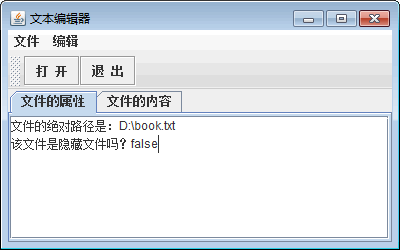
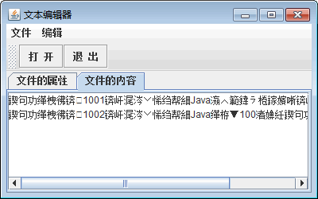

# Java Swing 文本编辑器的实现

最简单的文本编辑器要数 Windows 的记事本了。在学习了本章知识之后，本次案例将完成一个简单的文本编辑器程序。它可以打开文本文件，并输出文本文件的位置和内容。其中用到了菜单、工具栏以及选项卡等组件，是一个综合类的应用，主要实现步骤如下。

(1) 创建一个 TextFileOpener 类并继承 JFrame 父类。

```
package ch18;
import java.awt.BorderLayout;
import java.awt.event.ActionEvent;
import java.awt.event.ActionListener;
import java.io.BufferedReader;
import java.io.File;
import java.io.FileReader;
import javax.swing.JButton;
import javax.swing.JFileChooser;
import javax.swing.JFrame;
import javax.swing.JMenu;
import javax.swing.JMenuBar;
import javax.swing.JMenuItem;
import javax.swing.JScrollPane;
import javax.swing.JTabbedPane;
import javax.swing.JTextArea;
import javax.swing.JToolBar;
import javax.swing.filechooser.FileNameExtensionFilter;
public class TextFileOpener extends JFrame
{
    private static final long serialVersionUID=-9077023825514749548L;
    private JTextArea ta_showText;    //定义显示文件属性的文本域
    private JTextArea ta_showProperty;    //定义显示文件内容的文本域
    //Launch the application.
    public static void main(String[] args)
    {
        TextFileOpener frame=new TextFileOpener();
        frame.setVisible(true);
    }   
}
```

(2) 在构造方法中布局的设置，包括窗口大小、菜单栏和菜单项、工具栏，以及对各个组件的事件监听，主要实现代码如下所示。

```
public TextFileOpener()
{
    setTitle("文本编辑器");    //设置窗体标题
    setBounds(100,100,400,250);    //设置窗体位置和大小
    setDefaultCloseOperation(JFrame.DISPOSE_ON_CLOSE);    //设置窗体默认关闭方式
    final JMenuBar menuBar=new JMenuBar();    //创建菜单栏
    setJMenuBar(menuBar);    //把菜单栏放到窗体上
    final JMenu mn_file=new JMenu();    //创建文件菜单
    mn_file.setText("文件");    //为文件菜单设置标题
    menuBar.add(mn_file);    //把文件菜单添加到菜单栏上
    final JMenuItem mi_open=new JMenuItem();    //创建打开菜单项
    mi_open.addActionListener(new ActionListener()
    {
        //为打开菜单项添加监听器
        public void actionPerformed(final ActionEvent arg0)
        {
            openTextFile();    //调用方法，操作文件
        }
    });
    mi_open.setText("打开");    //设置打开菜单项的标题
    mn_file.add(mi_open);    //把打开菜单项添加到文件菜单
    mn_file.addSeparator();    //添加菜单分隔符
    final JMenuItem mi_exit=new JMenuItem();    //创建退出菜单项
    mi_exit.addActionListener(new ActionListener()
    {
        //为退出菜单项添加监听器
        public void actionPerformed(final ActionEvent arg0)
        {
            System.exit(0);    //退出系统
        }
    });
    mi_exit.setText("退出");    //设置退出菜单项的标题
    mn_file.add(mi_exit);    //把退出菜单项添加到文件菜单
    final JMenu mn_edit=new JMenu();    //创建编辑菜单
    mn_edit.setText("编辑");    //为编辑菜单设置标题
    menuBar.add(mn_edit);    //把编辑菜单添加到菜单栏上
    final JMenuItem mi_copy=new JMenuItem();    //创建复制菜单项
    mi_copy.setText("复制");    //设置复制菜单项的标题
    mn_edit.add(mi_copy);    //把复制菜单项添加到编辑菜单
    final JMenuItem mi_cut=new JMenuItem();    //创建剪切菜单项
    mi_cut.setText("剪切");    //设置剪切菜单项的标题
    mn_edit.add(mi_cut);    //把剪切菜单项添加到编辑菜单
    final JMenuItem mi_paste=new JMenuItem();    //创建粘贴菜单项
    mi_paste.setText("粘贴");    //设置粘贴菜单项的标题
    mn_edit.add(mi_paste);    //把粘贴菜单项添加到编辑菜单
    final JToolBar toolBar=new JToolBar();    //创建工具栏
    getContentPane().add(toolBar,BorderLayout.NORTH);    //把工具栏放到窗体上方
    final JButton btn_open=new JButton();    //创建工具按钮
    btn_open.addActionListener(new ActionListener()
    {
        //添加动作监听器
        public void actionPerformed(final ActionEvent arg0)
        {
            openTextFile();    //调用方法，操作文件
        }
    });
    btn_open.setText("  打  开  ");    //设置工具按钮的标题
    toolBar.add(btn_open);    //把工具按钮添加到工具栏上
    final JButton btn_exit=new JButton();    //创建工具按钮
    btn_exit.addActionListener(new ActionListener()
    {
        //添加动作监听器
        public void actionPerformed(final ActionEvent arg0)
        {
            System.exit(0);    //退出系统
        }
    });
    btn_exit.setText("  退  出  ");    //设置工具按钮的标题
    toolBar.add(btn_exit);    //把工具按钮添加到工具栏上
    final JTabbedPane tabbedPane=new JTabbedPane();    //创建选项卡面板
    getContentPane().add(tabbedPane,BorderLayout.CENTER);    //把选项卡面板放到窗体中央
    final JScrollPane scrollPane1=new JScrollPane();    //创建滚动面板
    //把滚动面板放到选项卡的第一个选项页
    tabbedPane.addTab("文件的属性",null,scrollPane1,null);
    ta_showProperty=new JTextArea();    //创建文本域
    //把文本域添加到滚动面板的视图中
    scrollPane1.setViewportView(ta_showProperty);
    final JScrollPane scrollPane2=new JScrollPane();    //创建滚动面板
    //把滚动面板放到选项卡的第二个选项页
    tabbedPane.addTab("文件的内容",null,scrollPane2,null);
    ta_showText=new JTextArea();    //创建文本域
    //把文本域添加到滚动面板的视图中
    scrollPane2.setViewportView(ta_showText);
}
```

(3) 无论是从菜单栏还是工具栏选择“打开”文件操作时都是调用 openTextFile() 方法。该方法会弹出文件选择器让用户选择一个文件，然后使用文件流获取文件属性和读取文件的内容，再把信息呈现到界面上。openTextFile() 方法的实现代码如下：

```
//用于打开文件并获得文件信息的方法
public void openTextFile()
{
    JFileChooser fileChooser=new JFileChooser();    //创建文件选择对话框
    fileChooser.setFileFilter(new FileNameExtensionFilter("文本文件","txt"));
    int returnValue=fileChooser.showOpenDialog(getContentPane());    //打开文件选择对话框
    if(returnValue==JFileChooser.APPROVE_OPTION)
    {
        //判断用户是否选择了文件
        File file=fileChooser.getSelectedFile();    //获得文件对象
        //获得文件的绝对路径
        ta_showProperty.append("文件的绝对路径是："+file.getAbsolutePath()+"\n");
        //是否为隐藏文件
        ta_showProperty.append("该文件是隐藏文件吗？"+file.isHidden()+"\n");
        FileReader reader;    //声明字符流
        BufferedReader in;    //声明字符缓冲流
        try
        {
            reader=new FileReader(file);    //创建字符流
            in=new BufferedReader(reader);    //创建字符缓冲流
            String info=in.readLine();    //从文件中读取一行信息
            while(info!=null)
            {
                //判断是否读到内容
                ta_showText.append(info+"\n");    //把读到的信息追加到文本域中
                info=in.readLine();    //继续读下一行信息
            }
            in.close();    //关闭字符缓冲流
            reader.close();    //关闭字符流
        }
        catch(Exception ex)
        {
            ex.printStackTrace();    //输出栈踪迹
        }
    }
}
```

(4) 运行程序，单击“打开”按钮，选择一个 TXT 文件。图 1 所示为查看文件属性效果，图 2 所示为查看文件内容效果。单击“退出”按钮，可以关闭程序。


图 1 查看文件属性

图 2 查看文件内容