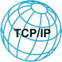

# TCP/IP 协议入门教程

> 原文：[`c.biancheng.net/tcp_ip/`](http://c.biancheng.net/tcp_ip/)

TCP/IP 协议（TCP/IP Protocol Suite）是互联网通信的基础框架，它采用分层结构，规定了数据如何封装、寻址、传输、路由和接收。为了实现这些功能，TCP/IP 协议包含了几十种网络协议，构成了一个协议族。

由于 TCP/IP 协议对整个互联网运作进行了标准化，所以它包含大量的理论知识。同时，由于大部分协议都被隐藏在系统和软件内部，用户无法直接接触，更不可能复现，因此传统 TCP/IP 协议的学习过程漫长而又枯燥乏味。

这套 TCP/IP 协议入门教程便是针对这种现状而写，主要是结合理论，并通过实际动手实践，带领读者掌握 TCP/IP 的相关知识。

教程将使用 Wireshark 和 netwox 工具对 TCP/IP 协议进行讲解：

*   netwox 工具提供了大量模块，允许用户手动创建各种协议的数据包；
*   Wireshark 工具则可以捕获数据包，直观地展现用户创建的数据包。