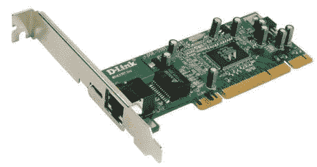
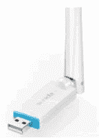
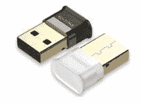
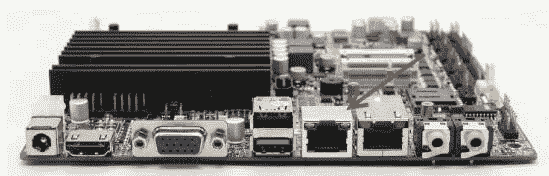
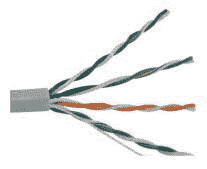
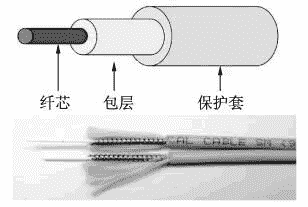
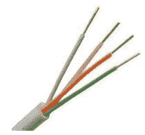
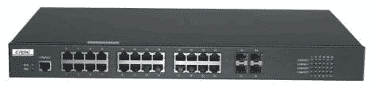
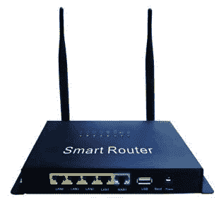
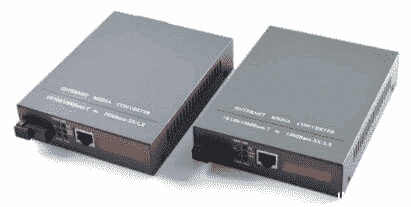

# 计算机网络由哪些硬件设备组成？

> 原文：[`c.biancheng.net/view/6376.html`](http://c.biancheng.net/view/6376.html)

网络是计算机或类似计算机的网络设备的集合，它们之间通过各种传输介质进行连接。无论设备之间如何连接，网络都是将来自于其中一台网络设备上的数据，通过传输介质传输到另外一台网络设备上。

本节将基于这个过程讲解网络的组成。

## 网卡

网卡也被称为网络适配器（Network Adapter），是连接计算机和传输介质的接口。网卡主要用来将计算机数据转换为能够通过传输介质传输的信号。

#### 网卡种类

网络设备要访问互联网，就需要通过网卡进行连接。由于上网的方式不同，所使用的网卡种类也会不同。网卡的种类有以下几种：

1) 有线网卡
有线网卡就是通过“线”连接网络的网卡。这里所说的“线”指的是网线。有线网卡常见形式如图所示。

2) 无线网卡
与有线网卡相反，无线网卡是不需要通过网线进行连接的，而是通过无线信号进行连接。无线网卡通常特指 Wi-Fi 网络的无线网卡。无线网卡常见形式如图所示。

3) 蓝牙适配器
蓝牙适配器也是一种无线网卡。蓝牙适配器与无线网卡的区别是数据通信方式不同。蓝牙适配器常见样式如图所示。

#### 按安装方式分类

网卡通常是网络设备的从属设备。根据其安装方式，网卡可以分为内置网卡和外置网卡。

1) 内置网卡
由于网卡已经成为连接网络的必要设备，所以很多网络设备都内置了网卡。因此，内置网卡也被称为集成网卡。例如，现在的主板都集成了有线网卡，如图所示。箭头所指的接口就是内置网卡提供的有线网卡接口。

2) 外置网卡
除了内置网卡外，很多网络设备都允许用户安装额外的网卡。这类网卡被称为外置网卡，有时被称为独立网卡。由于它可以插在主板的各种扩展插槽中，所以可以随意拆卸，具有一定的灵活性。上面所说的有线网卡和无线网卡就属于外置网卡。

## 网络电缆

网络电缆用来连接网络中的各个设备，供设备之间进行数据通信。常见的网络电缆有双绞线、光纤、电话线等。

#### 双绞线

双绞线也就是网线。它是由两根具有绝缘保护层的铜导线缠绕组成的，如图所示。这样的铜线一共有 8 根。每根都通过对应的颜色进行区分。现实生活中，家庭和企业中的计算机进行上网，一般都是通过双绞线连接网络。这些双绞线在排序上往往采用 EIA/TIA 568B 的线序，依次为橙白、橙、绿白、蓝、蓝白、绿、棕白、棕。

#### 光纤

光纤是一种传输光信号的细而柔软的媒质，多数光纤在使用前必须由几层保护结构包裹，如图所示。光纤的主要作用是把要传送的数据由电信号转换为光信号进行通信。在光纤的两端分别装有“光猫”进行信号转换。

#### 电话线

电话线就是连接电话的线。电话线也是由绝缘保护层的铜导线组成的。与双绞线不同的是，电话线只有 2 根或 4 根线，而且不一定会缠绕在一起，也没有颜色排序，如图所示。

## 网络设备

网络设备指的是网络组成中的设备，如交换机、路由器、调制解调器等。它们是发送或接收数据的终端设备。

#### 交换机

交换机（Switch）可以将多个网络设备连接起来组成一个局域网。它是一种用于电（光）信号转发的网络设备，用来进行数据交换。交换机外观如图所示。

#### 路由器

路由器（Router）又称网关设备（Gateway），用于连接多个逻辑上分开的网络。所谓逻辑网络是代表一个单独的网络或者一个子网。当数据从一个子网传输到另一个子网中时，可通过路由器的路由功能来完成。它会根据信道的情况自动选择和设定路由，以最佳路径，按前后顺序发送信号。路由器也是用来进行数据转换的。路由器与交换机很容易区分，最大的区别是，路由器上有 WAN 口和 LAN 接口，而交换机没有这些接口。

常见的路由器外观如图所示。

#### 调制解调器

调制解调器（Modem），俗称“猫”，是一种计算机硬件。它能把计算机的数字信号翻译成可沿普通电话线传送的脉冲信号，而这些脉冲信号又可被线路另一端的另一个调制解调器接收，并翻译为计算机的数字信号语言。调制解调器外观如图所示。