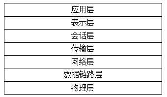
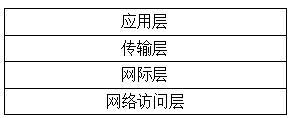

# 网络协议是什么？

> 原文：[`c.biancheng.net/view/6377.html`](http://c.biancheng.net/view/6377.html)

网络协议是网络运行的基石。在网络中，网络设备、传输介质、网卡又各有不同，数据在传输过程中也会使用不同的规则进行传输，而这些规则是依靠网络协议完成的，本节将介绍网络协议的相关知识。

## 什么是网络协议

网络协议为计算机网络中进行数据交换而建立的规则、标准或约定的集合，它规定了通信时信息必须采用的格式和这些格式所代表的意义。网络协议使网络上各种设备能够相互交换信息。

网络中存在着许多协议，接收方和发送方使用的协议必须一致，否则一方将无法识别另一方发出的信息。而 TCP/IP 协议就是一种常见的协议，Internet 上的计算机使用的就是该协议。

## TCP/IP 协议

TCP/IP 协议是 Internet 网络的基础协议，它不是一个协议，而是一个协议族的统称。

起初，TCP/IP 是一门新的通信技术，这项新技术主要用于国防军事上，是为了在通信过程中，即使遭到了敌人的攻击和破坏，也可以经过迂回线路实现最终通信，保证通信不中断。

在 20 世纪 70 年代前半叶，ARPANET（全球互联网的祖先）中的一个研究机构研发了 TCP/IP，直到 1983 年成为 ARPANET 网络中唯一指定的协议，后来逐步演变为现有的 TCP/IP 协议族。

TCP/IP 协议族包括 TCP 协议、IP 协议和 ICMP 协议和 HTTP 协议等。

## OSI 协议层次

OSI 协议层次结构就是现在常说的 OSI 参考模型（Open System Interconnection Reference Model），它是国际标准化组织（ISO）提出的一个标准框架，定义了不同计算机互连的标准，目的是使世界范围内的各种计算机互连起来，构成一个网络。

OSI 框架是基于 1984 年国际标准化组织（ISO）发布的 ISO/IEC 7498 标准，该标准定义了网络互联的 7 层框架，自下而上依次为物理层、数据链路层、网络层、传输层、会话层、表示层和应用层，如下图所示：

OSI 协议每层的作用

| 层次 | 说明 |
| 应用层 | 为应用程序提供服务并规定应用程序中相关的通信细节。常见的协议包括超文本传输协议（HTTP）、简单邮件传送协议（SMTP）和远程登录（Telnet）协议等。 |
| 表示层 | 将应用处理的信息转换为适合网络传输的格式，或将来自下一层的数据转换为上层能够处理的格式。该层主要负责数据格式的转换，确保一个系统的应用层信息可被另一个系统应用层读取。 |
| 会话层 | 负责建立和断开通信连接（数据流动的逻辑通路），以及记忆数据的分隔等数据传输相关的管理。 |
| 传输层 | 只在通信双方的节点上（比如计算机终端）进行处理，无须在路由器上处理。 |
| 网络层 | 将数据传输到目标地址，主要负责寻找地址和路由选择，网络层还可以实现拥塞控制、网际互联等功能。 |
| 数据链路层 | 负责物理层面上互连的节点间的通信传输。例如，一个以太网相连的两个节点之间的通信。该层的作用包括：物理地址寻址、数据的成帧、流量控制、数据的检错和重发等。 |
| 物理层 | 利用传输介质为数据链路层提供物理连接，实现比特流的透明传输。 |

## TCP/IP 协议层次结构

TCP/IP 协议层次结构也就是现在常说的 TCP/IP 参考模型，它是 ARPANET 和其后继的因特网使用的参考模型。

基于 TCP/IP 的参考模型，可以将协议分成 4 个层次，从上到下分别为应用层、传输层、网际层和网络访问层，如下图所示。分层以后，层中的协议只负责该层的数据处理。

TCP/IP 参考模型每层的作用

| 层次 | 说明 |
| 应用层 | 为应用程序提供服务并规定应用程序中相关的通信细节。 |
| 传输层 | 为两台主机上的应用程序提供端到端的通信，提供流量控制、错误控制和确认服务。 |
| 网际层 | 提供独立于硬件的逻辑寻址，从而让数据能够在具有不同的物理结构的子网之间传递。负责寻找地址和路由选择的同时，网络层还可以实现拥塞控制、网际互联等功能。 |
| 网络访问层 | 提供了与物理网络连接的接口。针对传输介质设置数据格式，根据硬件的物理地址实现数据的寻址，对数据在物理网络中的传递提供错误控制。 |