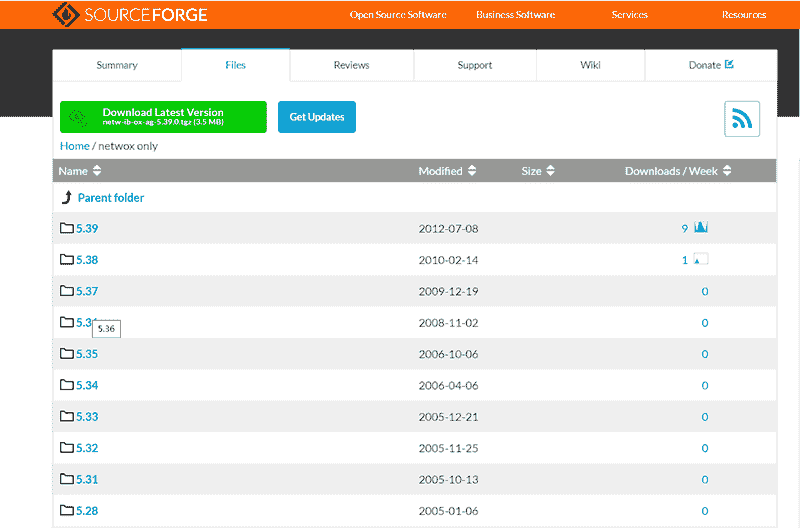
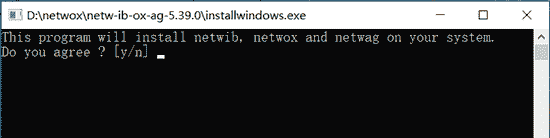
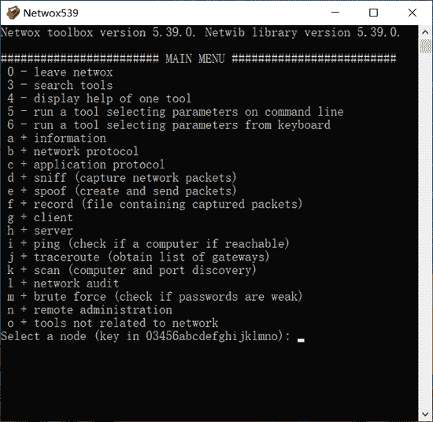

# netwox 网络工具集入门教程

> 原文：[`c.biancheng.net/view/6378.html`](http://c.biancheng.net/view/6378.html)

一个好的辅助工具可以起到事半功倍的效果，在本教程中将使用到两个辅助工具——网络工具集工具 netwox 和网络分析工具 Wireshark。本节只讲解 netwox，下节《Wireshark 使用教程》将讲解 Wireshark。

netwox 是由 lauconstantin 开发的一款网络工具集，适用群体为网络管理员和网络黑客，它可以创造任意的 TCP、UDP 和 IP 数据报文，以实现网络欺骗，并且可以在 Linux 和 Windows 系统中运行。

netwox 可以在命令模式下使用，也可以在 GUI 中 使用 netwag 调用。

netwox 包含了超过 200 个不同的功能，这里被称为模块。每个模块都有一个特定的编号，使用不同的编号模块来实现不同的功能。

由于后面的章节需要结合 netwox 工具来实现各种功能，所以这里讲解该工具的安装及基本使用方法。

## 下载及安装

Kali Linux 系统自带 netwox 工具，而 Windows 系统默认没有安装。因此，本节将讲解如何在 Windows 系统中安装 netwox 工具。安装方法如下：

1) 访问网址 [`sourceforge.net/projects/ntwox/`](https://sourceforge.net/projects/ntwox/)，进入 netwox 下载页面，如图所示。图中显示了可下载的版本，从这里可以看到当前的最新版本为 5.39。

2) 下载最新版本，单击 Download Latest Version 按钮进行下载。成功下载后，下载的是一个压缩包，名称为 netw-ib-ox-ag-5.39.0.tgz。

3) 解压 netw-ib-ox-ag-5.39.0.tgz 安装包，在解压的文件夹中找到对应的应用程序文件 installwindows.exe。双击该文件进行安装，会弹出“安装确认”对话框，如图所示。

4) 同意在该系统中安装。输入 y，并回车，将显示其他需要确认的信息。这里，一律输入 y 并回车即可，信息如下：

This program will install netwib, netwox and netwag on your system.
Do you agree ? [y/n] y
Setting global variables.
Version...
Version=539
InstallDir...
InstallDir=C:\Program Files (x86)\netw\netw539
Do you agree to use this installation directory ? [y/n] y   #确认安装的目录
Copying files under C:\Program Files (x86)\netw\netw539
src\netwox-bin_windows\netwib539.dll
src\netwox-bin_windows\netwox539.exe
src\netwag-bin_windows\netwag539.tcl
src\netwib-bin_windows\dll
src\netwib-bin_windows\include
src\netwib-bin_windows\lib
src\netwib-doc_html\*
src\netwox-doc_html\*
src\netwag-doc_html\*
Do you agree to place shortcuts on desktop ? [y/n] y  #确认是否创建桌面快捷键
Do you agree to place shortcuts in start menu ? [y/n] y  #确认是否在开始菜单中创建快捷键
Press any key to terminate

5) 上述代码中的最后一行信息表示按任意键终止，即表示安装完成。此时在“开始”菜单中可以查看到安装的 netwox 工具，如图所示。

## 层次结构分析

成功安装了 netwox 工具以后就可以使用了。由于该工具提供了众多模块，为了方便用户对模块的查找和使用，netwox 对这些模块以分类的方式进行了整理，以层次结构（如主菜单、子菜单）的方式进行显示，供用户查找和使用。使用该工具之前，需要了解分类的这些层次结构。下面将对层次结构进行分析。

在“开始”菜单中，选择 netwox 命令，运行 netwox 工具，如图所示。

上图中显示了该工具的主菜单。每一行表示一个菜单项，第一个字符为该菜单的快捷键。每个菜单含义如下：

*   0：退出 netwox 工具。
*   3：搜索工具，用来搜索与指定信息相关的模块。
*   4：显示指定模块的帮助信息。
*   5：在命令行中输入指定模块的参数选项并运行。
*   6：从键盘输入指定模块的参数选项并运行。
*   a：显示信息。
*   b：显示网络协议下相关的模块。
*   c：显示应用程序协议下相关的模块。
*   d：显示与嗅探数据包相关的模块。
*   e：显示与创建和发送数据包相关的模块。
*   f：显示与进行数据包记录相关的模块。
*   g：显示与客户端相关的模块。
*   h：显示与服务器相关的模块。
*   i：显示与检测主机连通性相关的模块。
*   j：显示与路由跟踪相关的模块。
*   k：显示与扫描计算机和端口相关的模块。
*   l：显示与审计相关的模块。
*   m：显示与暴力破解相关的模块。
*   n：显示与远程管理相关的模块。
*   o：显示其他模块。

以上菜单项是 netwox 工具的总体分类，每个菜单项属于一个大类。而每个菜单项中还会有子菜单，而每个子菜单下又有一个小的分类。

2) 使用快捷键 e，查看创建和发送数据包的相关模块，输出信息如下：

Select a node (key in 03456abcdefghijklmno): e

############# spoof (create and send packets) ##############
#创建和发送数据包模块
0 - leave netwox
1 - go to main menu
2 - go to previous menu
3 - search tools
4 - display help of one tool
5 - run a tool selecting parameters on command line
6 - run a tool selecting parameters from keyboard
a + Ethernet spoof
b + IP spoof
c + UDP spoof
d + TCP spoof
e + ICMP spoof
f + ARP spoof

从输出信息可以了解到，该分类中的子菜单包含了各种创建和发送数据包的模块，如 IP 协议的（快捷键 b）、UDP 协议的（快捷键 c）、ICMP 协议的（快捷键 e）。通过子菜单的快捷键，可以进一步查看具体的可用模块或更小的分类。

3) 使用快捷键 c，查看创建和发送 UDP 数据包的模块，输出信息如下：

Select a node (key in 0123456abcdef): c

######################## UDP spoof #########################
#创建和发送 UDP 数据包
0 - leave netwox
1 - go to main menu  #返回主菜单
2 - go to previous menu  #返回上一个菜单
3 - search tools
4 - display help of one tool
5 - run a tool selecting parameters on command line
6 - run a tool selecting parameters from keyboard
a - 35:Spoof EthernetIp4Udp packet
b - 39:Spoof Ip4Udp packet
c - 43:Spoof of packet samples : fragment, ip4opt:noop
d - 44:Spoof of packet samples : fragment, ip4opt:rr
e - 45:Spoof of packet samples : fragment, ip4opt:lsrr
f - 46:Spoof of packet samples : fragment, ip4opt:ts
g - 47:Spoof of packet samples : fragment, ip4opt:ipts
h - 48:Spoof of packet samples : fragment, ip4opt:ippts
i - 141:Spoof EthernetIp6Udp packet
j - 145:Spoof Ip6Udp packet
k - 192:Spoof of packet samples : fragment, ip4opt:ssrr

以上输出信息显示了相关的各种模块及快捷键。例如，加粗部分的信息表示 netwox 的第 39 个模块功能为创建基于 IPv4 地址的 UDP 协议数据包。

如果使用该模块，可以使用快捷键 b；如果用户想退出当前分类，可以使用快捷键 1 返回主菜单，或使用快捷键 2 返回上一个菜单；使用快捷键 0 退出 netwox 工具。以类似的方法，可以查看其他分类中的模块。

## 使用搜索功能

虽然 netwox 工具对所有模块进行了整理和分类，但是有时候想找到要使用的模块也会很麻烦。因此，netwox 提供了搜索功能。用户可以指定关键字搜索与之相关的模块。例如，搜索与 DNS 相关的模块。在主菜单界面中输入 3，显示信息如下：

Select a node (key in 03456abcdefghijklmno): 3
Enter search string:

以上输出信息表示，需要在这里输入要搜索的关键字。

例如，这里输入 dns 然后回车，将显示与 DNS 相关的模块，输出信息如下：

Enter search string: dns

############ list of tools containing this text ############
Tools containing "dns":
102:Query a DNS server
103:Obtain version of a Bind DNS server
104:DNS server always answering same values
105:Sniff and send DNS answers

输出信息显示了与 DNS 相关的模块。相关的模块编号有 102、103、104 和 105。

## 使用模块

上面介绍了如何查找要使用的模块。找到要使用的模块编号以后就可以进行使用了。本节将以一个模块为例，简单地介绍其使用方法。无论使用哪个模块，基本语法是不会变的。

语法格式如下：

neywox ID options

其中，ID 表示模块对应的编号，是必需的；options 表示可用到的选项，是可选的。

演示使用编号为 1 的模块，实现对应的功能。

1) 启动 netwox 工具。然后在主菜单界面中按快捷键 5，显示信息如下：

Select a node (key in 03456abcdefghijklmno): 5
Select tool number (between 1 and 223):

以上输出信息表示需要输入要使用的模块编号。

2) 本例使用第 1 个模块，输入 1 然后回车，将显示该模块的帮助信息，并在帮助信息下面会给出使用模块的命令。

输出信息如下：

Select tool number (between 1 and 223): 1

################## running tool number 1 ###################
Title: Display network configuration  #功能简单介绍
+--------------------------------------------------------------------------------------------------------------+
| This tool displays network configuration:             |  #功能详细说明
|  - the list of devices/interfaces:                    |
|     + nu: device number                                |
|     + dev: easy device name                          |
···  #省略其他信息
|  - the routes                                                 |
|     + nu: device number of device associated to this entry  |
|     + destination/netmask: destination addresses                |
| If no Parameter is set, they are all displayed.                       |
|                                                                                               |
| This tool may need to be run with admin privilege in order to obtain |
| full network configuration.                                      |
+-------------------------------------------------------------+
Synonyms: address, arp, device, gateway, ifconfig, interface, ipconfig, mac,
neighbor, netmask, route, show
Usage: netwox 1 [-d|+d] [-i|+i] [-a|+a] [-r|+r]  #语法格式
Parameters:  #可用的选项参数
-d|--devices|+d|--no-devices   display devices
-i|--ip|+i|--no-ip             display ip addresses
-a|--arpcache|+a|--no-arpcache display arp cache and neighbors
-r|--routes|+r|--no-routes     display routes
Example: netwox 1  #参考实例
Enter optional tool parameters and press Return key.
netwox 1

上述信息首先输出模块功能的简单介绍，以及功能的详细说明信息；然后输出的是该模块的语法格式和可用的选项参数，并给出了参考实例。

输出信息的最后一行是用户使用到的命令。我们要使用的模块为 1，因此给出的命令信息为 netwox 1。

这里还可以输入可使用的选项。如果选项不是必须的，可以不输入选项。

3) 本例中，使用选项 -i 表示获取 IP 地址信息。在 netwox 1 后面输入 -i 然后回车，将执行模块功能。运行结果如下：

netwox 1 -i
  nu ip                     /netmask                    ppp point_to_point_with
  1  127.0.0.1               /255.0.0.0                         0
  2  192.168.59.1         /255.255.255.0                 0
  5  192.168.12.102     /255.255.255.0                 0
  7  192.168.38.1         /255.255.255.0                 0
  13  192.168.12.102   /255.255.255.0                 0
  25  192.168.38.1       /255.255.255.0                 0
  26  192.168.59.1       /255.255.255.0                 0
  9  127.0.0.1               /255.0.0.0                         0

  Command returned 0 (OK)
  Press 'r' or 'k' to run again this tool, or any other key to continue

以上输出信息显示了模块执行的结果。输出信息的最后一行表示，如果用户继续使用该模块，按快捷键 r 或 k，将回到 netwox 1 使用模块的命令模式中；如果用户不再使用该模块，按任意键将返回主菜单界面。

#### 温馨提示

在 Windows 系统中使用 netwox 工具，需要按照以上模式运行工具。

在 Linux 系统中，用户可以直接在命令行中，使用 netwox 命令 + 模块编号方式来直接使用，无须进行菜单操作。例如，在 Linux 系统中使用编号为 1 的模块，直接执行如下命令：

netwox 1 -i