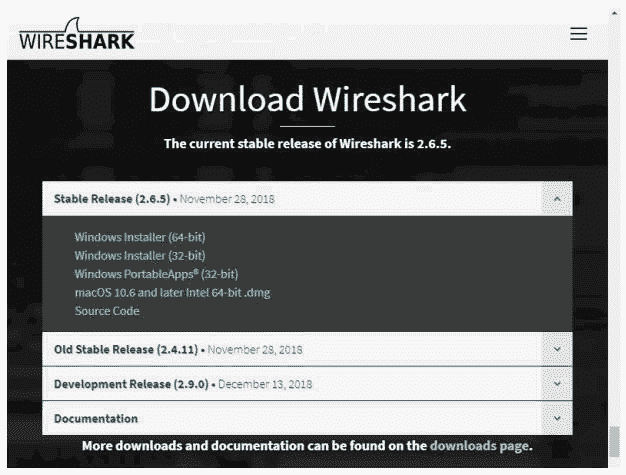
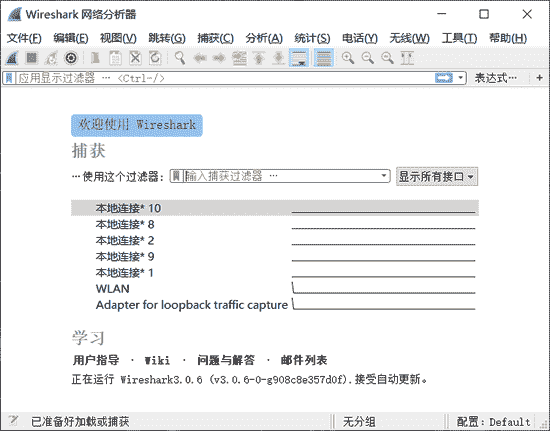
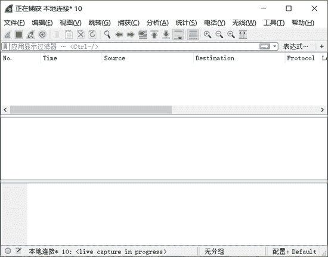
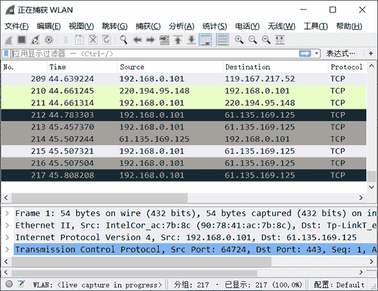
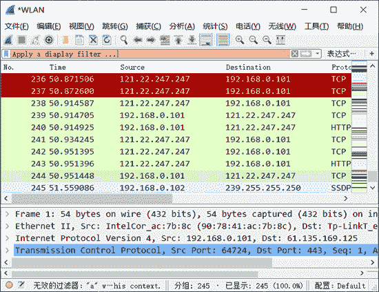
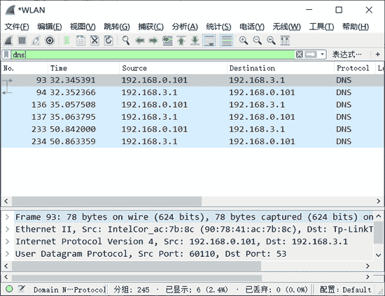
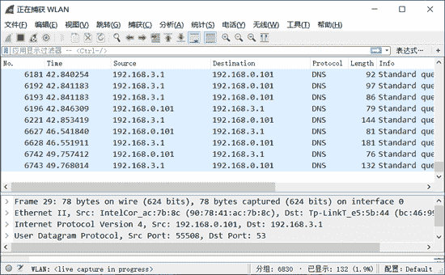
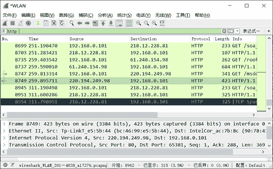

# Wireshark 下载安装和使用教程

> 原文：[`c.biancheng.net/view/6379.html`](http://c.biancheng.net/view/6379.html)

Wireshark（前身 Ethereal）是一个网络包分析工具。该工具主要是用来捕获网络数据包，并自动解析数据包，为用户显示数据包的详细信息，供用户对数据包进行分析。

它可以运行在 Windows 和 Linux 操作系统上。由于后面章节会使用该工具捕获并分析各类协议数据包，本节将讲解该工具的安装及基本使用方法。

## 下载及安装

Kali Linux 系统自带 Wireshark 工具，而 Windows 系统中默认没有安装该工具。因此，本节讲解如何在 Windows 系统中安装 Wireshark 工具。

安装方法如下：

1) 打开网址 [`www.wireshark.org`](http://www.wireshark.org)，进入 Wireshark 官网，如图所示。

2) 单击图中的下载图标进入下载页面，如图所示。

在 Stable Release 部分可以看到目前 Wireshark 的最新版本是 2.6.5，并提供了 Windows（32 位和 64 位）、Mac OS 和源码包的下载地址。用户可以根据自己的操作系统下载相应的软件包。

3) 这里下载 Windows 64 位的安装包。单击 Windows Installer(64-bit) 链接，进行下载。下载后的文件名为 Wireshark-win64-2.6.5.exe。

4) 双击下载的软件包进行安装。安装比较简单，只要使用默认值，单击 Next 按钮，即可安装成功。

5) 安装好以后，在 Windows 的“开始”菜单中会出现 Wireshark 图标，如图所示。

## 实施抓包

安装好 Wireshark 以后，就可以运行它来捕获数据包了。方法如下：

1) 在 Windows 的“开始”菜单中，单击 Wireshark 菜单，启动 Wireshark，如图所示。

该图为 Wireshark 的主界面，界面中显示了当前可使用的接口，例如，本地连接 5、本地连接 10 等。要想捕获数据包，必须选择一个接口，表示捕获该接口上的数据包。

在上图中，选择捕获“本地连接”接口上的数据包。选择“本地连接”选项，然后单击左上角的“开始捕获分组”按钮，将进行捕获网络数据，如下如所示。

图中没有任何信息，表示没有捕获到任何数据包。这是因为目前“本地连接”上没有任何数据。只有在本地计算机上进行一些操作后才会产生一些数据，如浏览网站。

3) 当本地计算机浏览网站时，“本地连接”接口的数据将会被 Wireshark 捕获到。捕获的数据包如图所示。图中方框中显示了成功捕获到“本地连接”接口上的数据包。

4) Wireshark 将一直捕获“本地连接”上的数据。如果不需要再捕获，可以单击左上角的“停止捕获分组”按钮，停止捕获。

## 使用显示过滤器

默认情况下，Wireshark 会捕获指定接口上的所有数据，并全部显示，这样会导致在分析这些数据包时，很难找到想要分析的那部分数据包。这时可以借助显示过滤器快速查找数据包。

显示过滤器是基于协议、应用程序、字段名或特有值的过滤器，可以帮助用户在众多的数据包中快速地查找数据包，可以大大减少查找数据包时所需的时间。

使用显示过滤器，需要在 Wireshark 的数据包界面中输入显示过滤器并执行，如图所示。

图中方框标注的部分为显示过滤器区域。用户可以在里面输入显示过滤器，进行数据查找，也可以根据协议过滤数据包。

显示过滤器及其作用

| 显示过滤器 | 作用 |
| arp | 显示所有 ARP 数据包 |
| bootp | 显示所有 BOOTP 数据包 |
| dns | 显示所有 DNS 数据包 |
| ftp | 显示所有 FTP 数据包 |
| http | 显示所有 HTTP 数据包 |
| icmp | 显示所有 ICMP 数据包 |
| ip | 显示所有 IPv4 数据包 |
| ipv6 | 显示所有 IPv6 数据包 |
| tcp | 显示所有基于 TCP 的数据包 |
| tftp | 显示所有 TFTP（简单文件传输协议）数据包 |

例如，要从捕获到的所有数据包中，过滤出 DNS 协议的数据包，这里使用 dns 显示过滤器，过滤结果如图所示。图中显示的所有数据包的协议都是 DNS 协议。

## 分析数据包层次结构

任何捕获的数据包都有它自己的层次结构，Wireshark 会自动解析这些数据包，将数据包的层次结构显示出来，供用户进行分析。这些数据包及数据包对应的层次结构分布在 Wireshark 界面中的不同面板中。

下面介绍如何查看指定数据包的层次结构。

1) 使用 Wireshark 捕获数据包，界面如图所示。

上图中所显示的信息从上到下分布在 3 个面板中，每个面板包含的信息含义如下：

*   Packet List 面板：上面部分，显示 Wireshark 捕获到的所有数据包，这些数据包从 1 进行顺序编号。
*   Packet Details 面板：中间部分，显示一个数据包的详细内容信息，并且以层次结构进行显示。这些层次结构默认是折叠起来的，用户可以展开查看详细的内容信息。
*   Packet Bytes 面板：下面部分，显示一个数据包未经处理的原始样子，数据是以十六进制和 ASCII 格式进行显示。

2) 以 HTTP 协议数据包为例，了解该数据包的层次结构。在 Packet List 面板中找到一个 HTTP 协议数据包，如图所示。

其中，编号 21 的数据包是一个 HTTP 协议数据包。此时在 Packet Details 面板上显示的信息就是该数据包的层次结构信息。

这里显示了 5 个层次，每个层次的含义如下：

*   Frame：该数据包物理层的数据帧概况。
*   Ethernet II：数据链路层以太网帧头部信息。
*   Internet Protocol Version 4：网际层 IP 包头部信息。
*   Transmission Control Protocol：传输层的数据段头部信息。
*   Hypertext Transfer Protocol：应用层的信息，此处是 HTTP 协议。

由此可见，Wireshark 对 HTTP 协议数据包进行解析，显示了 HTTP 协议的层次结构。

3) 用户对数据包分析就是为了查看包的信息，展开每一层，可以查看对应的信息。例如，查看数据链路层信息，展开 Ethernet II 层，显示信息如下：

Ethernet II, Src: Tp-LinkT_46:70:ba (ec:17:2f:46:70:ba), Dst: Giga-Byt_17:cf:21 (50:e5:49:17:cf:21)
Destination: Giga-Byt_17:cf:21 (50:e5:49:17:cf:21)  #目标 MAC 地址
Source: Tp-LinkT_46:70:ba (ec:17:2f:46:70:ba)  #源 MAC 地址
Type: IPv4 (0x0800)

显示的信息包括了该数据包的发送者和接收者的 MAC 地址（物理地址）。

可以以类似的方法分析其他数据包的层次结构。在下面的章节中将要借助 Wireshark 工具来分析数据包。