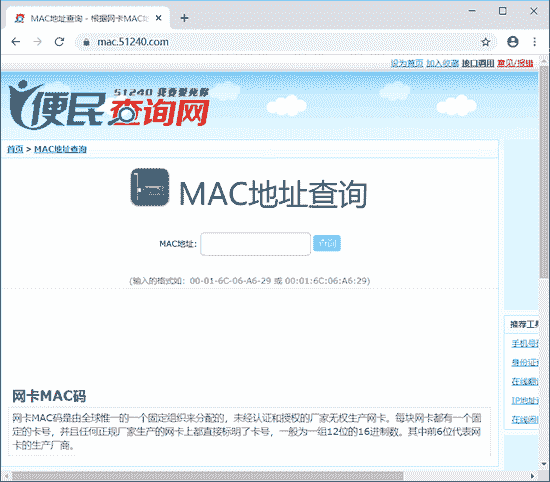
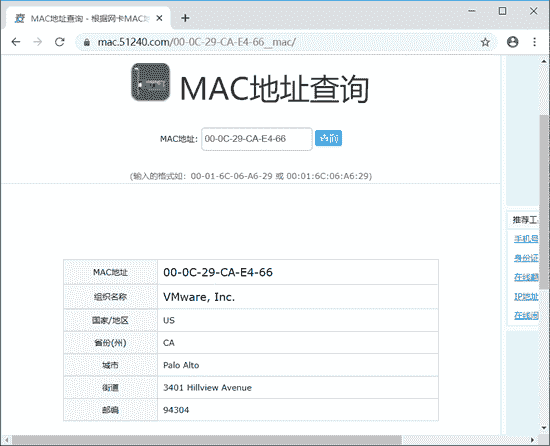

# 物理地址（MAC 地址）是什么？

> 原文：[`c.biancheng.net/view/6382.html`](http://c.biancheng.net/view/6382.html)

物理地址是一种标识符，用来标记网络中的每个设备。同现实生活中收发快递一样，网络内传输的所有数据包都会包含发送方和接收方的物理地址。

由于网络设备对物理地址的处理能力有限，物理地址只在当前局域网内有效。所以，接收方的物理地址都必须存在于当前局域网内，否则会导致发送失败。

MAC 地址的英语是 Media Access Control Address，直译为媒体存取控制位址，也称为局域网地址（LAN Address）、以太网地址（Ethernet Address）或物理地址（Physical Address），它是一个用来确认网络设备位置的位址。

## MAC 地址是预留的

由于数据包中都会包含发送方和接收方的物理地址，数据包从起始地发送到目的地，为了能够正确地将数据包发送出去，就必须要求 MAC 地址具有唯一性。因此 MAC 地址都是由生产厂家在生产时固化在网络硬件中，是硬件预留的地址。

## MAC 地址格式

硬件的 MAC 地址是厂家按照一定的规则，进行设置所产生的，因此，MAC 地址拥有自己的格式。

MAC 地址采用十六进制数表示，共 6 个字节（48 位），长度为 48bit（字节）。整个地址可以分为前 24 位和后 24 位，代表不同的含义。

*   前 24 位称为组织唯一标识符（Organizationally Unique Identifier，OUI），是由 IEEE 的注册管理机构给不同厂家分配的代码，区分了不同的厂家。
*   后 24 位是由厂家自己分配的，称为扩展标识符。同一个厂家生产的网卡中 MAC 地址后 24 位是不同的。

## 查询 MAC 厂商

由于 MAC 地址的前 24 位是生产厂商的标识符，因此可以根据前 24 位标识符判断出硬件的生产厂商和生产地址。用户可以在一些网站上查询，如 [`mac.51240.com/`](http://mac.51240.com/)。

【示例】查询 MAC 地址 00:0C:29:CA:E4:66 所对应的厂商。

1) 在浏览器中输入网址 [`mac.51240.com/`](http://mac.51240.com/)，如图所示。

2) 在“MAC 地址”文本框中输入 MAC 地址 00-0C-29-CA-E4-66。然后单击“查询”按钮，查询结果如图所示。

从上图显示的信息中，可以看到 MAC 地址 00-0C-29-CA-E4-66 的厂商是 VMware，Inc，由此可以推断出这是一台虚拟机设备，并且可以看到厂家对应的省份、街道、邮编等信息。

## 查看网络主机 MAC 地址信息

一个局域网或公司中往往存在多台计算机，这些计算机都有自己的 MAC 地址和 IP 地址。其中，IP 地址是可变的，而 MAC 地址一般是不可变的。为了准确地识别主机，用户可以获取计算机对应的 MAC 地址。

【示例】显示网络主机 MAC 地址信息。

1) 显示局域网中指定主机的 MAC 地址信息。例如，显示主机 192.168.59.133 的 MAC 地址。执行命令如下：

root@daxueba:~# netwox 5 -i 192.168.59.133

输出信息如下：

192.168.59.133       00:0C:29:D0:21:23

输出信息表示主机 192.168.59.133 的 MAC 地址为 00：0C：29：D0：21：23。

2) 显示局域网中所有主机的 MAC 地址，执行命令如下：

root@daxueba:~# netwox 5 -i 192.168.59.0/24

输出所有主机的 MAC 地址如下：

192.168.59.1              00:50:56:C0:00:08
192.168.59.2              00:50:56:EA:F3:A1
192.168.59.131          00:0C:29:CA:E4:66
192.168.59.132          00:0C:29:C4:8A:DE
192.168.59.133          00:0C:29:D0:21:23
192.168.59.254          00:50:56:F0:69:32

以上输出信息显示了局域网中所有启用主机的 IP 地址和对应的 MAC 地址。

3) 在显示局域网中所有主机的 MAC 地址信息时，有时由于暂时没有发现主机，等待较长的时间，也不会有任何输出信息。

为了能够更好地了解当前的进度，可以使用`-u`选项，显示未发现主机的 MAC 地址的信息，进而可以查看扫描进度。执行命令如下：

root@daxueba:~# netwox 5 -i 192.168.59.0/24 -u

输出信息如下：

192.168.59.0            unresolved
192.168.59.1            00:50:56:C0:00:08
192.168.59.2            00:50:56:EA:F3:A1
192.168.59.3            unresolved
…  #省略其他信息
192.168.59.131         00:0C:29:CA:E4:66
192.168.59.132         00:0C:29:C4:8A:DE
192.168.59.133         00:0C:29:D0:21:23
192.168.59.134         unresolved
192.168.59.135         unresolved
…  #省略其他信息
192.168.59.254         00:50:56:F0:69:32
192.168.59.255         unresolved

从输出信息可以看到，程序对局域网中的所有主机进行了扫描，主机 IP 地址为 192.168.59.0 到 192.168.59.255。

如果扫描的主机存在，则给出对应的 MAC 地址；如果主机不存在，则显示为 unresolved。

## 根据 MAC 地址获取主机其他信息

进行数据传输的主机不仅拥有 MAC 地址，还拥有路由器分配的 IP 地址，有的还会有自己的主机名、标题等信息。如果知道了主机的 MAC 地址信息，那么就可以使用 netwox 工具获取该主机的这些信息。

【示例】已知一主机的 MAC 地址为 00:0C:29:CA:E4:66，显示该主机的其他信息。

1) 显示该主机相关信息，执行命令如下：

root@daxueba:~# netwox 4 -e 00:0C:29:CA:E4:66

输出信息如下：

IP address:   192.168.59.131
Hostname:    localhost
Hostnames:   localhost

从输出信息可以看到，该主机的 IP 地址为 192.168.59.131，主机名为 localhost。

2) 如果在显示信息时只想显示 IP 地址信息，可以使用`--ip`选项，执行命令如下：

root@daxueba:~# netwox 4 -e 00:0C:29:CA:E4:66 --ip

输出信息只有 IP 地址信息，如下：

192.168.59.131

3) 如果在显示信息时只想显示主机名信息，可以使用`--host`选项，执行命令如下：

root@daxueba:~# netwox 4 -e 00:0C:29:CA:E4:66 --host

输出信息只有主机名信息，如下：

localhost

4) 如果在显示信息时只想显示标题信息，可以使用`--title`选项，执行命令如下：

root@daxueba:~# netwox 4 -e 00:0C:29:CA:E4:66 --title

执行命令后，如果没有输出信息，表示该主机没有标题信息。