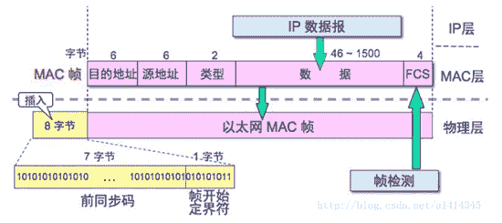
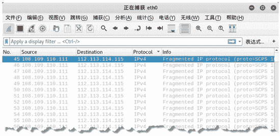

# 以太网数据帧格式（结构）图解

> 原文：[`c.biancheng.net/view/6391.html`](http://c.biancheng.net/view/6391.html)

以太网链路传输的数据包称做以太帧，或者以太网数据帧。在以太网中，网络访问层的软件必须把数据转换成能够通过网络适配器硬件进行传输的格式。

## 以太帧的工作机制

当以太网软件从网络层接收到数据报之后，需要完成如下操作：

1) 根据需要把网际层的数据分解为较小的块，以符合以太网帧数据段的要求。

以太网帧的整体大小必须在 64～1518 字节之间（不包含前导码）。有些系统支持更大的帧，最大可以支持 9000 字节。有些系统支持更大的帧，最大可以支持 9000 字节。

2) 把数据块打包成帧。每一帧都包含数据及其他信息，这些信息是以太网网络适配器处理帧所需要的。

3) 把数据帧传递给对应于 OSI 模型物理层的底层组件，后者把帧转换为比特流，并且通过传输介质发送出去。

4) 以太网上的其他网络适配器接收到这个帧，检查其中的目的地址。如果目的地址与网络适配器的地址相匹配，适配器软件就会处理接收到的帧，把数据传递给协议栈中较高的层。

## 以太帧的结构

以太帧起始部分由前同步码和帧开始定界符组成，后面紧跟着一个以太网报头，以 MAC 地址说明目的地址和源地址。以太帧的中部是该帧负载的包含其他协议报头的数据包，如 IP 协议。

以太帧由一个 32 位冗余校验码结尾，用于检验数据传输是否出现损坏。以太帧结构如图所示。

上图中每个字段的含义如下表所示：

| 字段 | 含义 |
| 前同步码 | 用来使接收端的适配器在接收 MAC 帧时能够迅速调整时钟频率，使它和发送端的频率相同。前同步码为 7 个字节，1 和 0 交替。 |
| 帧开始定界符 | 帧的起始符，为 1 个字节。前 6 位 1 和 0 交替，最后的两个连续的 1 表示告诉接收端适配器：“帧信息要来了，准备接收”。 |
| 目的地址 | 接收帧的网络适配器的物理地址（MAC 地址），为 6 个字节（48 比特）。作用是当网卡接收到一个数据帧时，首先会检查该帧的目的地址，是否与当前适配器的物理地址相同，如果相同，就会进一步处理；如果不同，则直接丢弃。 |
| 源地址 | 发送帧的网络适配器的物理地址（MAC 地址），为 6 个字节（48 比特）。 |
| 类型 | 上层协议的类型。由于上层协议众多，所以在处理数据的时候必须设置该字段，标识数据交付哪个协议处理。例如，字段为 0x0800 时，表示将数据交付给 IP 协议。 |
| 数据 | 也称为效载荷，表示交付给上层的数据。以太网帧数据长度最小为 46 字节，最大为 1500 字节。如果不足 46 字节时，会填充到最小长度。最大值也叫最大传输单元（MTU）。 
在 Linux 中，使用 ifconfig 命令可以查看该值，通常为 1500。 |
| 帧检验序列 FCS | 检测该帧是否出现差错，占 4 个字节（32 比特）。发送方计算帧的循环冗余码校验（CRC）值，把这个值写到帧里。接收方计算机重新计算 CRC，与 FCS 字段的值进行比较。如果两个值不相同，则表示传输过程中发生了数据丢失或改变。这时，就需要重新传输这一帧。 |

## 构建以太帧

通过上面的学习了解了以太帧的结构。用户可以根据需要设置以太帧的字段值，从而构建以太帧。netwox 工具中编号为 32 的模块提供了以太帧构建功能。

【示例】构建以太网数据帧。

1) 查看以太网数据帧，执行命令如下：

root@daxueba:~# netwox 32

输出信息如下：

Ethernet________________________________________________________.
| 00:0C:29:CA:E4:66->00:08:09:0A:0B:0C type:0x0000           |
|____________________________________________________________   |

上述输出信息中的 00:0C:29:CA:E4:66 为源 MAC 地址，是当前主机的 MAC 地址；00:08:09:0A:0B:0C 为目标 MAC 地址，0x0000 为以太网类型。

2) 构建以太帧，设置源 MAC 地址为 00:0c:29:c4:8a:de，目标 MAC 地址为 01:02:03:04:05:06，执行命令如下：

root@daxueba:~# netwox 32 -a 00:0c:29:c4:8a:de -b 01:02:03:04:05:06

输出信息如下：

Ethernet________________________________________________________.
| 00:0C:29:C4:8A:DE->01:02:03:04:05:06 type:0x0000              |
|_____________________________________________________________    |

3) 为了验证构建的以太帧，通过 Wireshark 工具进行抓包。在链路层中可以看到伪造的源 MAC 地址和目标 MAC 地址，信息如下：

Ethernet II, Src: Vmware_c4:8a:de (00:0c:29:c4:8a:de), Dst: Woonsang_04:05:06(01:02:03:04:05:06)

4) 为了不被其他主机发现，在构造数据包时，可以指定假的源 MAC 地址。但是，每构造一次只能发送一个数据包。如果需要发送多个数据包，就需要构造多次。

为了方便，可以使用 macchanger 工具临时修改 MAC 地址，这样就不需要每次构造假的源 MAC 地址了。例如，将当前主机的 MAC 地址修改为 00:0c:29:aa:e0:28，执行命令如下：

Current MAC:         00:0c:29:ca:e4:66 (VMware, Inc.)
Permanent MAC:    00:0c:29:ca:e4:66 (VMware, Inc.)
New MAC:              00:0c:29:aa:e0:28 (VMware, Inc.)

以上输出信息表示当前主机原来的 MAC 地址为 00:0c:29:ca:e4:66，修改后的 MAC 地址为 00:0c:29:aa:e0:28。

5) 再次使用 netwox 工具进行发包，默认使用修改后的 MAC 地址作为源 MAC 地址，如下：

root@daxueba:~# netwox 32

输出信息如下：

Ethernet_________________________________________________
| 00:0C:29:AA:E0:28->00:08:09:0A:0B:0C type:0x0000    |
|_______________________________________________________    |

## 以太帧洪水攻击

交换机为了方便数据传输，通常会存储每个端口所对应的 MAC 地址，形成一张表。当交换机收到计算机发来的以太帧时，就会查看帧中的源 MAC 地址，并查找存储的表：

*   如果表中存在该 MAC 地址，就直接转发数据；
*   如果没有，则将该 MAC 地址存入该表中。

当其他计算机向这个 MAC 地址发送数据时，可以快速决定向哪个端口发送数据。由于该表不可能是无穷大的，所以当达到一定数量时，将不会储存其他新的 MAC 地址。再有新的主机发来数据帧时，部分交换机将不再查找对应的端口，而是以广播的形式转发给所有的端口。这样，就使其他主机可以接收到该数据帧了。

netwox 工具提供编号为 75 的模块，用来实现以太帧洪水攻击功能。它可以伪造大量的以太网数据包，填满交换机的存储表，使交换机失去正确的转发功能。

实施以太帧洪水攻击，执行命令如下：

root@daxueba:~# netwox 75

执行命令后没有任何输出信息，但是会发送大量的以太网数据包。

使用 Wireshark 工具进行抓包，如图所示。图中捕获的数据包为以太帧洪水攻击产生的数据包。

