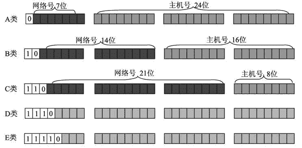

# IP 地址的格式和分类

> 原文：[`c.biancheng.net/view/6407.html`](http://c.biancheng.net/view/6407.html)

在网际层中，利用 IP 地址将数据传输到目的地。为了能够使数据正确地发送到目标主机上，网络上的 IP 地址必须有一定的规则来识别主机的位置。

## IP 地址的基本构成

为了便于寻址，了解目标主机的位置，每个 IP 地址包括两个标识码（ID），即网络 ID 和主机 ID。同一个物理网络上的所有主机都使用同一个网络 ID，网络上的一个主机（包括网络上的工作站、服务器和路由器等）有一个主机 ID 与其对应。

网络 ID 和主机 ID 含义如下：

*   网络 ID：用于识别主机所在的网络，网络 ID 的位数直接决定了可以分配的网络数量。
*   主机 ID：用于识别该网络中的主机，主机 ID 的位数则决定了网络中最大的主机数量。

## IP 地址的分类和格式

大型网络包含大量的主机，而小型网络包含少量的主机。根据用户需求不同，一个网络包含的主机数量也会不同。为了满足不同场景的需要，网络必须使用一种方式来判断 IP 地址中哪一部分是网络 ID，哪一部分是主机 ID。

IP 地址为 32 位地址，被分为 4 个 8 位段。为了方便对 IP 地址的管理，将 IP 地址基本分为三大类，每类地址的分类与含义如下：

*   A 类：前 8 位表示网络 ID，后 24 位表示主机 ID；该地址分配给政府机关单位使用。
*   B 类：前 16 位表示网络 ID，后 16 位表示主机 ID；该地址分配给中等规模的企业使用。
*   C 类：前 24 位表示网络 ID，后 8 位表示主机 ID；该地址分配给任何需要的人使用。

除了上述的 A、B、C 三类地址以外，还有两类隐藏地址，即 D 类地址和 E 类地址：

*   D 类：不分网络 ID 和主机 ID；该地址用于多播。
*   E 类：不分网络 ID 和主机 ID；该地址用于实验。

## 如何判断 IP 地址的分类？

IP 地址被分类以后，如何判断一个 IP 地址是 A 类、B 类还是 C 类地址呢？为了更好地进行区分，将每类地址的开头部分设置为固定数值，如图所示。

从上图中可以看出，每类 IP 地址都是以 32 位的二进制格式显示的，每类地址的区别如下：

*   A 类：网络 ID 的第一位以 0 开始的地址。
*   B 类：网络 ID 的第一位以 10 开始的地址。
*   C 类：网络 ID 的第一位以 110 开始的地址。
*   D 类：地址以 1110 开始的地址。
*   E 类：地址以 11110 开始的地址。

## 不同分类的 IP 地址的范围

由于每类地址的开头是固定的，因此每类地址都有自己的范围：

*   A 类：IP 地址范围为 0.0.0.0～127.255.255.255。
*   B 类：IP 地址范围为 128.0.0.0～191.255.255.255。
*   C 类：IP 地址范围为 192.0.0.0～223.255.255.255。
*   D 类：IP 地址范围为 224.0.0.0～239.255.255.255。
*   E 类：IP 地址范围为 240.0.0.0～255.255.255.254。

## 特殊 IP 地址

在进行 IP 地址分配时，有一些 IP 地址具有特殊含义，不会分配给互联网的主机。例如，保留了一些 IP 地址范围，用于私有网络，这些地址被称为私有地址。再如，保留一部分地址用于测试，被称为保留地址。

A 类、B 类、C 类地址的地址范围及含义如下：

1) A 类地址

*   私有地址范围为 10.0.0.0～10.255.255.255。
*   保留地址范围为 127.0.0.0～127.255.255.255。

2) B 类地址

*   私有地址范围为 172.16.0.0～172.31.255.255。
*   保留地址为 169.254.X.X。

3) C 类地址

*   私有地址范围为 192.168.0.0～192.168.255.255。

## 子网划分

数据在网络中进行传输是通过识别 IP 地址中的网络 ID，从而将数据发送到正确的网络中，然后再根据主机 ID 将数据发送到目标主机上。

如果一个网络中包含了百万台主机，数据通过网关找到对应的网络后，很难快速地发送到目标主机上。为了能够在大型网络中实现更高效的数据传输，需要进行子网划分，将网络划分为更小的网络。

子网划分是将 IP 地址的主机 ID 部分划分为子网 ID 和主机 ID。其中，子网 ID 用来寻找网络内的子网，主机 ID 用来寻找子网中的主机。

子网掩码则是用来指明地址中多少位用于子网 ID，保留多少位用于实际的主机 ID。