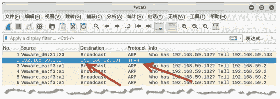
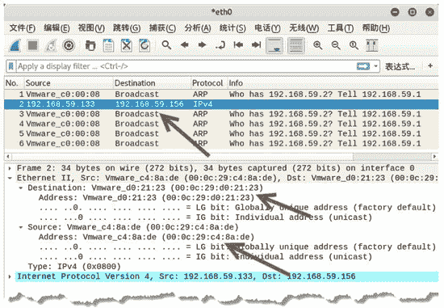
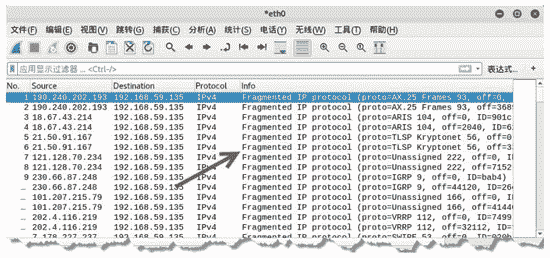

# 使用 netwox 构造 IP 数据包

> 原文：[`c.biancheng.net/view/6387.html`](http://c.biancheng.net/view/6387.html)

为了更好地掌握 IP 协议，下面使用 netwox 工具提供的模块来构建各种 IP 数据包。

## 构建 IP 数据包

netwox 工具提供编号为 38 的模块，用来构造 IP 数据包。用户不仅可以设置源 IP 地址和目标 IP 地址，还可以设置 TTL、数据分片等字段。

【示例】构造 IP 数据包。

1) 不指定选项，直接运行该模块。执行命令如下：

root@daxueba:~# netwox 38

输出信息如下：

```

IP______________________________________________________________.
|version|  ihl  |      tos      |             totlen            |
|___4___|___5___|____0x00=0_____|___________0x0014=20___________|
|              id               |r|D|M|       offsetfra         |
|_________0x87D6=34774__________|0|0|0|________0x0000=0_________|
|      ttl      |    protocol   |           checksum            |
|____0x00=0_____|____0x00=0_____|____________0x2ADB_____________|
|                            source                             |
|________________________192.168.59.131_________________________|
|                          destination                          |
|____________________________5.6.7.8____________________________|
```

在输出信息中，第一行 IP 表示当前数据包是基于 IP 协议的。包中的字段值均为默认值。例如，源 IP 地址为 192.168.59.131，目的 IP 地址为 5.6.7.8。

2) 指定源 IP 地址为 192.168.59.132，目标 IP 地址为 192.168.12.101。执行命令如下：

root@daxueba:~# netwox 38 -l 192.168.59.132 -m 192.168.12.101

输出信息如下：

```

IP______________________________________________________________.
|version|  ihl  |      tos       |            totlen             |
|___4___|___5___|____0x00=0_____ |___________0x0014=20___________|
|              id                |r|D|M|       offsetfrag        |
|__________0x1B26=6950__________ |0|0|0|________0x0000=0_________|
|      ttl      |   protocol     |           checksum            |
|____0x00=0_____|____0x00=0_____ |____________0xD68A_____________|
|                            source                              |
|________________________192.168.59.132_________________________ |
|                          destination                           |
|________________________192.168.12.101_________________________ |
```

从上述输出信息中可看出，源 IP 地址由原来的 192.168.59.131 变为了 192.168.59.132，目的 IP 地址由原来的 5.6.7.8 变为了 192.168.12.101。

3) 通过抓包，验证构造的 IP 数据包。捕获到的数据包如图所示。其中，第 2 个 数据包为构造的数据包。源 IP 地址为 192.168.59.132，目标 IP 地址为 192.168.12.101，协议为 IPv4。



## 基于 Ethernet 层构造 IP 数据包

netwox 工具提供编号为 34 的模块，用于指定 IP 数据报的以太层字段信息。

【示例】指定 IP 数据报的以太层字段信息。

1) 不指定选项，直接运行该模块，查看默认设置。执行命令如下：

root@daxueba:~# netwox 34

输出信息如下：

```

Ethernet________________________________________________________.
| 00:0C:29:CA:E4:66->00:08:09:0A:0B:0C type:0x0800              |
|_______________________________________________________________|
IP______________________________________________________________.
|version|  ihl  |      tos      |            totlen             |
|___4___|___5___|____0x00=0_____|___________0x0014=20__________ |
|              id                     |r|D|M|       offsetfrag  |
|_________0xE1C2=57794________  |0|0|0|________0x0000=0_________|
|      ttl      |   protocol    |           checksum            |
|____0x00=0_____|____0x00=0_____|____________0xD0EE_____________|
|                            source                             |
|________________________192.168.59.131_________________________|
|                          destination                          |
|____________________________5.6.7.8____________________________|
```

在输出信息中，第一行 Ethernet 表示当前数据包的以太网层字段信息。这些字段值均为默认值。例如，当前以太网的源 MAC 地址为 00：0C：29：CA：E4：66，目标 MAC 地址为 00：08：09：0A：0B：0C。

2) 指定以太网的源 MAC 地址和目标 MAC 地址。设置源 MAC 地址为 00：0C：29：C4：8A：DE，目标 MAC 地址为 00：0C：29：D0：21：23，目标 IP 地址为 192.168.59.156。

执行命令如下：

root@daxueba:~# netwox 34 -a 00:0C:29:C4:8A:DE -b 00:0C:29:D0:21:23

输出信息如下：

```

Ethernet________________________________________________________.
| 00:0C:29:C4:8A:DE->00:0C:29:D0:21:23 type:0x0800                   |
|_______________________________________________________________     |
IP______________________________________________________________.
|version|  ihl  |      tos      |            totlen                  |
|___4___|___5___|____0x00=0_____|___________0x0014=20___________     |
|              id                       |r|D|M|       offsetfrag     |
|_________0x6983=27011__________|0|0|0|________0x0000=0_________     |
|      ttl      |   protocol    |           checksum                 |
|____0x00=0_____|____0x00=0_____|____________0x492E_____________     |
|                                   source                           |
|____________________________192.168.59.131_________________________ |
|                                destination                         |
|____________________________192.168.59.156__________________________|
```

从输出信息可以看到，以太网的 MAC 地址由原来的 00：0C：29：CA：E4：66 变为了 00：0C：29：C4：8A：DE，目标 MAC 地址由原来的 00：08：09：0A：0B：0C 变为了 00：0C：29：D0：21：23。

3) 验证构造的数据包，使用 Wireshark 工具捕获数据包，如图所示。其中，第 2 个数据包为构造的 IPv4 数据包。在 Ethernet II 部分中，源 MAC 地址为指定的 00：0C：29：c4：8a：de，目标 MAC 地址为指定的 00：0c：29：d0：21：23。



## 利用分片实施洪水攻击

IP 协议在传输数据包时，经常会进行分片传输。例如，当一个设备准备传输一个 IP 数据包时，它将首先获取这个数据包的大小，然后获取发送数据包所使用的网络接口的最大传输单元值（MTU）。如果数据包的大小大于 MTU，则该数据包将被分片。

将一个数据包分片包括下面几步：

1.  设备将数据包分为若干个可成功进行传输的数据包。
2.  每个 IP 数据包的首部的总长度域会被设置为每个分片的片段长度。
3.  更多分片标志将会在数据流的所有数据包中设置为 1，除了最后一个数据包。
4.  IP 数据包头中分片部分的分片偏移将会被设置。
5.  数据包被发送出去。

目标主机收到分片包后，会根据分片信息重组报文。如果发送大量的无效 IP 分片包，会造成洪水攻击。用户可以使用 netwox 工具中编号为 74 的模块实施洪水攻击。

已知目标主机 IP 地址为 192.168.59.135，使用 netwox 工具向目标主机发送大量的 IP 分片实施洪水攻击，执行命令如下：

root@daxueba:~# netwox 74 -i 192.168.59.135

执行命令后没有任何输出信息，但是会向目标主机发送大量的 IP 分片数据包。如果使用 Wireshark 工具抓包，可以捕获到大量的 IP 分片数据包，如图所示。

图中显示了大量的 IPv4 数据包，Info 列中的 Fragmented IP protocol 信息表示数据包为 IP 分片数据包。