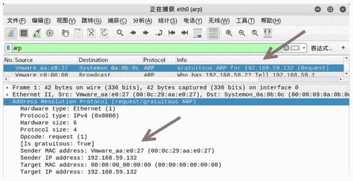

# ARP 报文格式详解

> 原文：[`c.biancheng.net/view/6389.html`](http://c.biancheng.net/view/6389.html)

ARP 协议包（ARP 报文）主要分为 ARP 请求包和 ARP 响应包，本节将介绍 ARP 协议包的格式。

## ARP 报文格式

ARP 协议是通过报文进行工作的，ARP 报文格式如图所示。ARP 报文总长度为 28 字节，MAC 地址长度为 6 字节，IP 地址长度为 4 字节。

其中，每个字段的含义如下。

*   硬件类型：指明了发送方想知道的硬件接口类型，以太网的值为 1。
*   协议类型：表示要映射的协议地址类型。它的值为 0x0800，表示 IP 地址。
*   硬件地址长度和协议长度：分别指出硬件地址和协议的长度，以字节为单位。对于以太网上 IP 地址的 ARP 请求或应答来说，它们的值分别为 6 和 4。
*   操作类型：用来表示这个报文的类型，ARP 请求为 1，ARP 响应为 2，RARP 请求为 3，RARP 响应为 4。
*   发送方 MAC 地址：发送方设备的硬件地址。
*   发送方 IP 地址：发送方设备的 IP 地址。
*   目标 MAC 地址：接收方设备的硬件地址。
*   目标 IP 地址：接收方设备的 IP 地址。

ARP 数据包分为请求包和响应包，对应报文中的某些字段值也有所不同。

*   ARP 请求包报文的操作类型（op）字段的值为 request(1)，目标 MAC 地址字段的值为 Target 00：00：00_00：00：00(00：00：00：00：00：00)（广播地址）。
*   ARP 响应包报文中操作类型（op）字段的值为 reply(2)，目标 MAC 地址字段的值为目标主机的硬件地址。

## 构造 ARP 报文

ARP 报文默认由操作系统自动发送。用户可以自己构造 ARP 报文，向目标主机发送请求，从而获取目标主机的 MAC 地址。这时，可以使用 netwox 工具提供的编号为 33 的模块。

【示例】使用 netwox 工具构造 ARP 包。

1) 查看 netwox 所在主机默认的 ARP 包的相关信息，执行命令如下：

root@daxueba:~# netwox 33

输出信息如下：

```

Ethernet________________________________________________________.
| 50:E5:49:EB:46:8D->00:08:09:0A:0B:0C type:0x0806              |
|_______________________________________________________________|
ARP Request_____________________________________________________.
| this address : 50:E5:49:EB:46:8D 0.0.0.0                      |
| asks         : 00:00:00:00:00:00 0.0.0.0                      |
|_______________________________________________________________|
```

上述输出信息中，Ethernet 部分为以太网信息。ARP Request 部分为 ARP 请求。this address 表示源地址信息。其中，50：E5：49：EB：46：8D 为源主机 MAC 地址；asks 为目标地址信息，这里为 ARP 请求包。由于还没有构造请求，因此地址为 0。

2) 构造 ARP 请求包，请求目标主机 192.168.12.102，执行命令如下：

root@kali:~# netwox 33 -i 192.168.12.102

输出信息如下：

```

Ethernet________________________________________________________.
| 50:E5:49:EB:46:8D->00:08:09:0A:0B:0C type:0x0806              |
|_______________________________________________________________|
ARP Request_____________________________________________________.
| this address : 50:E5:49:EB:46:8D 0.0.0.0                      |
| asks         : 00:00:00:00:00:00 192.168.12.102               |
|_______________________________________________________________|
```

此时，ARP Request 部分 asks 中的 00：00：00：00：00：00 为目标 MAC 地址，因为正在请求目标主机的 MAC 地址，所以为 00：00：00：00：00：00。

192.168.12.102 为目标主机的 IP 地址，表示向该主机进行 ARP 请求。

3) 为了验证构造的 ARP 请求包，使用 Wireshark 进行抓包，如图所示。


 其中，第一个数据包为构造的 ARP 请求包。在 Address Resolution Protocol(request) 部分中，Opcode 的值为 request(1)，表示该数据包为 ARP 请求包；Target MAC address 的值为 00：00：00_00：00：00(00：00：00：00：00：00)，表示此时没有获取目标 MAC 地址；Target IP address 的值 192.168.12.102，表示请求主机的 IP 地址。

4) 如果请求的目标主机存在，将成功返回 ARP 响应数据包，如图所示。


其中，第 2 个数据包为 ARP 响应数据包。在 Address Resolution Protocol(reply) 部分中，Opcode 的值为 reply(2)，表示该数据包为 ARP 响应包；Sender IP address 的值为 192.168.12.102，表示此时源主机为目标主机；Sender MAC address 的值为 Giga-Byt_17：cf：21(50：e5：49：17：cf：21)，表示 50：e5：49：17：cf：21 为目标主机 192.168.12.102 的 MAC 地址。

## 免费 ARP 包

免费 ARP（Gratuitous ARP）包是一种特殊的 ARP 请求，它并非期待得到 IP 对应的 MAC 地址，而是当主机启动的时候，发送一个 Gratuitous ARP 请求，即请求自己的 IP 地址的 MAC 地址。

本节将介绍免费 ARP 包的结构、作用，以及如何发送免费 ARP 包。

#### 免费 ARP 包的结构

免费 ARP 报文与普通 ARP 请求报文的区别在于报文中的目标 IP 地址。普通 ARP 报文中的目标 IP 地址是其他主机的 IP 地址；而免费 ARP 的请求报文中，目标 IP 地址是自己的 IP 地址。

#### 作用

*   免费 ARP 数据包有以下 3 个作用。
*   该类型报文起到一个宣告作用。它以广播的形式将数据包发送出去，不需要得到回应，只为了告诉其他计算机自己的 IP 地址和 MAC 地址。
*   可用于检测 IP 地址冲突。当一台主机发送了免费 ARP 请求报文后，如果收到了 ARP 响应报文，则说明网络内已经存在使用该 IP 地址的主机。
*   可用于更新其他主机的 ARP 缓存表。如果该主机更换了网卡，而其他主机的 ARP 缓存表仍然保留着原来的 MAC 地址。这时，可以发送免费的 ARP 数据包。其他主机收到该数据包后，将更新 ARP 缓存表，将原来的 MAC 地址替换为新的 MAC 地址。

#### 构造免费 ARP 包

用户可以使用 netwox 工具中编号为 33 的模块构造免费的 ARP 数据包。

构造免费的 ARP 数据包。

1) 构造免费的 ARP 数据包，设置源 IP 地址和目标 IP 地址为 192.168.59.132，执行命令如下：

root@daxueba:~# netwox 33 -g 192.168.59.132 -i 192.168.59.132

输出信息如下：

Ethernet________________________________________________________.
| 00:0C:29:AA:E0:27->00:08:09:0A:0B:0C type:0x0806               |
|_______________________________________________________________   |
ARP Request_____________________________________________________.
| this address : 00:0C:29:AA:E0:27 192.168.59.132                     |
| asks         : 00:00:00:00:00:00 192.168.59.132                           |
|_______________________________________________________________   |

2) 使用 Wireshark 进行抓包，验证构造的免费 ARP 数据包，如图所示。


其中，第一个数据包的 Info 列显示 Gratuitous ARP for 192.168.59.132(Request)，表示该数据包为构造的免费 ARP 数据包。

在 Address Resolution Protocol(request/gratuitous ARP) 部分中，Sender IP address 和 Target IP address 的值为同一个 IP 地址 192.168.59.132。