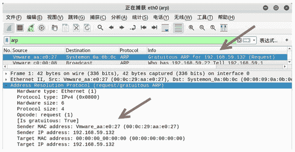

# 免费 ARP 详解

> 原文：[`c.biancheng.net/view/6420.html`](http://c.biancheng.net/view/6420.html)

免费 ARP（Gratuitous ARP）包是一种特殊的 ARP 请求，它并非期待得到 IP 对应的 MAC 地址，而是当主机启动的时候，发送一个 Gratuitous ARP 请求，即请求自己的 IP 地址的 MAC 地址。

## 免费 ARP 包的结构

免费 ARP 报文与普通 ARP 请求报文的区别在于报文中的目标 IP 地址。普通 ARP 报文中的目标 IP 地址是其他主机的 IP 地址；而免费 ARP 的请求报文中，目标 IP 地址是自己的 IP 地址。

## 免费 ARP 的作用

免费 ARP 数据包有以下 3 个作用：

*   该类型报文起到一个宣告作用。它以广播的形式将数据包发送出去，不需要得到回应，只为了告诉其他计算机自己的 IP 地址和 MAC 地址。
*   可用于检测 IP 地址冲突。当一台主机发送了免费 ARP 请求报文后，如果收到了 ARP 响应报文，则说明网络内已经存在使用该 IP 地址的主机。
*   可用于更新其他主机的 ARP 缓存表。如果该主机更换了网卡，而其他主机的 ARP 缓存表仍然保留着原来的 MAC 地址。这时，可以发送免费的 ARP 数据包。其他主机收到该数据包后，将更新 ARP 缓存表，将原来的 MAC 地址替换为新的 MAC 地址。

## 构造免费 ARP 包

用户可以使用 netwox 工具中编号为 33 的模块构造免费的 ARP 数据包。

【示例】构造免费的 ARP 数据包。

1) 构造免费的 ARP 数据包，设置源 IP 地址和目标 IP 地址为 192.168.59.132，执行命令如下：

root@daxueba:~# netwox 33 -g 192.168.59.132 -i 192.168.59.132

输出信息如下：

```

Ethernet________________________________________________________.
| 00:0C:29:AA:E0:27->00:08:09:0A:0B:0C type:0x0806              |
|_______________________________________________________________|
ARP Request_____________________________________________________.
| this address : 00:0C:29:AA:E0:27 192.168.59.132               |
| asks         : 00:00:00:00:00:00 192.168.59.132               |
|_______________________________________________________________|
```

2) 使用 Wireshark 进行抓包，验证构造的免费 ARP 数据包，如图所示。


其中，第一个数据包的 Info 列显示 Gratuitous ARP for 192.168.59.132(Request)，表示该数据包为构造的免费 ARP 数据包。

在 Address Resolution Protocol(request/gratuitous ARP) 部分中，Sender IP address 和 Target IP address 的值为同一个 IP 地址 192.168.59.132。