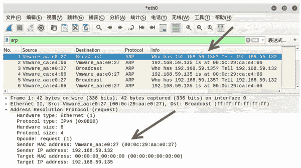
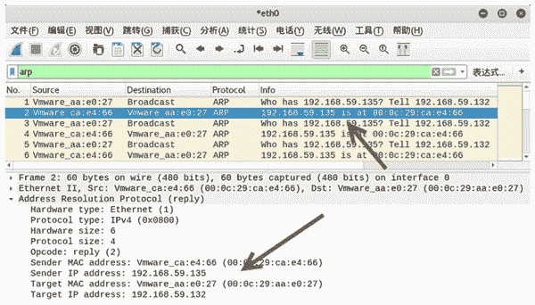
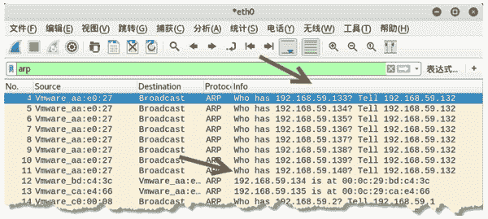
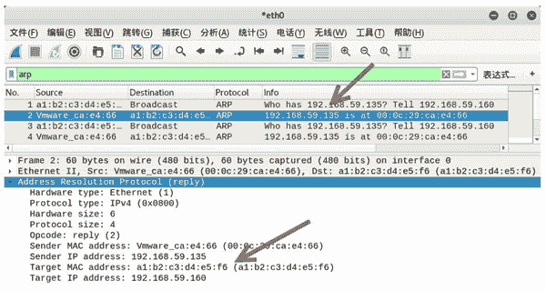
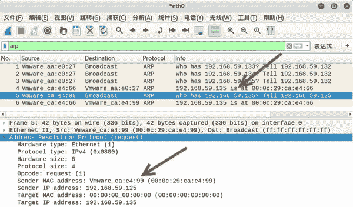
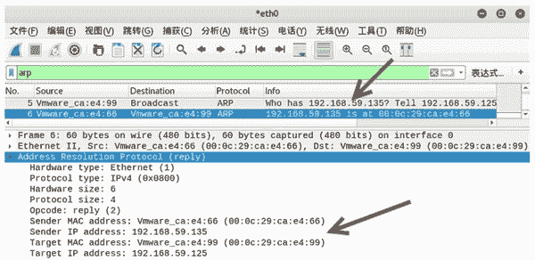

# 基于 ARP 协议进行扫描

> 原文：[`c.biancheng.net/view/6390.html`](http://c.biancheng.net/view/6390.html)

ARP 协议是根据目标主机的 IP 地址获取对应的 MAC 地址。如果目标主机存在，将返回 MAC 地址。利用这一点，用户可以基于 ARP 协议对目标主机进行扫描，来判断目标主机是否启用。

## 扫描单一主机

如果用户想判断一个主机是否启用，可以使用 netwox 工具中编号为 55 的模块对目标主机进行 ARP 协议扫描。

【示例】判断主机 192.168.59.135 是否启用。

1) 查看 netwox 所在主机的 IP 地址，执行命令如下：

root@daxueba:~# ifconfig

输出信息如下：

eth0: flags=4163<UP,BROADCAST,RUNNING,MULTICAST>  mtu 1500
    inet 192.168.59.132  netmask 255.255.255.0  broadcast 192.168.59.255
    inet6 fd15:4ba5:5a2b:1008:20c:29ff:feaa:e027  prefixlen 64  scopeid
    0x0<global>
    inet6 fd15:4ba5:5a2b:1008:b95e:f970:dff4:789  prefixlen 64  scopeid
    0x0<global>
    inet6 fe80::20c:29ff:feaa:e027  prefixlen 64  scopeid 0x20<link>
    ether 00:0c:29:aa:e0:27  txqueuelen 1000  (Ethernet)
    RX packets 28796  bytes 21695251 (20.6 MiB)
    RX errors 0  dropped 0  overruns 0  frame 0
    TX packets 7210  bytes 552808 (539.8 KiB)
    TX errors 0  dropped 0 overruns 0  carrier 0  collisions 0

从输出信息可以了解到，netwox 所在主机的 IP 地址为 192.168.59.132，MAC 地址为 00：0c：29：aa：e0：27。

2) 验证目标主机是否启用，执行命令如下：

root@daxueba:~# netwox 55 -i 192.168.59.135

输出信息如下：

Ok
Ok
Ok
Ok
Ok
Ok
…  #省略其他信息

输出信息在持续地显示 OK，表示持续不断地向目标主机进行了扫描。其中，OK 代表目标主机已启用。如果目标主机未启用将不会有任何输出信息。

3) 为了验证 ARP 协议扫描，可以通过 Wireshark 进行抓包，如图所示。

其中，第 1~6 个数据包是对目标主机进行扫描时产生的 ARP 数据包。第 1、3、5 个数据包为 ARP 请求数据包，第 2、4、6 个数据包为 ARP 响应数据包。

选择任意一个请求数据包，Address Resolution Protocol(request) 部分的源 IP 地址和 MAC 地址正好为 netwox 主机的地址，目标 IP 地址为扫描的目标主机地址。此时，目标 MAC 地址为 0，表示在向目标主机发送了 ARP 请求数据包。

4) 选择任意一个 ARP 响应包，查看信息，如图所示。

这里，选择的是第 2 个数据包。在 Address Resolution Protocol(reply) 部分中，源 IP 地址和 MAC 地址为目标主机的地址；目标 IP 地址和 MAC 地址为 netwox 主机的地址，表示目标主机成功向 netwox 主机返回了响应。

## 扫描多个主机

有时用户需要判断多个主机的启用情况，使用上述的扫描方式需要分别对每个主机进行扫描，这样比较费时。这时，可以使用 netwox 工具中编号为 71 的模块进行扫描。如果主机启用，则返回对应的 MAC 地址。

【示例】判断主机 192.168.59.133-192.168.59.140 的启用情况。

1) 扫描多个主机，执行命令如下：

root@daxueba:~# netwox 71 -i 192.168.59.133,192.168.59.134,192.168.59.135,192\. 168.59.136,192.168.59.137,192.168.59.138,192.168.59.139,192.168.59.140

输出信息如下：

192.168.59.134 : 00:0C:29:BD:C4:3C
192.168.59.135 : 00:0C:29:CA:E4:66
192.168.59.133 : unreached
192.168.59.136 : unreached
192.168.59.137 : unreached
192.168.59.138 : unreached
192.168.59.139 : unreached
192.168.59.140 : unreached

以上输出信息显示了对主机 192.168.59.133～192.168.59.140 进行了扫描。

如果主机已启用，将给出对应的 MAC 地址，如主机 192.168.59.135 的 MAC 地址 00：0C：29：CA：E4：66；如果主机是未启用的，将给出 unreached，如主机 192.168.59.133 是未启用的。

2) 为了验证扫描过程，使用 Wireshark 工具进行抓包，如图所示。

其中，第 4～11 个数据包分别为对每个主机进行了 ARP 请求。其中，第 5 个数据包和第 6 个数据包为对主机 192.168.59.134 和 192.168.59.135 发送的 ARP 请求，并得到了 ARP 响应包。

第 12 个和第 13 个数据包说明这两个主机是启用状态。

## 隐蔽扫描

在判断目标主机是否存在时，为了避免被发现，用户可以使用 netwox 工具中编号为 56 和 72 的模块来伪造地址信息。这样，即使被发现，对方获取的也是一个假的地址信息。

【示例】已知 netwox 所在主机的 IP 地址为 192.168.59.132，对单一主机扫描，并伪造地址信息。

例如，判断目标主机 192.168.59.135 是否启用。具体步骤如下：

1) 伪造虚假地址，设置 IP 地址为 192.168.59.160，MAC 地址为 A1：B2：C3：D4：E5：F6，验证目标主机 192.168.59.135 是否启用，执行命令如下：

root@daxueba:~# netwox 56 -i 192.168.59.135 -I 192.168.59.160 -E A1:B2:C3:D4:E5:F6

扫描结果如下：

Ok
Ok
Ok
Ok
Ok
Ok
…  #省略其他信息

2) 通过捕获数据包验证是否伪造了地址，捕获的数据包如图所示。

其中，第一个数据包为 ARP 请求数据包。其中，源 IP 地址为伪造的 192.168.59.160，MAC 地址也是伪造的 a1：b2：c3：d4：e5：f6。

3) 选择任意一个响应包，查看地址信息，如图所示。

其中，第 2 个数据包为对应的 ARP 响应包，可以看到成功返回了目标主机的 MAC 地址。但是，响应包中的目标地址为伪造的地址信息，而不是 netwox 主机真实的地址。

【示例】已知 netwox 所在主机的 IP 地址为 192.168.59.132，对多台主机扫描伪造地址信息。

例如，判断目标主机 192.168.59.133-192.168.59.135 的启用情况。具体步骤如下：

1) 设置扫描主机的假 IP 地址为 192.168.59.125，MAC 地址为 00：0c：29：ca：e4：99，验证多个目标主机是否启用，执行命令如下：

root@daxueba:~# netwox 72 -i 192.168.59.133,192.168.59.134,192.168.59.135
-E 00:0c:29:ca:e4:99 -I 192.168.59.125

输出信息如下：

Warning : Eth address needed to reach 192.168.59.133 is unknown
Warning : Eth address needed to reach 192.168.59.134 is unknown
192.168.59.135 : 00:0C:29:CA:E4:66

以上输出信息表示主机 192.168.59.135 是启用的，主机 192.168.59.133 和 192.168.59.134 未启用。

2) 如果主机是启用的，捕获的数据包的地址信息将是伪造的地址信息，如图所示。

其中，第 5 个数据包为 ARP 请求包，可以看到请求的目标 IP 地址为 192.168.59.135（目标主机），源 IP 地址为 192.168.59.125，而不是真正的 192.168.59.132；MAC 地址为 00：0c：29：ca：e4：99，也是伪造的。

3) 查看响应包，如图所示。

其中，第 6 个数据包为对应的 ARP 响应包，可以看到目标 IP 地址和 MAC 地址为伪造的地址，而不是真实的 netwox 主机的地址。