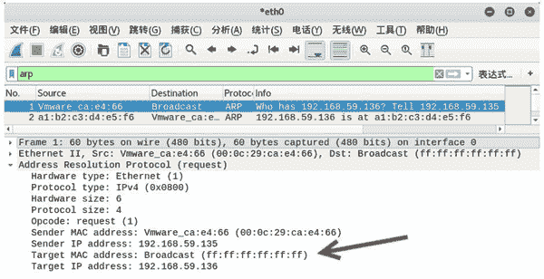
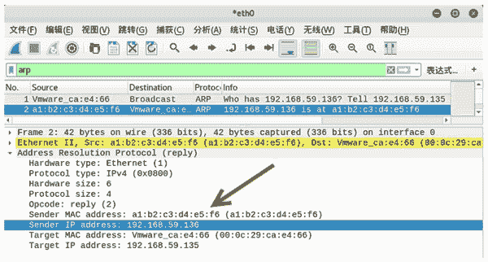

# 如何伪造 ARP 响应？

> 原文：[`c.biancheng.net/view/6396.html`](http://c.biancheng.net/view/6396.html)

正常情况下，向目标主机发送 ARP 请求，如果主机存在，将会得到一个 ARP 响应；如果主机不存在，将不会得到 AR P 响应。

伪造 ARP 响应是指伪造一个不存在的主机的 ARP 响应。例如，黑客在攻击局域网中的主机时，会扫描局域网中的所有主机，然后对发现的主机实施攻击。如果伪造了 ARP 响应包，会误导黑客以为扫描到的主机是存在的，从而起到了迷惑作用。

伪造 ARP 响应需要使用 netwox 工具中编号为 73 的模块。

【示例】以主机 A 为基础实施伪造 ARP 响应，伪造模拟主机 192.168.59.136，其 MAC 地址为 A1：B2：C3：D4：E5：F6。已知局域网中另一主机为主机 B，其 IP 地址为 192.168.59.135。具体步骤如下：

1) 在模拟之前，验证局域网中是否存在主机 192.168.59.136。在主机 B 上使用 arping 命令 ping 该主机。执行命令如下：

root@daxueba:~# arping 192.168.59.136

输出信息如下：

ARPING 192.168.59.136 from 192.168.59.135 eth0

没有任何输出信息，表示主机 192.168.59.136 不存在。

2) 在主机 A 上伪造 ARP 响应，创建虚拟主机 192.168.59.136，设置其 MAC 地址为 A1：B2：C3：D4：E5：F6。执行命令如下：

root@daxueba:~# netwox 73 -i 192.168.59.136 -e A1:B2:C3:D4:E5:F6

执行命令后没有任何输出信息，但是成功创建模拟的主机 192.168.59.136。

3) 再次在主机 B 上使用 arping 命令 ping 该主机。执行命令如下：

root@daxueba:~# arping 192.168.59.136

输出信息如下：

ARPING 192.168.59.136 from 192.168.59.135 eth0
Unicast reply from 192.168.59.136 [A1:B2:C3:D4:E5:F6]  56.346ms
Unicast reply from 192.168.59.136 [A1:B2:C3:D4:E5:F6]  35.184ms
Unicast reply from 192.168.59.136 [A1:B2:C3:D4:E5:F6]  50.823ms
Unicast reply from 192.168.59.136 [A1:B2:C3:D4:E5:F6]  46.639ms

以上输出信息表示已经成功向主机 192.168.59.136 发出 arping 命令，并得到了对应的 MAC 地址 A1：B2：C3：D4：E5：F6，表示该主机是存在的。

4) 为了验证整个过程，捕获数据包进行查看，如图所示。

其中，第 1 个数据包为 ARP 请求包，可以看到源 IP 地址为 192.168.59.135（主机 B），目标 IP 地址为 192.168.59.136（虚拟主机）。这说明的确向虚拟主机发送了 ARP 请求。

5) 查看对应的响应包，如图所示。

其中，第 2 个数据包为 ARP 响应包，可以看到源 IP 地址为 192.168.59.136（虚拟主机的），目标主机的 IP 地址为 192.168.59.135（主机 B），源 MAC 地址为 a1：b2：c3：d4：e5：f6（假的），目标 MAC 地址为 00：0c：29：ca：e4：66（主机 B）。这说明虚拟主机成功给主机 B 返回了响应。