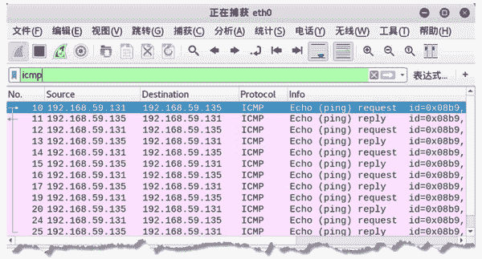

# ping 命令检测远程主机是否可用

> 原文：[`c.biancheng.net/view/6400.html`](http://c.biancheng.net/view/6400.html)

如要向目标主机发送数据包，首先需要确保目标主机是启用的；ICMP 协议可以用来探测主机，以判断主机是否启用。

ping 命令就是借助 ICMP 传输协议，发出要求回应的 Echo(ping)request 消息。若远端主机的网络功能没有问题，就会回应 Echo(ping)reply 信息，因而得知该主机运作正常。因此用户可以通过 ping 命令来判断目标主机是否启用。

【实例】判断目标主机 192.168.59.135 是否启用。

1) 使用 ping 命令探测目标主机，执行命令如下：

root@daxueba:~# ping 192.168.59.135

输出信息如下：

PING 192.168.59.135 (192.168.59.135) 56(84) bytes of data.
64 bytes from 192.168.59.135: icmp_seq=1 ttl=64 time=0.683 ms
64 bytes from 192.168.59.135: icmp_seq=2 ttl=64 time=2.10 ms
64 bytes from 192.168.59.135: icmp_seq=3 ttl=64 time=0.291 ms
64 bytes from 192.168.59.135: icmp_seq=4 ttl=64 time=0.283 ms
64 bytes from 192.168.59.135: icmp_seq=5 ttl=64 time=0.339 ms

上述输出信息表示，成功向目标主机发送了 ping 请求并得到了响应时间，这表示目标主机已启用。

如果目标主机未启用将显示以下信息：

PING 192.168.59.135 (192.168.59.135) 56(84) bytes of data.
From 192.168.59.132 icmp_seq=1 Destination Host Unreachable
From 192.168.59.132 icmp_seq=2 Destination Host Unreachable
From 192.168.59.132 icmp_seq=3 Destination Host Unreachable
From 192.168.59.132 icmp_seq=4 Destination Host Unreachable
From 192.168.59.132 icmp_seq=5 Destination Host Unreachable

2) 通过 Wireshark 捕获数据包，验证 ping 命令所产生的 ICMP 数据包，如图所示。

图中第 10～25 个数据包都为 ICMP 数据包。从图中还可以看到 ping 命令发出的 ICMP 请求 Echo(ping)request 与 ICMP 响应 Echo(ping)reply。