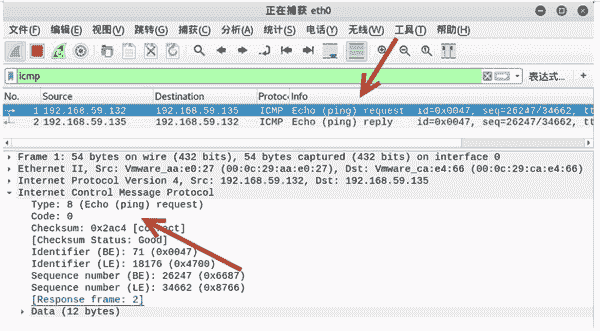
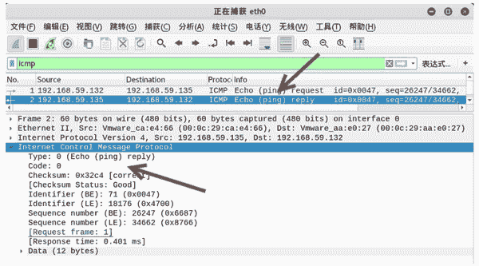

# 构造 ICMP 数据包

> 原文：[`c.biancheng.net/view/6401.html`](http://c.biancheng.net/view/6401.html)

ICMP 协议可以用来对目标主机发送 ICMP 数据包，判断目标主机是否启用。

正常情况下，ICMP 请求包报文中的类型值为 8，代码值为 0；ICMP 响应包报文中的类型值为 0，代码值为 0。

用户可以使用 netwox 工具的编号 65 的模块构造 ICMP 数据包，并对目标主机进行扫描。

【实例】在主机 192.168.59.132 上，构造 ICMP 数据包，判断目标主机 192.168.59.135 是否启用。

1) 构造 ICMP 扫描，执行命令如下：

root@daxueba:~# netwox 65 -i 192.168.59.135

输出信息如下：

192.168.59.135 : reached

在输出信息中，reached 表示目标主机可达。这说明目标主机是启用状态。

如果目标主机没有启用，则显示如下信息，其中，unreached 表示不可达。

192.168.59.139 : unreached

2) 为了验证以上构造的 ICMP 数据包，使用 Wireshark 工具进行捕获数据包，如图所示。

其中，第 1 个数据包的源 IP 地址为 192.168.59.132，目标 IP 地址为 192.168.59.135，Info 显示这是一个 ICMP 请求包。

在 Internet Control Message Protocol 部分中，Type 的值为 8，Code 的值为 0，表示该数据包为正常的 ICMP 请求包。

3) 查看第 2 个数据包，如图所示。

该数据包的源 IP 地址为 192.168.59.135，目标 IP 地址为 192.168.59.132，这是第 1 个数据包的响应包。

在 Internet Control Message Protocol 部分中，Type 的值为 0，Code 的值为 0，表示该数据包为正常的 ICMP 响应包。