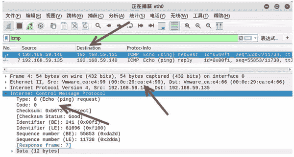
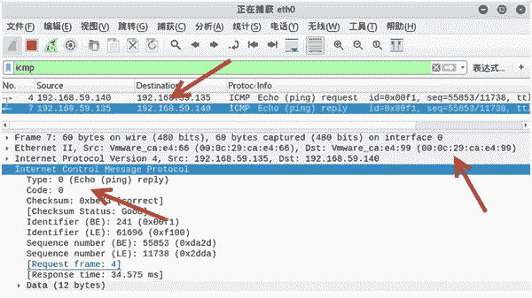

# 伪造 ICMP 数据包

> 原文：[`c.biancheng.net/view/6402.html`](http://c.biancheng.net/view/6402.html)

使用《ping 命令检测远程主机是否可用》和《构造 ICMP 数据包》这两节介绍的方式进行 ICMP 扫描，容易被目标主机发现。为了解决这个问题，可以使用 netwox 工具中编号为 66 的模块伪造 ICMP 数据包，如设置假的 IP 地址和 MAC 地址。

【实例】在主机 192.168.59.132 上实施 ICMP 数据包扫描，判断目标主机 192.168.59.135 是否启用。

1) 伪造 IP 地址为 192.168.59.140，MAC 地址为 00：0c：29：ca：e4：99，执行命令如下：

root@daxueba:~#  netwox 66 -i 192.168.59.135 -E 00:0c:29:ca:e4:99 -I 192.168.59.140

输出信息如下：

192.168.59.135 : reached

2) 验证伪造的 ICMP 数据包扫描，捕获数据包进行查看，如图所示。

其中，第 4 个数据包的源 IP 地址为 192.168.59.140（伪造的），目标地址为 192.168.59.135（目标主机），该数据包为伪造的 ICMP 请求包。

在 Ethernet II 部分的 Source 中可以看到 MAC 地址为 00：0c：29：ca：e4：99，也是伪造的。

3) 选择第 7 个数据包，查看信息，如图所示。

从该数据包可以看到源 IP 地址为 192.168.59.135，目标 IP 地址为 192.168.59.140（伪造的），目标 MAC 地址为 00：0c：29：ca：e4：99（伪造的）。这说明目标主机给伪造的主机返回了 ICMP 响应。