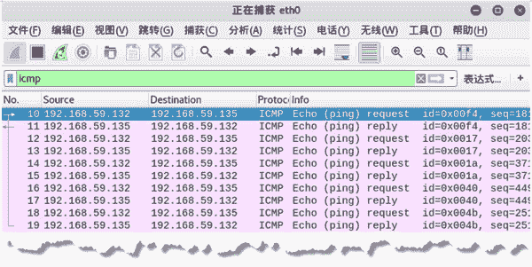

# 构造连续的 ICMP 数据包

> 原文：[`c.biancheng.net/view/6403.html`](http://c.biancheng.net/view/6403.html)

在向目标主机发送 ICMP 请求时，如果主机启用，将返回响应信息。为了持续判断目标主机的状态，需要连续发送 ICMP 数据包。netwox 工具提供了编号为 49 的模块，用于持续构造 ICMP 数据包，实时监听目标主机的启用情况。

【实例】构造连续的 ICMP 数据包，对目标主机 192.168.59.135 进行扫描。

1) 持续向目标主机发送 ICMP 请求，执行命令如下：

root@daxueba:~# netwox 49 -i 192.168.59.135

输出信息如下：

Ok
Ok
Ok
Ok
…  #省略其他信息

输出信息在持续地显示 Ok，表示目标主机已启用。如果目标主机未启用，将不会有任何输出信息。

2) 通过捕获数据包，验证该模块发送的 ICMP 请求。捕获到的数据包如图所示。

图中捕获到了大量的 ICMP 数据包，其中，第 10、12、14、16、18 个数据包为构造的 ICMP 请求包，第 11、13、15、17、19 个数据包为得到的 ICMP 响应包。