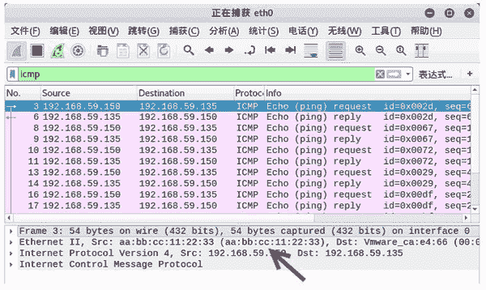

# 伪造连续的 ICMP 数据请求包

> 原文：[`c.biancheng.net/view/6404.html`](http://c.biancheng.net/view/6404.html)

为了避免被发现，可以使用 netwox 工具中编号为 50 的模块伪造连续的 ICMP 数据请求包。

【实例】伪造连续的 ICMP 数据包，实时判断目标主机 192.168.59.135 的启用情况。

1) 伪造实施主机的 IP 地址为 192.168.59.150，MAC 地址为 aa：bb：cc：11：22：33，指定目标主机的 MAC 地址为 00：0c：29：ca：e4：66，目标主机 IP 地址为 192.168.59.135，进行持续扫描。执行命令如下：

root@daxueba:~# netwox 50 -i 192.168.59.135 -E aa:bb:cc:11:22:33 -I 192.168.59.150 -e 00:0c:29:ca:e4:66

输出信息如下：

Ok
Ok
Ok
Ok
Ok
…  #省略其他信息

2) 通过捕获数据包，验证发送的 ICMP 伪造包，捕获的数据包如图所示。

图中捕获到了大量的 ICMP 请求包，并且都得到了响应。在这些数据包中可以看到成功伪造的 IP 地址和 MAC 地址，而不是真正实施主机的地址。