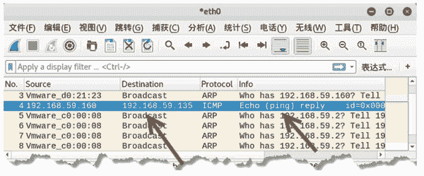

# 伪造 ICMP 数据包的 IP 层

> 原文：[`c.biancheng.net/view/6405.html`](http://c.biancheng.net/view/6405.html)

ICMP 是位于 IP 层上的协议。用户可以使用 netwox 工具中编号为 42 的模块，对 ICMP 数据包的 IP 层信息进行伪造。

【实例】伪造基于 IPv4 的 ICMP 数据包。

1) 查看基于 IPv4 的 ICMP 数据包的默认值，执行命令如下：

root@daxueba:~# netwox 41

输出信息如下：

```

IP______________________________________________________________.
|version|  ihl  |      tos      |            totlen                   |
|___4___|___5___|____0x00=0_____|___________0x001C=28___________      |
|              id                     |r|D|M|       offsetfrag        |
|_________0xD03C=53308__________|0|0|0|________0x0000=0_________      |
|      ttl            |   protocol     |           checksum           |
|____0x00=0_____|____0x01=1_____|____________0xE26B_____________      |
|                            source                                   |
|________________________192.168.59.131_________________________      |
|                          destination                                |
|____________________________5.6.7.8____________________________      |
ICMP4_echo reply________________________________________________.
|     type            |     code        |           checksum          |
|____0x00=0_____|____0x00=0_____|_________0xFFFF=65535__________      |
|              id                     |            seqnum             |
|___________0x0000=0____________|___________0x0000=0____________      |
| data:                                                               |
|_______________________________________________________________      |
```

输出信息分为两部分，IP 部分表示 IPv4 层信息，ICMP4_echo reply 部分为 ICMP 响应包部分。

这两部分中包含了多个字段信息。例如，IP 部分中 source 的值为 192.168.59.131，表示该 IPv4 数据包源 IP 地址（本地 IP 地址），destination 的值为 5.6.7.8，表示目标 IP 地址。这里的值均为默认值。用户可以对这些值进行修改，自定义特定的 ICMP 数据包。

2) 伪造源 IP 地址为 192.168.59.160，执行命令如下：

root@daxueba:~# netwox 41 -l 192.168.59.160 -m 192.168.59.135

输出信息如下：

```

IP______________________________________________________________.
|version|  ihl  |      tos      |            totlen                   |
|___4___|___5___|____0x00=0_____|___________0x001C=28___________      |
|              id                     |r|D|M|       offsetfrag        |
|_________0xDD2B=56619__________|0|0|0|________0x0000=0_________      |
|      ttl      |   protocol    |           checksum                  |
|____0x00=0_____|____0x01=1_____|____________0xE55A_____________      |
|                            source                                   |
|________________________192.168.59.160_________________________      |
|                          destination                                |
|________________________192.168.59.135_________________________      |
ICMP4_echo reply________________________________________________.
|     type      |     code      |           checksum                  |
|____0x00=0_____|____0x00=0_____|_________0xFFFF=65535__________      |
|              id               |            seqnum                   |
|___________0x0000=0____________|___________0x0000=0____________      |
| data:                                                               |
|_______________________________________________________________      |
```

其中，IP 部分的 source 的值由原来的本地地址 192.168.59.131 变为了 192.168.59.160；destination 的值由默认的 5.6.7.8 变为了 192.168.59.135。

3) 通过捕获数据包，验证伪造的 ICMP 请求包是否被发送，如图所示。

图中第 4 个数据包为伪造的数据包，源 IP 地址为伪造的地址 192.168.59.160，而不是本地 IP 地址。Ech0(ping)reply 表示该数据包为 ICMP