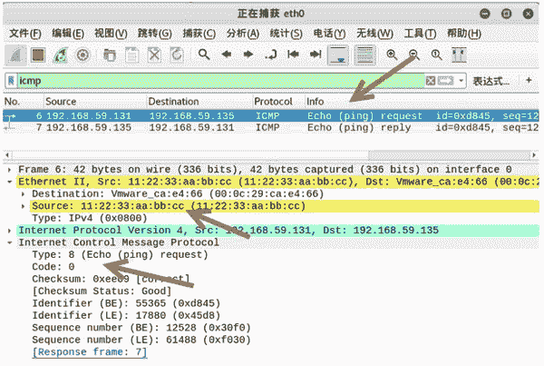
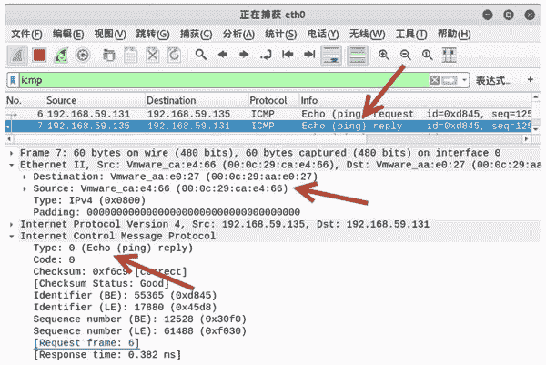

# 伪造 ICMP 数据包的 Ethernet 层

> 原文：[`c.biancheng.net/view/6406.html`](http://c.biancheng.net/view/6406.html)

用户不仅可以对 ICMP 数据包的 IPv4 层进行伪造，还可以对 ICMP 数据包的 Ehternet 层进行伪造。这时，需要使用 netwox 工具中编号为 37 的模块。该模块可以伪造 ICMP 数据包的 MAC 地址信息。

【实例】基于主机 192.168.59.131，伪造 ICMP 数据包的 Ethernet 层信息。

1) 查看 ICMP 包的 Ehternet 默认值，执行命令如下：

root@daxueba:~# netwox 37

输出信息如下：

```

Ethernet________________________________________________________.
| 00:0C:29:AA:E0:27->00:08:09:0A:0B:0C type:0x0800                    |
|_______________________________________________________________      |
IP______________________________________________________________.
|version|  ihl  |      tos      |            totlen                   |
|___4___|___5___|____0x00=0_____|___________0x001C=28___________      |
|              id                     |r|D|M|       offsetfrag        |
|__________0x18A0=6304__________|0|0|0|________0x0000=0_________      |
|      ttl      |   protocol    |           checksum                  |
|____0x00=0_____|____0x01=1_____|____________0x9A08_____________      |
|                            source                                   |
|________________________192.168.59.131_________________________      |
|                          destination                                |
|____________________________5.6.7.8____________________________      |
ICMP4_echo reply________________________________________________.
|     type      |     code      |           checksum                  |
|____0x00=0_____|____0x00=0_____|_________0xFFFF=65535__________      |
|              id               |            seqnum                   |
|___________0x0000=0____________|___________0x0000=0____________      |
| data:                                                               |
|_______________________________________________________________      |
```

在以上输出信息中，第一行 Ethernet 表示 ICMP 数据包是基于以太网的数据包。

默认源 MAC 地址为 00：0C：29：AA：E0：27，目标 MAC 地址为 00：08：09：0A：0B：0C。

2) 伪造源 MAC 地址为 11：22：33：AA：BB：CC，指定目标 IP 地址为 192.168.59.135，MAC 地址为 00：0C：29：CA：E4：66。执行命令如下：

root@daxueba:~# netwox 37 -a 11:22:33:aa:bb:cc -m 192.168.59.135 -b 00:0c:29:ca:e4:66 -o 8

输出信息如下：

```

Ethernet________________________________________________________.
| 11:22:33:AA:BB:CC->00:0C:29:CA:E4:66 type:0x0800                    |
|_______________________________________________________________      |
IP______________________________________________________________.
|version|  ihl  |      tos      |            totlen                   |
|___4___|___5___|____0x00=0_____|___________0x001C=28___________      |
|              id                     |r|D|M|       offsetfrag        |
|__________0x246B=9323__________|0|0|0|________0x0000=0________       |
|      ttl      |   protocol    |           checksum                  |
|____0x00=0_____|____0x01=1_____|____________0x9E08_____________      |
|                            source                                   |
|________________________192.168.59.131_________________________      |
|                          destination                                |
|________________________192.168.59.135_________________________      |
ICMP4_echo reply________________________________________________.
|     type      |     code      |           checksum                  |
|____0x00=0_____|____0x00=0_____|_________0xFFFF=65535__________      |
|              id               |            seqnum                   |
|___________0x0000=0____________|___________0x0000=0____________      |
| data:                                                               |
|_______________________________________________________________      |
```

从 Ethernet 部分可以看到，源 MAC 地址由原来的 00：0C：29：AA：E0：27 变为了 11：22：33：aa：bb：cc；目标 MAC 地址由原来的 00：08：09：0A：0B：0C 变为了 00：0C：29：CA：E4：66；而 IP 部分 Source 的值保留原来的值。

3) 为了验证构建的 ICMP 数据包，可以捕获数据包查看，如图所示。

从第 6 个数据包的 Ethernet II 部分可以看到，Source 的值为 11：22：33：aa：bb：cc，是伪造的 MAC 地址。

在 Internet Control Message Protocol 部分中，Type 值为 8，Code 值为 0，表示该数据包为 ICMP 请求包。

4) 选择第 7 个数据包进行查看，如图所示。

从该数据包的 Ethernet II 部分可以看到，源 MAC 地址为目标主机的 MAC 地址 00：0c：29：ca：e4：66，目标 MAC 地址为实施主机的 MAC 地址 00：0c：29：aa：e0：27。这表示目标主机成功给伪造 MAC 地址的主机进行了回复。

在 Internet Control Message Protocol 部分中，Type 值为 0，Code 值为 0，表示该数据包为 ICMP 响应包。