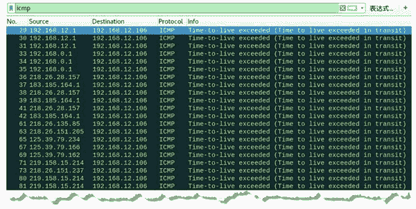

# traceroute 命令进行路由跟踪

> 原文：[`c.biancheng.net/view/6408.html`](http://c.biancheng.net/view/6408.html)

路由跟踪功能是用来识别一个设备到另一个设备的网络路径。在一个简单的网络上，这个网络路径可能只经过一个路由器，甚至一个都不经过。但是在复杂的网络中，数据包可能要经过数十个路由器才会到达最终目的地。在通信过程中，可以通过路由跟踪功能判断数据包传输的路径。

traceroute 命令用来检测发出数据包的主机到目标主机之间所经过的网关。它通过设置探测包的 TTL（存活时间）值，跟踪数据包到达目标主机所经过的网关，并监听来自网关 ICMP 的应答。

【实例】在主机 192.168.12.106 中，使用 traceroute 命令探测数据包到达目标 www.qq.com ([`www.qq.com`](http://www.qq.com)) 所经过的路由信息。

1) 进行路由跟踪，执行命令如下：

root@kali:~# traceroute www.qq.com

输出信息如下：

traceroute to www.qq.com (125.39.52.26), 30 hops max, 60 byte packets
1  localhost (192.168.12.1)        0.297 ms  0.297 ms  0.336 ms
2  localhost (192.168.0.1)  0.971 ms  0.969 ms  0.964 ms
3  1.164.185.183.adsl-pool.sx.cn (183.185.164.1) 4.941 ms 5.173 ms 5.511 ms
4  157.28.26.218.internet.sx.cn (218.26.28.157) 4.554 ms 4.898 ms 5.463 ms
5  237.151.26.218.internet.sx.cn (218.26.151.237)  37.650 ms 85.135.26.218.router-switch.sx.cn (218.26.135.85)  15.346 ms 205.151.26.218.internet.sx.cn (218.26.151.205)  18.777 ms
6  219.158.15.214 (219.158.15.214)  36.378 ms  38.361 ms  38.319 ms
7  * * *
8  no-data (125.39.79.162)  16.932 ms no-data (125.39.79.234)  16.165 ms no-data (125.39.79.166)  16.766 ms
9  * * *
10  * * *
11  * * *
···  #省略其他信息

上述输出信息显示了跟踪到的路由地址信息。记录从序号 1 开始，每个记录就是一跳，而每一跳表示经过的一个网关。记录给出了每个网关对应的 IP 地址。

例如，经过的第 2 个网关的 IP 地址为 192.168.0.1。其中，为 *** 的记录表示可能被防火墙拦截的 ICMP 的返回信息。

2) 为了验证 traceroute 命令探测数据包，使用 Wireshark 捕获数据包进行查看，如图所示。

图中捕获的数据包的目标地址都为 192.168.12.106，数据包协议都为 ICMP，数据包的源 IP 地址为进行路由跟踪时所经过的网关地址。因此这些数据包都为路由返回主机 192.168.12.106 的 ICMP 包。