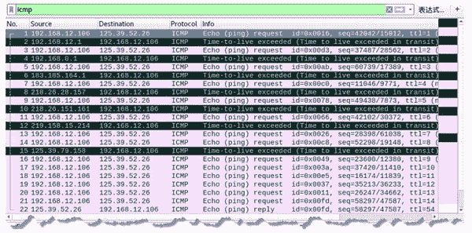
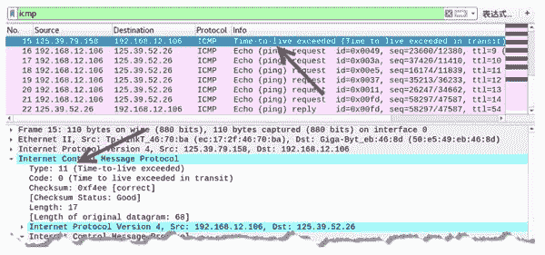
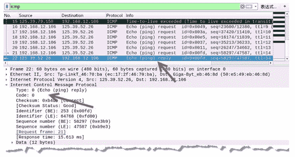

# 构造 ICMP 请求包进行路由跟踪

> 原文：[`c.biancheng.net/view/6412.html`](http://c.biancheng.net/view/6412.html)

为了实施路由跟踪，也可以使用 netwox 工具提供的编号为 57 的模块，构造 ICMP 请求包进行路由跟踪，查询经过的路由地址。

该工具也是通过设定 TTL 值的方式向目标发送 ICMP 请求，每经过一个路由都会得到相应的 ICMP 响应包，直到目标返回 ICMP 响应。其中，超时消息的 ICMP 数据包的报文中类型值为 11，代码值为 0。

在主机 192.168.12.106 上，构造 ICMP 请求包对目标 125.39.52.26 进行路由跟踪。

1) 进行路由跟踪，执行命令如下：

root@kali:~# netwox 57 -i 125.39.52.26

输出信息如下：

1 : 192.168.12.1
2 : 192.168.0.1
3 : 183.185.164.1
4 : 218.26.28.157
5 : 218.26.151.161
6 : 219.158.15.214
8 : 125.39.79.158
14 : 125.39.52.26

输出信息显示了经过的路由 IP 地址。

2) 通过 Wireshark 抓包，验证构造的 ICMP 请求包和对应的响应包，如图所示。

其中，第 1 个数据包是向目标主机发送的 ICMP 请求包，第 2 个数据包为经过的第一个路由返回的 ICMP 响应包，是一个超时消息数据包；第 3 个数据包是再次向目标主机发送的 ICMP 请求数据包；第 4 个数据包为经过的第二个路由返回的 ICMP 响应包，同样也是一个超时消息数据包。以此类推，直到成功得到目标 125.39.52.26 返回的 ICMP 响应信息。

3) 选择任意一个路由返回的 ICMP 数据包，如图所示。

例如，第 15 个数据包是路由 125.39.79.158 返回的响应包。

在 Internet Control Message Protocol 部分中，Type 值为 11，Code 值为 0，表示该数据包为 ICMP 超时消息数据包。

4) 选择最后一个数据包进行查看，如图所示。

该数据包源 IP 地址为 125.39.52.26（目标的），目标 IP 地址为 192.168.12.106（实施主机的），表示该数据包是目标主机返回构造 ICMP 请求的主机的数据包。

在 Internet Control Message Protocol 部分中，Type 值为 0，Code 值为 0，表示该数据包是一个正常的 ICMP 响应数据包。