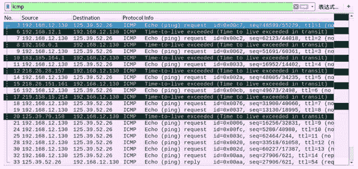
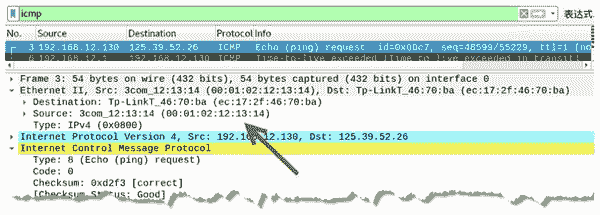

# 伪造 ICMP 请求包进行路由跟踪

> 原文：[`c.biancheng.net/view/6413.html`](http://c.biancheng.net/view/6413.html)

使用构造 ICMP 请求包进行路由跟踪方式时，容易被目标主机发现。为了避免这种情况，用户可以使用 netwox 工具提供的编号为 58 的模块伪造 ICMP 请求包。它可以伪造主机 IP 地址和 MAC 地址。

【实例】在主机 192.168.12.106 上，伪造 ICMP 请求包对目标 125.39.52.26 进行路由跟踪。

1) 伪造源 IP 地址为 192.168.12.130，MAC 地址为 00：01：02：12：13：14，指定目标 IP 地址为 125.39.52.26，MAC 地址为 ec：17：2f：46：70：ba，执行命令如下：

root@kali:~# netwox 58 -I 192.168.12.130 -E 00:01:02:12:13:14 -i 125.39.52.26 -e ec:17:2f:46:70:ba

输出信息如下：

1 : 192.168.12.1
2 : 192.168.0.1
3 : 183.185.164.1
4 : 218.26.28.157
5 : 218.26.151.161
6 : 219.158.15.214
8 : 125.39.79.158
14 : 125.39.52.26

2) 通过 Wireshark 抓包，验证伪造的 ICMP 请求包，如图所示。

其中，第 3～33 个数据包为进行路由跟踪所产生的 ICMP 数据包，并且可以看到经过的路由返回了超时消息 ICMP 数据包。

3) 选择第 3 个数据包，查看地址信息，如图所示。
其中，源 IP 地址为伪造的 192.168.12.130，目标地址为 125.39.52.26。在 Ethernet II 部分中，源 MAC 地址为伪造的 00：01：02：12：13：14。