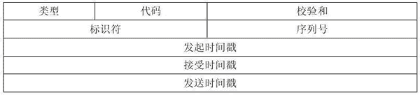

# 发送 ICMP 时间戳请求

> 原文：[`c.biancheng.net/view/6414.html`](http://c.biancheng.net/view/6414.html)

ICMP 时间戳请求允许系统向另一个系统查询当前的时间，但不包含日期，返回的建议值是自午夜零点开始计算的时间（UTC）。

ICMP 时间戳请求与应答报文格式如图所示。

在发送 ICMP 时间戳请求时，请求端填写发起时间戳，然后发送报文。应答系统收到请求报文时填写接收时间戳，在发送应答时填写发送时间戳。

在请求和响应的交互过程中，当 ICMP 报文中的类型值为 13、代码值为 0 时，数据包为 ICMP 时间戳请求数据包；当 ICMP 报文中的类型值为 14，代码值为 0 时，数据包为 ICMP 时间戳应答数据包。

netwox 工具提供编号为 81 的模块，用于构建时间戳请求。

【实例】向目标主机 192.168.59.135 发送 ICMP 时间戳请求，探测数据包传输的时间。

1) 发送 ICMP 时间戳请求，执行命令如下：

root@daxueba:~# netwox 81 -i 192.168.59.135

输出信息如下：

0 0

输出信息表示目标主机可达，如果目标主机不可达，将显示信息如下：

No answer.

2) 可以通过 Wireshark 进行抓包，验证成功发送了时间戳请求，如图所示。

其中，第 6 个数据包为 ICMP 时间戳请求。

在 Internet Control Message Protocol 部分中，Type 值为 13，Code 值为 0，表示该数据包为 ICMP 时间戳请求。

Originate timestamp 的值表示数据包发起的起始时间，这里为 0 秒（午夜 0 点 0 秒）；Receive timestamp 的值表示接收数据包的时间，这里为 0 秒；Transmit timestamp 的值表示数据包的发送时间，这里为 0 秒。时间为 0 秒，是因为从午夜零点开始计算。

3) 选择对应的响应包查看信息，如图所示。

其中，第 7 个数据包为 ICMP 时间戳应答。

在 Internet Control Message Protocol 部分中，Type 值为 14，Code 值为 0，表示该数据包为 ICMP 时间戳应答。

Originate timestamp 的值表示数据包发起的起始时间，这里为 0 秒（午夜零点后开始计算）；Receive timestamp 的值表示接收数据包的时间，这里为午夜零点后 8 小时 44 分 24.379 秒；Transmit timestamp 的值表示数据包的发送时间，这里为 31464379 秒，时间为午夜零点后 8 小时 44 分 24.379 秒。