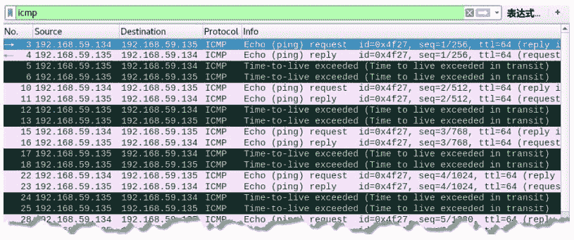
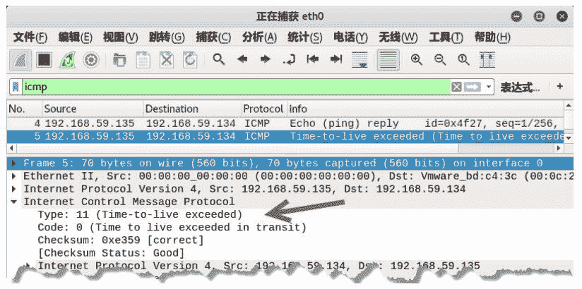

# 伪造请求超时的 ICMP 数据包

> 原文：[`c.biancheng.net/view/6415.html`](http://c.biancheng.net/view/6415.html)

在网络传输 IP 数据报的过程中，如果 IP 数据包的 TTL 值逐渐递减为 0 时，需要丢弃数据报。这时，路由器需要向源发送方发送 ICMP 超时报文，表示传输过程中超时了。

在超时 ICMP 数据包报文中，类型值为 11，代码值为 0。

用户可以通过 netwox 工具中编号为 83 的模块伪造请求超时 ICMP 数据包。

【实例】已知主机 A 的 IP 地址为 192.168.59.134，主机 B 的 IP 地址为 192.168.59.135，在主机 C 上伪造请求超时 ICMP 数据包。

1) 在主机 A 上 ping 主机 B，执行命令如下：

root@daxueba:~# ping 192.168.59.135

输出信息如下：

PING 192.168.59.135 (192.168.59.135) 56(84) bytes of data.
64 bytes from 192.168.59.135: icmp_seq=1 ttl=64 time=0.447 ms
64 bytes from 192.168.59.135: icmp_seq=2 ttl=64 time=0.468 ms
64 bytes from 192.168.59.135: icmp_seq=3 ttl=64 time=0.773 ms
64 bytes from 192.168.59.135: icmp_seq=4 ttl=64 time=0.307 ms

上述输出信息表示主机 B 是可达的，并且给出了传输的时间。例如，time=0.447ms，表示时间需要 0.447 毫秒。

2) 在主机 C 上伪造请求超时 ICMP 数据包，设置源 IP 地址为 192.168.59.135，执行命令如下：

root@daxueba:~# netwox 83 -i 192.168.59.135

执行命令后没有任何输出信息，但是成功伪造了请求超时 ICMP 数据包。

3) 再次在主机 A 上 ping 主机 B，执行命令如下：

root@daxueba:~# ping 192.168.59.135

输出信息如下：

PING 192.168.59.135 (192.168.59.135) 56(84) bytes of data.
64 bytes from 192.168.59.135: icmp_seq=6 ttl=64 time=0.336 ms
From 192.168.59.135 icmp_seq=6 Time to live exceeded
64 bytes from 192.168.59.135: icmp_seq=7 ttl=64 time=0.532 ms
From 192.168.59.135 icmp_seq=7 Time to live exceeded
64 bytes from 192.168.59.135: icmp_seq=8 ttl=64 time=0.495 ms
From 192.168.59.135 icmp_seq=8 Time to live exceeded

从上述输出信息可以看到，主机 A 向主机 192.168.59.135 发送了 ping 请求。部分请求没有收到响应信息，而显示了 Time to live exceeded 信息，表示时间超时。

4) 为了验证伪造的请求超时 ICMP 数据包，可以通过捕获数据包查看，如图所示，捕获到了若干个 ICMP 超时数据包。其中，第 3 个数据包的源 IP 地址为 192.168.59.134，目标 IP 地址为 192.168.59.135，是主机 A 向主机 B 发送的 ICMP 请求包；第 5 个数据包源 IP 地址为 192.168.59.135，目标 IP 地址为 192.168.59.134，Info 列显示的 Time-to-live exceeded 表示时间超时，说明该数据包为伪造的请求超时 ICMP 包。

5) 选择第 5 个数据包，查看包信息，如图所示。

在该数据包的 Internet Control Message Protocol 部分中，Type 值为 11，Code 值为 0，说明该数据包是请求超时 ICMP 数据包。