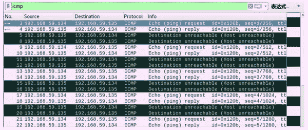
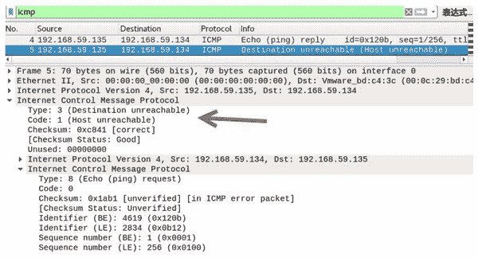

# 伪造目标不可达的 ICMP 数据包

> 原文：[`c.biancheng.net/view/6416.html`](http://c.biancheng.net/view/6416.html)

目标不可达包是指路由器无法将 IP 数据包发送给目标地址时，会给发送端主机返回一个目标不可达的 ICMP 消息。在目标不可达报文中，类型值为 3，代码值为 1。

伪造目标不可达的 ICMP 数据包需要使用 netwox 工具中编号为 82 的模块。

【实例】已知主机 A 的 IP 地址为 192.168.59.134，主机 B 的 IP 地址为 192.168.59.135，在主机 C 上伪造目标不可达 ICMP 数据包。

1) 在主机 C 上伪造目标不可达 ICMP 数据包，设置源 IP 地址为 192.168.59.135，执行命令如下：

root@daxueba:~# netwox 82 -i 192.168.59.135

执行命令后没有任何输出信息，说明成功伪造了目标主机不可达 ICMP 数据包。

2) 在主机 A 上 ping 主机 B，执行命令如下：

root@daxueba:~# ping 192.168.59.135

输出信息如下：

PING 192.168.59.135 (192.168.59.135) 56(84) bytes of data.
64 bytes from 192.168.59.135: icmp_seq=1 ttl=64 time=3.95 ms
From 192.168.59.135 icmp_seq=1 Destination Host Unreachable
64 bytes from 192.168.59.135: icmp_seq=2 ttl=64 time=0.608 ms
From 192.168.59.135 icmp_seq=2 Destination Host Unreachable
64 bytes from 192.168.59.135: icmp_seq=3 ttl=64 time=0.341 ms
From 192.168.59.135 icmp_seq=3 Destination Host Unreachable
64 bytes from 192.168.59.135: icmp_seq=4 ttl=64 time=0.499 ms
From 192.168.59.135 icmp_seq=4 Destination Host Unreachable

从上述输出信息可以看到，主机 A 向主机 192.168.59.135 发送了 ping 请求，但是部分请求没有得到响应信息，而显示了 Destination Host Unreachable 信息，表示目标主机不可达。

3) 为了验证伪造的目标不可达 ICMP 数据包，可以使用 Wireshark 抓包查看，如图所示，捕获到了若干个 ICMP 数据包。

其中，第 3 个数据包的源 IP 地址为 192.168.59.134，目标 IP 地址为 192.168.59.135，是主机 A 向主机 B 发送的 ICMP 请求包；第 5 个数据包的源 IP 地址为 192.168.59.135，目标 IP 地址为 192.168.59.134，Info 列显示的 Destination unreachable(Host unreachable) 表示目标主机不可达，说明该数据包为伪造的目标不可达 ICMP 数据包。

5) 选择第 5 个数据包，查看包信息，如图所示。

在该数据包的 Internet Control Message Protocol 部分中，Type 值为 3，Code 值为 1，说明该数据包是目标不可达 ICMP 数据包。