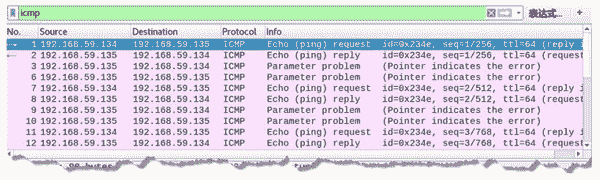
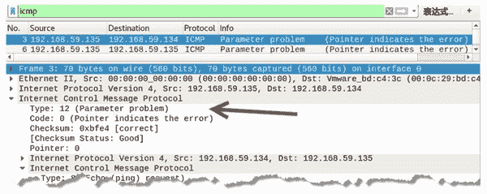

# 伪造参数错误的 ICMP 数据包

> 原文：[`c.biancheng.net/view/6417.html`](http://c.biancheng.net/view/6417.html)

当路由器或主机处理数据报时，发现因为报文头的参数错误而不得不丢弃报文时，需要向源发送方发送参数错误报文。该报文中，类型值为 12，代码值为 0。

伪造参数错误的 ICMP 数据包需要使用 netwox 工具中编号为 84 的模块。

【实例】已知主机 A 的 IP 地址为 192.168.59.134，主机 B 的 IP 地址为 192.168.59.135，在主机 C 上伪造参数错误 ICMP 数据包。

1) 在主机 C 上伪造参数错误 ICMP 数据包，设置源 IP 地址为 192.168.59.135，执行命令如下：

root@daxueba:~# netwox 82 -i 192.168.59.135

执行命令后没有任何输出信息，但是会伪造参数错误 ICMP 数据包。

2) 在主机 A 上 ping 主机 B，执行命令如下：

root@daxueba:~# ping 192.168.59.135

输出信息如下：

PING 192.168.59.135 (192.168.59.135) 56(84) bytes of data.
64 bytes from 192.168.59.135: icmp_seq=1 ttl=64 time=11.1 ms
From 192.168.59.135 icmp_seq=1 Parameter problem: pointer = 0
64 bytes from 192.168.59.135: icmp_seq=2 ttl=64 time=0.546 ms
From 192.168.59.135 icmp_seq=2 Parameter problem: pointer = 0
64 bytes from 192.168.59.135: icmp_seq=3 ttl=64 time=0.453 ms
From 192.168.59.135 icmp_seq=3 Parameter problem: pointer = 0

从输出信息可以看到，主机 A 向主机 192.168.59.135 发送了 ping 请求，但部分请求没有得到响应信息，而显示了 Parameter problem 信息，表示参数错误。

3) 通过捕获数据包，验证伪造的参数错误的 ICMP 数据包，如图所示，捕获到了若干个 ICMP 数据包。

第 1 个数据包的源 IP 地址为 192.168.59.134，目标 IP 地址为 192.168.59.135，是主机 A 向主机 B 发送的 ICMP 请求包；第 3 个数据包的源 IP 地址为 192.168.59.135，目标 IP 地址为 192.168.59.134，Info 列显示的 Parameter problem 表示参数错误，说明该数据包为伪造的参数错误 ICMP 数据包。

4) 选择第 3 个数据包，查看包信息，如图所示。

在 Internet Control Message Protocol 部分中，Type 值为 12，Code 值为 0，说明该数据包是参数错误 ICMP 数据包。