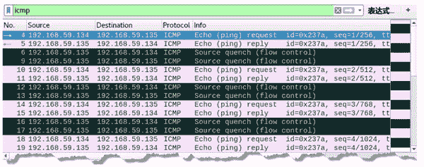
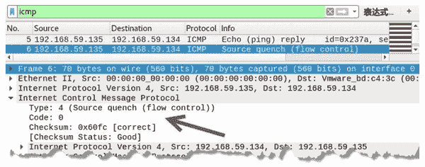

# 伪造源站抑制的 ICMP 数据包

> 原文：[`c.biancheng.net/view/6419.html`](http://c.biancheng.net/view/6419.html)

主机在处理报文时会有一个缓存队列。当主机接收数据包的速度比处理速度快时，一旦超过最大缓存队列，主机将无法处理，从而选择丢弃报文。这时，主机会向源发送方发送一个 ICMP 源站抑制报文，告诉对方缓存队列已满，稍后再进行请求。

在源站抑制的 ICMP 报文中，类型值为 4，代码值为 0。

伪造源站抑制的数据包需要使用 netwox 工具中编号为 85 的模块。

【实例】已知主机 A 的 IP 地址为 192.168.59.134，主机 B 的 IP 地址为 192.168.59.135。在主机 C 上伪造源站抑制 ICMP 数据包。

1) 在主机 C 上伪造源站抑制 ICMP 数据包，设置源 IP 地址为 192.168.59.135，执行命令如下：

root@daxueba:~# netwox 85 -i 192.168.59.135

执行命令后没有任何输出信息，但是成功伪造了源站抑制 ICMP 数据包。

2) 在主机 A 上 ping 主机 B，执行命令如下：

root@daxueba:~# ping 192.168.59.135

输出信息如下：

PING 192.168.59.135 (192.168.59.135) 56(84) bytes of data.
64 bytes from 192.168.59.135: icmp_seq=1 ttl=64 time=1.77 ms
From 192.168.59.135: icmp_seq=1 Source Quench
64 bytes from 192.168.59.135: icmp_seq=2 ttl=64 time=0.429 ms
From 192.168.59.135: icmp_seq=2 Source Quench
64 bytes from 192.168.59.135: icmp_seq=3 ttl=64 time=18.8 ms
From 192.168.59.135: icmp_seq=3 Source Quench

从输出信息可以看到，主机 A 向主机 192.168.59.135 发送了 ping 请求，但是部分请求没有得到响应信息，而显示了 Source Quench 信息，表示源站抑制。

3) 通过捕获数据包，验证伪造的源站抑制的 ICMP 数据包，如图所示。

捕获到了若干个 ICMP 数据包，其中，第 4 个数据包的源 IP 地址为 192.168.59.134，目标 IP 地址为 192.168.59.135，是主机 A 向主机 B 发送的 ICMP 请求包；第 6 个数据包的源 IP 地址为 192.168.59.135，目标 IP 地址为 192.168.59.134，Info 列显示的 Source Quench 表示源站抑制，说明该数据包为伪造的源站抑制 ICMP 数据包。

4) 选择第 6 个数据包，查看包信息，如图所示。
在 Internet Control Message Protocol 部分中，Type 值为 4，Code 值为 0，说明该数据包是源站抑制 ICMP 数据包。