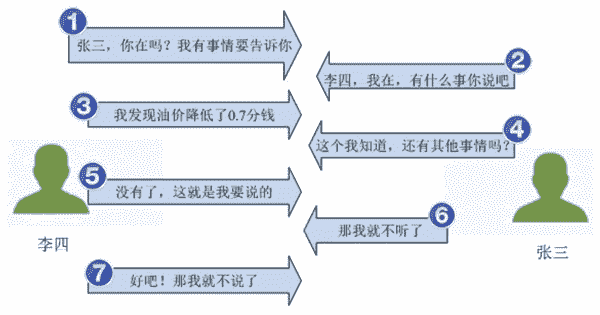

# 与传输层有关的基本知识

> 原文：[`c.biancheng.net/view/6422.html`](http://c.biancheng.net/view/6422.html)

传输层（Transport Layer）是 OSI 协议的第四层协议，是唯一负责总体的数据传输和数据控制传输层的一层协议。传输层提供端到端的交换数据机制，它不仅对会话层、表示层和应用层这高三层提供可靠的传输服务，还对网络层提供可靠的目的地站点信息。

为了更好地学习和了解传输层，本节将介绍其基本知识。通过学习这些基本知识，可以更好地掌握传输层中涉及的相关概念，并理解传输层的作用。

## 传输层的作用

网际层提供了主机之间的逻辑通道，即通过寻址的方式，把数据包从一个主机发到另一个主机上。如果一个主机有多个进程同时在使用网络连接，那么数据包到达主机之后，如何区分它属于哪个进程呢？为了区分数据包所属的进程，就需要使用到传输层。

传输层提供了应用进程之间的端到端连接，其作用如下：

*   为网络应用程序提供接口。
*   为端到端连接提供流量控制、差错控制、服务质量等管理服务。
*   提供多路复用、多路分解机制。

## 面向连接和无连接

针对不同情况下的数据质量保证，传输层提供了两种数据传输协议类型，分别为面向连接与无连接。下面介绍这两种类型的概念和工作原理。

#### 面向连接

面向连接就是通信双方在通信时，要事先建立一条通信线路，然后进行通信。其过程分为三个阶段。第一阶段是建立连接。第二阶段是连接成功建立之后，进行数据传输。第三阶段是在数据传输完毕后，释放连接。

下面以李四与张三的对话来说明面向连接的工作原理，如图所示。

其中，李四向张三说的每一句话都要得到张三的回应，然后才会说下一句话，直到李四说完最后一句话。

#### 无连接

无连接是指通信双方不需要事先建立通信线路，而是把每个带有目的地址的包（报文分组）发送到线路上，由系统选定路线进行传输，不需要目标方进行回复。

下面以李四与张三的对话来说明无连接的工作原理，如图所示。

从图中可以看到，李四向张三说出了要说的话，而不需要得到张三的回复。

## 端口和套接字

为了区分同一个主机上不同应用程序的数据包，传输层提供了端口和套接字概念。下面介绍端口和套接字的作用。

#### 端口的作用

在数据链路层中，通过 MAC 地址来寻找局域网中的主机；在网际层中，通过 IP 地址来寻找网络中互连的主机或路由器。在传输层中，需要通过端口进行寻址，来识别同一计算机中同时通信的不同应用程序。

#### 常用端口

端口号用来识别应用程序。

常用 TCP 端口号和对应的应用程序如表所示。

常见的 TCP 端口及对应的应用程序

| 应用程序 | 端口号 | 简要说明 |
| tcpmux | 1 | TCP 端口服务多路复用器 |
| Echo | 7 | 回显 |
| discard | 9 | 抛弃或空 |
| systat | 11 | 用户 |
| daytime | 13 | 时间 |
| netstat | 15 | 网络状态 |
| qotd | 17 | 每日引用 |
| chargen | 19 | 字符发生器 |
| ftp-data | 20 | 文件传输协议数据 |
| FTP | 21 | 文件传输协议控制 |
| ssh | 22 | 安全 Shell |
| Telnet | 23 | 终端网络连接 |
| SMTP | 25 | 简单邮件传输协议 |
| new-fe | 27 | NSW 用户系统 |
| time | 37 | 时间服务程序 |
| name | 42 | 主机名称服务程序 |
| domain | 53 | 域名服务程序（DNS） |
| gopher | 70 | Gopher 服务 |
| finger | 79 | Finger |
| http | 80 | WWW 服务 |
| link | 87 | TTY 链接 |
| supdup | 95 | SUPDUP 协议 |
| pop2 | 109 | 邮局协议 2 |
| pop3 | 110 | 邮局协议 3 |
| auth | 113 | 身份验证服务 |
| uucp-path | 117 | UUCP 路径服务 |
| nntp | 119 | USENET 网络新闻传输协议 |
| nbsession | 139 | NetBIOS 会话服务 |
| IMAP4 | 143 | 因特网消息访问协议 4 |
| BGP | 179 | 边界网关协议 |
| IRC | 194 | 互联网中继聊天 |
| SLP | 427 | 服务位置协议 |
| HTTPS | 443 | 加密传输协议 TLS/SSL |
| dantz | 497 | 备份服务 |
| rsync | 873 | 文件同步 |

常见的 UDP 端口号及对应的应用程序如表所示。

常见的 UDP 端口及对应的应用程序

| 应用程序 | 端口号 | 简要说明 |
| Echo | 7 | 回显 |
| discard | 9 | 抛弃或空 |
| systat | 11 | 用户 |
| daytime | 13 | 时间 |
| qotd | 17 | 每日引用 |
| chargen | 19 | 字符发生器 |
| time | 37 | 时间服务程序 |
| domain | 57 | 域名服务程序（DNS） |
| bootps | 67 | 引导程序协议服务 /DHCP |
| bootpc | 68 | 引导程序协议客户端 /DHCP |
| tftp | 69 | 简单文件传输协议 |
| ntp | 123 | 网络时间协议，用于时间同步 |
| nbname | 137 | NetBIOS 名称 |
| snmp | 161 | 简单网络管理协议 |
| snmp-trap | 162 | 简单网络管理协议 trap |
| syslog | 514 | 系统日志服务 |

#### 套接字

应用层通过传输层进行数据通信时，TCP 和 UDP 会遇到需要同时为多个应用程序进程提供并发服务的问题。

多个 TCP 连接或多个应用程序进程可能需要通过同一个 TCP 协议端口传输数据。为了区别不同的应用程序进程和连接，许多计算机操作系统为应用程序与 TCP／IP 协议交互提供了称为套接字（Socket）的接口，区分不同应用程序进程间的网络通信和连接。

套接字是由主机的 IP 地址加上主机上的端口号组成的地址。例如，套接字地址 101.102.103.104：21，表示指向 IP 地址为 101.102.103.104 的计算机的 21 端口。

## 多路复用和多路分解

在网络上主机与主机之间的通信实质上是主机上运行的应用进程之间的通信。在进行通信时，往往同时运行多个应用程序。

为了能够让一个计算机同时支持多个网络程序，并且同时保持与多台计算机进行连接，就需要使用多路复用和多路分解，其含义如下：

*   多路复用：从源主机的不同套接字中收集数据块，并为每个数据块封装首部信息，从而生成报文段，然后将报文段传递到网络层中。
*   多路分解：将传输层报文段中的数据交付到正确的套接字。