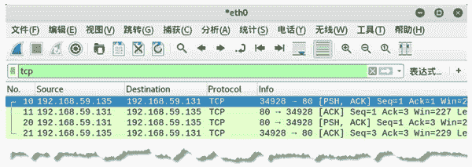

# TCP 协议的工作机制

> 原文：[`c.biancheng.net/view/6424.html`](http://c.biancheng.net/view/6424.html)

传输控制协议（Transmission Control Protocol，TCP）是一种面向连接的、可靠的、基于字节流的传输层通信协议。在 TCP 协议中，通过三次握手建立连接。通信结束后，还需要断开连接。如果在发送数据包时，没有正确被发送到目的地时，将会重新发送数据包。

本节将详细讲解 TCP 协议的工作机制。

## TCP 协议作用

TCP 协议使用的是面向连接的方法进行通信的，其作用如下：

*   面向流的处理：TCP 以流的方式处理数据。换句话说，TCP 可以一个字节一个字节地接收数据，而不是一次接收一个预订格式的数据块。TCP 把接收到的数据组成长度不等的段，再传递到网际层。
*   重新排序：如果数据以错误的顺序到达目的地，TCP 模块能够对数据重新排序，来恢复原始数据。
*   流量控制：TCP 能够确保数据传输不会超过目的计算机接收数据的能力。
*   优先级与安全：为 TCP 连接设置可选的优先级和安全级别。
*   适当的关闭：以确保所有的数据被发送或接收以后，再进行关闭连接。

## TCP 工作模式

TCP 协议的数据包进行传输采用的是服务器端和客户端模式。发送 TCP 数据请求方为客户端，另一方则为服务器端。客户端要与服务器端进行通信，服务器端必须开启监听的端口，客户端才能通过端口连接到服务器，然后进行通信。

netwox 工具提供了相关模块，用于建立 TCP 服务器端和 TCP 客户端。客户端连接服务器端后，可以进行数据通信。为了能够对服务器端进行远程操控，用户也可以建立远程 TCP 服务器端和远程 TCP 客户端，连接以后，可以在服务器端执行命令，进行上传和下载。

#### 建立 TCP 服务器端和 TCP 客户端

为了能够完成客户端与服务器端之间的通信，可以使用 netwox 工具编号为 89 的模块建立 TCP 服务器端，然后使用编号为 87 的模块建立 TCP 客户端。

【实例】已知主机 A 的 IP 地址为 192.168.59.131，主机 B 的 IP 地址为 192.168.59.135。分别在这两个主机上建立 TCP 服务器端和客户端，并进行连接，监听指定端口上的通信信息。

具体步骤如下：

1) 在主机 A 上建立 TCP 服务器端，监听端口为 80，执行命令如下：

root@daxueba:~# netwox 89 -P 80

运行后没有任何输出信息，可以输入要传输的数据。

2)在主机 B 上建立 TCP 客户端，连接 TCP 服务器端，执行命令如下：

root@daxueba:~# netwox 87 -i 192.168.59.131 -p 80

运行后没有任何输出信息，可以输入要传输的数据。

3) 当在客户端输入信息后，将被发送到服务器端。例如，在客户端输入 hi，如下：

root@daxueba:~# netwox 87 -i 192.168.59.131 -p 80
hi

4) 在服务器端将会收到到客户端的信息，如下：

root@daxueba:~# netwox 89 -P 80
hi

可以看出，输出信息为客户端输入的内容。

5) 在服务器端输入 Hello，客户端也会监听到服务器端输入的内容，如下：

root@daxueba:~# netwox 87 -i 192.168.59.131 -p 80
hi
Hello

6) 通过捕获数据包，验证客户端和服务器端的通信过程。捕获到的数据包如图所示。

其中，第 10 个数据包是 TCP 客户端向服务器端进行通信的数据包，其中 [PSH，ACK]，表示该包为数据通信数据包；第 11 个数据包为对应的响应包，表示允许通信；第 20 个数据包是 TCP 服务器端向客户端进行通信的数据包，第 21 个数据包为对应的响应包。

#### 建立远程操作的 TCP 服务器端和 TCP 客户端

通过前面的讲解，用户可以建立 TCP 客户端，并连接到 TCP 服务器端，然后进行简单的通信。下面讲解如何通过 TCP 协议，远程在服务器端执行命令。

【实例】已知主机 A 的 IP 地址为 192.168.59.131，主机 B 的 IP 地址为 192.168.59.135，使用 netwox 编号为 93 和 94 的模块，分别在主机 A 和主机 B 建立 TCP 服务器端和客户端，然后通过客户端远程在服务器上执行命令。具体步骤如下：

1) 在主机 A 上建立 TCP 远程管理服务器，并设置监听的端口为 7615，执行命令如下：

root@daxueba:~# netwox 93 -P 7615

执行命令后没有任何输出信息。

2) 查看远程管理服务器的配置信息，如下：

root@daxueba:~# ifconfig

输出信息如下：

```

eth0: flags=4163<UP,BROADCAST,RUNNING,MULTICAST>  mtu 1500
    inet 192.168.59.131  netmask 255.255.255.0  broadcast 192.168.59.255
    inet6 fd15:4ba5:5a2b:1008:20c:29ff:fe64:a54f  prefixlen 64  scopeid 0x0<global>
    inet6 fe80::20c:29ff:fe64:a54f  prefixlen 64  scopeid 0x20<link>
    inet6 fd15:4ba5:5a2b:1008:2c92:52e9:dd2:37a7  prefixlen 64  scopeid 0x0<global>
    ether 00:0c:29:64:a5:4f  txqueuelen 1000  (Ethernet)
    RX packets 215123  bytes 259364632 (247.3 MiB)
    RX errors 0  dropped 0  overruns 0  frame 0
    TX packets 83482  bytes 5073376 (4.8 MiB)
    TX errors 0  dropped 0 overruns 0  carrier 0  collisions 0
```

上述输出信息显示了服务器的配置信息。例如，IP 地址为 192.168.59.131，MAC 地址为 00：0c：29：64：a5：4f。

3) 在主机 B 上建立 TCP 客户端，并连接服务器端，然后执行命令 ifconfig，如下：

root@daxueba:~# netwox 94 -i 192.168.59.131 -p 7615 -c "/bin/sh -c ifconfig"

输出信息如下：

```

eth0: flags=4163<UP,BROADCAST,RUNNING,MULTICAST>  mtu 1500
    inet 192.168.59.131  netmask 255.255.255.0  broadcast 192.168.59.255
    inet6 fd15:4ba5:5a2b:1008:20c:29ff:fe64:a54f  prefixlen 64  scopeid
    0x0<global>
    inet6 fe80::20c:29ff:fe64:a54f  prefixlen 64  scopeid 0x20<link>
    inet6 fd15:4ba5:5a2b:1008:2c92:52e9:dd2:37a7  prefixlen 64  scopeid
    0x0<global>
    ether 00:0c:29:64:a5:4f  txqueuelen 1000  (Ethernet)
    RX packets 215293  bytes 259375823 (247.3 MiB)
    RX errors 0  dropped 0  overruns 0  frame 0
    TX packets 83491  bytes 5074036 (4.8 MiB)
    TX errors 0  dropped 0 overruns 0  carrier 0  collisions 0
```

输出信息与上面实例的输出信息一样，说明成功执行了 ifconfig 命令。

#### 建立 TCP 远程客户端（下载文件）

有时候客户端需要从服务器上下载文件。用户可以使用 netwox 工具编号为 95 的模块建立 TCP 客户端，下载服务器上的文件。

【实例】已知主机 A 的 IP 地址为 192.168.59.131，主机 B 的 IP 地址为 192.168.59.135；主机 A 上有一个文件 user.txt。使用 netwox 工具编号为 93 和 95 的模块分别在主机 A 和主机 B 建立服务器端和客户端，然后通过客户端从服务器上下载 user.txt 文件。

具体步骤如下：

1) 在主机 A 上建立 TCP 远程管理服务器，并设置监听的端口为 7615，执行命令如下：

root@daxueba:~# cat user.txt

执行命令后没有任何输出信息。

2) 在服务器上，查看 user.txt 文件的信息，执行命令如下：

root@daxueba:~# cat user.txt

输出信息如下：

smz
admin
root
abc133
bob
tom123
administrator
wang001

3) 在主机 B 上建立 TCP 客户端，并连接 TCP 服务器，获取 user.txt 文件的信息，如下：

root@daxueba:~# netwox 95 -i 192.168.59.131 -p 7615 -f "user.txt"

输出信息如下：

smz
admin
root
abc133
bob
tom123
administrator
wang001

上述输出信息为服务器上 file.txt 文件的信息。

4) 如果用户想要保存文件内容，可以指定保存的位置。例如，将信息保存到文件 fileuser.txt 中，执行命令如下：

root@daxueba:~# netwox 95 -i 192.168.59.131 -p 7615 -f "user.txt" -F fileuser.txt

#### 建立 TCP 远程客户端（上传文件）

有时候，客户端需要将文件上传到服务器上。这时，可以使用 netwox 工具编号为 96 的模块来实现。

【实例】已知主机 A 的 IP 地址为 192.168.59.131，主机 B 的 IP 地址为 192.168.59.135；主机 B 上有一个文件 password.txt。使用 netwox 工具编号为 93 和 96 的模块分别在主机 A 和主机 B 建立服务器和客户端，并将客户端的 password.txt 文件上传到服务器上，命名为 pass.txt。

具体步骤如下：

1) 在主机 A 上建立 TCP 远程管理服务器，并设置监听的端口为 7615，执行命令如下：

root@daxueba:~# netwox 93 -P 7615

执行命令后没有任何输出信息。

2) 在主机 B 上，查看 password.txt 文件的信息，如下：

root@daxueba:~# cat password.txt

输出信息如下：

www
mail
remote
blog
webmail
server
ns1

3) 在主机 B 上建立 TCP 远程管理客户端，并连接服务器，将 password.txt 文件上传到服务器上，文件名称为 pass.txt，执行命令如下：

root@daxueba:~# netwox 96 -i 192.168.59.131 -p 7615 -f password.txt -F pass.txt

执行命令后没有任何输出信息，但是会成功将文件 password.txt 上传到服务器上，上传后的文件名称为 pass.txt。

4) 在服务器上，查看文件 pass.txt 的信息，执行命令如下：

root@daxueba:~# cat pass.txt

输出信息如下：

www
mail
remote
blog
webmail
server
ns1