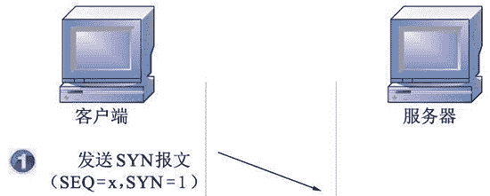
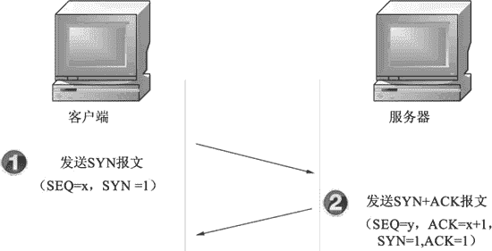
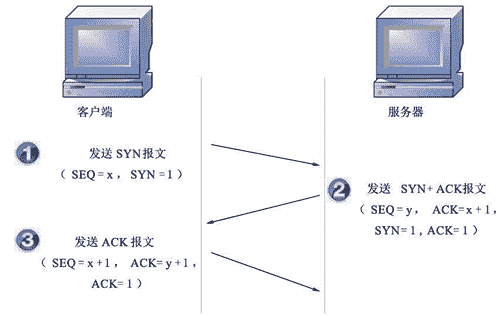
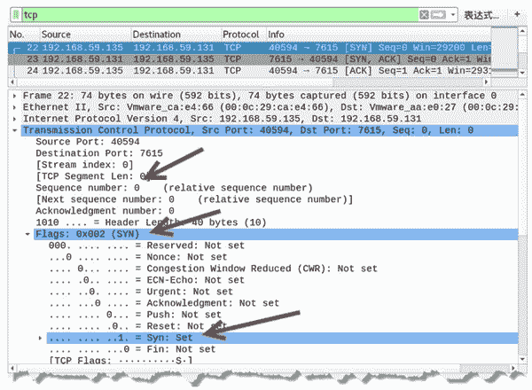
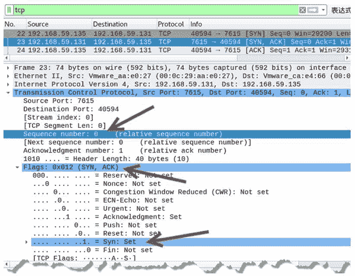
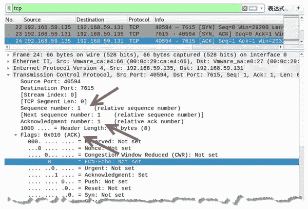
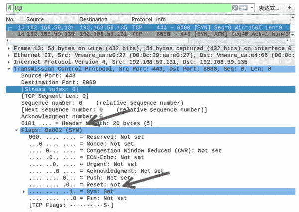
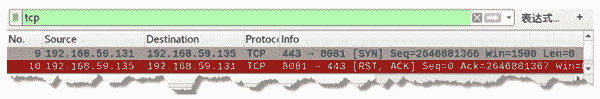
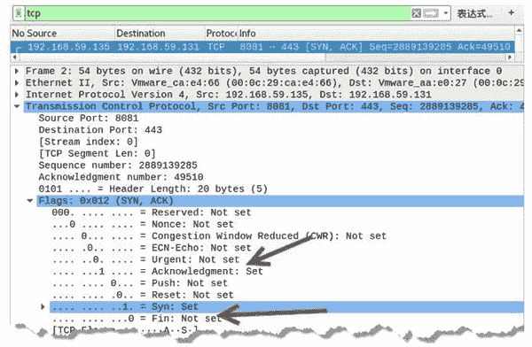
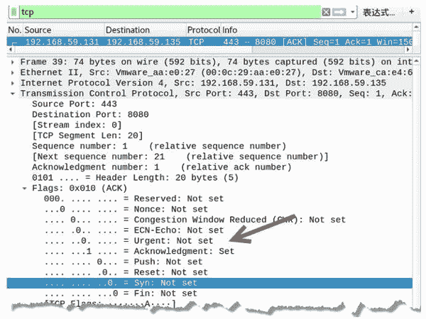

# TCP 三次握手建立连接的过程

> 原文：[`c.biancheng.net/view/6425.html`](http://c.biancheng.net/view/6425.html)

TCP 是面向连接的协议，所以每次发出的请求都需要对方进行确认。TCP 客户端与 TCP 服务器在通信之前需要完成三次握手才能建立连接。

下面详细讲解三次握手的过程。

## 第 1 次握手

第 1 次握手建立连接时，客户端向服务器发送 SYN 报文（SEQ=x，SYN=1），并进入 SYN_SENT 状态，等待服务器确认，如图所示。



## 第 2 次握手

第 2 次握手实际上是分两部分来完成的，即 SYN+ACK（请求和确认）报文。

*   服务器收到了客户端的请求，向客户端回复一个确认信息（ACK=x+1）。
*   服务器再向客户端发送一个 SYN 包（SEQ=y）建立连接的请求，此时服务器进入 SYN_RECV 状态，如图所示。



## 第 3 次握手

第 3 次握手，是客户端收到服务器的回复（SYN+ACK 报文）。此时，客户端也要向服务器发送确认包（ACK）。此包发送完毕客户端和服务器进入 ESTABLISHED 状态，完成 3 次握手，如图所示。

SEQ 表示请求序列号，ACK 表示确认序列号，SYN 和 ACK 为标志位。

## 分析握手过程中字段的变化

我们知道每一次握手时，TCP 报文中标志位的值是不同的。为了更好地分析 3 次握手时每个标志位的变化，下面以抓包方式分析每个数据包的信息。

【实例】使用 Wireshark 捕获 TCP 连接数据包并进行分析。

1) 捕获到 3 次握手包，如图所示。

图中，第 22 个数据包的源 IP 地址为 192.168.59.135，目标 IP 地址为 192.168.59.131。

在 Transmission Control Protocol 中可以看到，Flags 为 SYN，并且值设置为 1，表示该数据包是主机 192.168.59.135 向主机 192.168.59.131 发起的请求，希望建立 TCP 连接。

Sequence number 表示请求序列号 EQ，值为 0，是由主机 192.168.59.135 随机生成的。

2) 选择第 23 个数据包进行查看，如图所示。

该数据包源 IP 地址为 192.168.59.131，目标 IP 地址为 192.168.59.135。

在 Transmission Control Protocol 中可以看到，Flags 为（SYN，ACK），并且将 SYN 置为 1，表示该数据包是主机 192.168.59.131 用来回复主机 192.168.59.135 发送的 TCP 连接请求。

Acknowledgment number 表示 ACK，值为 1。该值是回复主机 192.168.59.135 发来的连接请求 SEQ，因此在 SEQ 的基础上加 1，以代表确认。

Sequence number 值为 0，该值是由主机 192.168.59.131 生成的，是向主机 192.168.59.135 发送的 SYN，表示同意该主机发来的连接请求。

3) 选择第 24 个数据包进行查看，如图所示。

源 IP 地址为 192.168.59.135，目标 IP 地址为 192.168.59.131。

在 Transmission Control Protocol 中可以看到，Flags 为 ACK。表示该数据包是主机 192.168.59.135 对主机 192.168.59.131 发来的同意连接数据包后做出的确认回复。

Acknowledgment number 的值为 1，该值是在主机 192.168.59.131 发来的 SEQ 的基础上加 1 得到的。

Sequence number 的值为 1，表示收到主机 192.168.59.131 发来的同意连接数据包后，再次向该主机发送连接请求，表示要连接了。

## 构造 TCP 三次握手数据包

客户端与服务器通过 3 次握手建立连接，实际上是端口与端口之间的连接。用户可以伪造 3 次握手包，连接指定的端口，或者使用未启用的端口回复连接，以误导连接者，使其认为已经正确连接了端口。构造 3 次握手包需要使用 netwox 工具中编号为 42 的模块。

【实例】已知主机 A 的 IP 地址为 192.168.59.131，端口 443 处于开放状态。主机 B 的 IP 地址为 192.168.59.135，端口 8080 处于开放状态。通过主机 A 连接主机 B，构造 3 次握手。

1) 在主机 A 上构造第 1 次握手包，连接主机 B 的 8080 端口，执行命令如下：

root@daxueba:~# netwox 42 -x -s 192.168.59.131 -d 192.168.59.135 -S 443 -D 8080 -n 2

输出信息如下：

```

IP______________________________________________________________.
|version|  ihl   |      tos       |            totlen                   |
|___4___|___5___ |____0x00=0_____ |___________0x0028=40___________      |
|                  id               |r|D|M|       offsetfrag            |
|____________0x2262=8802________|0|0|0|________0x0000=0_________        |
|           ttl  |      protocol  |           checksum                  |
|_____0x80=128___|______0x06=6____|____________ 0x2013__________        |
|                                 source                                |
|__________________________192.168.59.131_________________________      |
|                                destination                            |
|__________________________192.168.59.135_________________________      |
TCP_____________________________________________________________.
|               source port       |           destination port          |
|____________0x01BB=443__________ |__________0x1F90=8080__________      |
|                                 seqnum                                |
|_____________________ 0xA97F8D14=2843708692_____________________       |
|                                 acknum                                |
|_________________________0x00000000=0__________________________        |
| doff | r | r | r | r | C | E | U | A | P | R | S | F|   window        |
|_ 5_| 0 | 0 | 0 | 0 | 0 | 0 | 0 | 0 | 0 | 0 | 1 | 0|______0x05DC=1500______|
|              checksum           |            urgptr                   |
|___________0x59CC=22988___________|__________0x0000=0__________        |
```

上述输出信息的 IP 部分为 IP 数据报字段。其中，源 IP 地址为 192.168.59.131，目标 IP 地址为 192.168.59.135。TCP 部分为 TCP 数据报字段。其中，源端口为 443，目标端口为 8080，并且 S 的值为 1，表示 SYN 值为 1。

2) 通过抓包验证的确构造了第 1 次握手包。捕获的数据包如图所示。

图中，第 13 个数据包源 IP 地址为 192.168.59.131，目标 IP 地址为 192.168.59.135。

在 Transmission Control Protocol 中可以看到 Flags 为（SYN），并且 SYN 的值被设置为 1，说明该数据包为成功构造的第 1 次握手包。

第 14 个数据包为主机 B 返回的 [SYN，ACK] 响应包。

3) 如果构造的握手包连接主机 B 未开放的端口，将不会收到对应的 [SYN，ACK] 响应包。例如，连接端口 8081，捕获数据包如图所示。

其中，第 9 个数据包为构造的第 1 次握手包。由于目标主机 8081 端口未开放，没有收到第 2 次握手包。

4) 为了干扰判断，这时就可以在主机 B 上构造第 2 次握手包了。执行命令如下：

root@daxueba:~# netwox 42 -x -s 192.168.59.135 -d 192.168.59.131 -S 8081 -D 443 -n 3

输出信息如下：

```

IP______________________________________________________________.
|version |  ihl  |      tos       |            totlen              |
|___4___ |___5___|____0x00=0_____ |___________0x0028=40___________ |
|                  id                     |r|D|M|       offsetfrag |
|____________ 0x37E2=14306_______ |0|0|0|________0x0000=0_________ |
|           ttl  |      protocol  |           checksum             |
|_____0x80=128___|______0x06=6____|____________ 0x110E____________ |
|                                 source                           |
|__________________________192.168.59.135_________________________ |
|                                destination                       |
|__________________________192.168.59.131_________________________ |
TCP_____________________________________________________________.
|               source port       |           destination port     |
|____________ 0x1F91=8081_________|_________ 0x01BB=443__________  |
|                                 seqnum                           |
|_____________________ 0xAC34C455=2889139285_____________________  |
|                                 acknum                           |
|_________________________ 0x0000C166=49510______________________  |
| doff | r | r | r | r | C | E | U | A | P | R | S | F|   window   |
|_ 5_  | 0 | 0 | 0 | 0 | 0 | 0 | 0 | 1 | 0 | 0 | 1 | 0 |__________
0x05DC=1500__________|
|              checksum           |            urgptr              |
|___________ 0x5E5E=24158_________|___________0x0000=0___________  |
```

从 IP 部分可以看到，源 IP 地址为主机 B 的地址 192.168.59.135，目标 IP 地址为主机 A 的地址 192.168.59.131。

从 TCP 部分可以看到，源端口为 8081，目标端口为 443，并且 A 和 S 的值为 1，也就是 SYN 和 ACK 的值为 1。

5) 通过抓包验证成功构造的第 2 次握手包，如图所示。

其中，数据包源 IP 地址为 192.168.59.135，目标 IP 地址为 192.168.59.131。

在 Transmission Control Protocol 中可以看到，Flags 为（SYN，ACK），并且 SYN 和 Acknowledgment 的值被设置为 1，说明该数据包为成功构造的第 2 次握手包。这样，就可以干扰主机 A 的判断，使其认为主机 B 上的 8081 端口是开放的。

6) 在主机 A 上构造第 3 次握手包，执行命令如下：

root@daxueba:~# netwox 42 -x -s 192.168.59.131 -d 192.168.59.135 -S 443 -D 8080 -n 4

输出信息如下：

```

IP______________________________________________________________.
|version |  ihl  |      tos       |            totlen                   |
|___4___ |___5___|____0x00=0______|___________ 0x003C=60__________      |
|                  id                     |r|D|M|       offsetfrag      |
|____________ 0x029B=667________|0|0|0|________0x0000=0_________        |
|           ttl  |      protocol  |           checksum                  |
|_____0x80=128___|______0x06=6____|____________ 0x3FC6____________      |
|                                 source                                |
|__________________________192.168.59.131_________________________      |
|                                destination                            |
|__________________________192.168.59.135_________________________      |
TCP_____________________________________________________________.
|               source port       |           destination port          |
|____________0x01BB=443___________|__________0x1F90=8080__________      |
|                                 seqnum                                |
|_____________________ 0x6339F336=1664742198_____________________       |
|                                 acknum                                |
|_________________________ 0x000018C9=6345________________________      |
| doff  | r | r | r | r | C | E | U | A | P | R | S | F|   window       |
|_ 5_  | 0 | 0 | 0 | 0 | 0 | 0 | 0 | 1 | 0 | 0 | 0 | 0 |__________
0x05DC=1500__________|
|              checksum           |            urgptr                   |
|___________ 0x0A33=2611__________|__________0x0000=0____________       |
68  65  6c  6c   6f  2c  20  68   6f  77  20  61   72  65  20  79  # hello,
how are y
6f  75  20  3f                                                     # ou ?
```

从 TCP 部分可以看到，A 的值为 1，也就是 ACK 的值。下面的信息为 TCP 分段数据信息。

7) 抓包验证成功构造了第 3 次握手包，如图所示。

在 Transmission Control Protocol 中可以看到，Flags 为（ACK），并且 Acknowledgment 的值被设置为 1，说明该包为成功构造的第 3 次握手包。