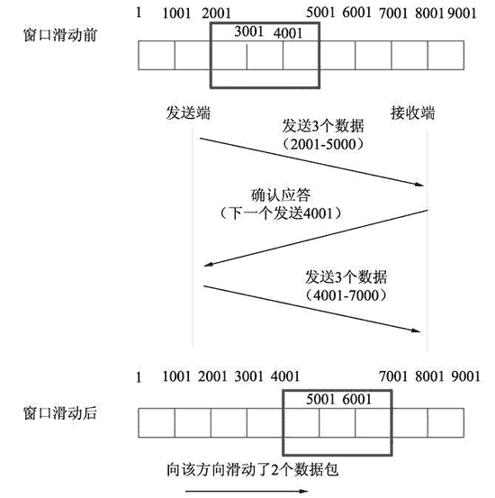

# TCP 滑动窗口机制深度剖析

> 原文：[`c.biancheng.net/view/6427.html`](http://c.biancheng.net/view/6427.html)

客户端与服务器之间的通信是一个数据传输过程。通信的消息将以数据包形式进行传输。

为了更有效地进行通信，TCP 协议在数据进行数据传输时，使用滑动窗口机制来同时发送多个数据包。当数据包丢失时，TCP 协议利用数据重发功能重新发送数据包。因接收端接收数据包的能力不同，TCP 流控制会根据接收端的能力发送适当数量的数据包。

## 数据分片

数据从主机传送到另一个主机往往要经过路由器、网关等设备。这些设备都要对经过的数据进行处理。由于这些设备处理数据有一定的限制，不能处理超过额定字节的数据，所以发送的时候需要确定发送数据包的最大字节数。

这个最大字节数被称为最大消息长度（Maximum Segment Size，MSS）。当要发送的数据超过该值，就需要将数据分为多个包，依次发送。该操作被称为数据分片。

MSS 是 TCP 数据包每次能够传输的最大数据量。通常，最大值为 1460 字节。如果发送的数据包大小大于 MSS 值，数据包将会被分片传输。分片原理如图所示。

其中，第 1 次和第 2 次握手包的 TCP 首部包含 MSS 选项，互相通知对方网络接口能够适应的 MSS 的大小，然后双方会使用较小的 MSS 值进行传输。

## 滑动窗口机制

在进行数据传输时，如果传输的数据比较大，就需要拆分为多个数据包进行发送。TCP 协议需要对数据进行确认后，才可以发送下一个数据包，如图所示。

从上图中可以看到，发送端每发送一个数据包，都需要得到接收端的确认应答以后，才可以发送下一个数据包。这样一来，就会在等待确认应答包环节浪费时间。为了避免这种情况，TCP 引入了窗口概念。窗口大小指的是不需要等待确认应答包而可以继续发送数据包的最大值。

例如，窗口大小为 3，数据包的传输如图所示。

从上图中可以看到，发送端发送第一个数据包（1-1000），没有等待对应的确认应答包，就继续发送第二个数据包（1001-2000）和第三个包（2001-3000）。当收到第 3 个数据包的确认应答包时，会连续发送 3 个数据包（3001-4000，4001-5000，5001-6000）。当收到第 6 个数据包的确认应答包时，又会发送 3 个数据包（6001-7000，7001-8000，8001-9000）。

以这种方式发送，就可以省去多个数据包（第 1、2、4、5、7、8 个）的确认应答包时间，从而避免了网络的吞吐量的降低。

窗口大小指的是可以发送数据包的最大数量。在实际使用中，它可以分为两部分。第一部分表示数据包已经发送，但未得到确认应答包；第二部分表示允许发送，但未发送的数据包。在进行数据包发送时，当发送了最大数量的数据包（窗口大小数据包），有时不会同时收到这些数据包的确认应答包，而是收到部分确认应答包。

那么，此时窗口就通过滑动的方式，向后移动，确保下一次发送仍然可以发送窗口大小的数据包。这样的发送方式被称为滑动窗口机制。设置窗口大小为 3，滑动窗口机制原理如图所示。

上图中，每 1000 个字节表示一个数据包。发送端同时发送了 3 个数据包（2001-5000），接收端响应的确认应答包为“下一个发送 4001”，表示接收端成功响应了前两个数据包，没有响应最后一个数据包。此时，最后一个数据包要保留在窗口中。

由于窗口大小为 3，发送端除了最后一个包以外，还可以继续发送下两个数据包（5001-6000 和 6001-7000）。窗口滑动到 7001 处。

## 数据重发

在进行数据包传输时，难免会出现数据丢失情况。这种情况一般分为两种。

*   第一种，如果未使用滑动窗口机制，发送的数据包没有收到确认应答包，那么数据都会被重发；如果使用了滑动窗口机制，即使确认应答包丢失，也不会导致数据包重发。
*   第二种，发送的数据包丢失，将导致数据包重发。

下面详细介绍使用滑动窗口机制的两种情况。

#### 确认应答包丢失

这种情况指的是前面发送的数据包没有收到对应的确认应答。当收到后面数据包的确认应答包，表示前面的数据包已经成功被接收端接收了，发送端不需要重新发送前面的数据包了。如图所示。

下面分为 5 部分对上图进行讲解。

1) 发送端第 1 次发送数据包：这里设置的窗口大小为 3，可以最大发送 3 个数据包。发送端同时发送 3 个数据包 1-1000、1001-2000 和 2001-3000。

2) 接收端返回确认应答包：接收端接收到这些数据，并给出确认应答包。数据包 1-1000 和数据包 2001-3000 的确认应答包没有丢失，但是数据包 1001-2000 的确认应答包丢失了。

3) 发送端第 2 次发送数据包：发送端收到接收端发来的确认应答包，虽然没有收到数据包 1001-2000 的确认应答包，但是收到了数据包 2001-3000 的确认应答包。判断第一次发送的 3 个数据包都成功到达了接收端。再次发送 3 个数据包 3001-4000、4001-5000 和 5001-6000。

4) 接收端返回确认应答包：接收端接收到这些数据，并给出确认应答包。数据包 3001-4000 和数据包 4001-5000 的确认应答包丢失了，但是数据包 5001-6000 没有丢失。

5) 发送端第 3 次发送数据包：发送端收到接收端发来的确认应答包，查看到数据包 5001-6000 收到了确认应答包。判断第 2 次发送的 3 个数据包都成功到达了接收端。再次发送 3 个数据包 6001-7000、7001-8000 和 8001-9000。

#### 发送数据包丢失

这种情况指的是发送端发送的部分数据包没有达到接收端。那么，如果在接收端收到的数据包，不是本应该要接收的数据包，那么就会给发送端返回消息，告诉发送端自己应该接收的数据包。

如果发送端连续收到 3 次这样的数据包，就认为该数据包成功发送到接收端，这时就开始重发该数据包。如图所示。

下面分为 7 部分对上图进行讲解。

1) 发送端发送数据包：这里窗口大小为 4，发送端发送 4 个数据包，分别为 1-1000、1001-2000、2001-3000 和 3001-4000。

2) 接收端返回确认应答包：接收端接收到这些数据，并给出确认应答包。接收端收到了数据包 1-1000，返回了确认应答包；收到了数据包 1001-2000，返回了确认应答包；但是数据包 2001-3000，在发送过程中丢失了，没有成功到达接收端。数据包 3001-4000 没有丢失，成功到达了接收端，但是该数据包不是接收端应该接收的数据包，数据包 2001-3000 才是真正应该接收的数据包。因此收到数据包 3001-4000 以后，接收端第一次返回下一个应该发送 2001 的数据包的确认应答包。

3) 发送端发送数据包：发送端仍然继续向接收端发送 4 个数据包，分别为 4001-5000、5001-6000、6001-7000 和 7001-8000。

4) 接收端返回确认应答包：接收端接收到这些数据，并给出确认应答包。当接收端收到数据包 4001-5000 时，发现不是自己应该接收的数据包 2001-3000，第二次返回下一个应该发送 2001 的数据包的确认应答包。当接收端收到数据包 5001-6000 时，仍然发现不是自己应该接收的数据包 2001-3000，第三次返回下一个应该发送 2001 的数据包的确认应答包。以此类推直到接收完所有数据包，接收端都返回下一个应该发送 2001 的数据包的确认应答包。

5) 发送端重发数据包：发送端连续 3 次收到接收端发来的下一个应该发送 2001 的数据包的确认应答包，认为数据包 2001-3000 丢失了，就进行重发该数据包。

6) 接收端收到重发数据包：接收端收到重发数据包以后，查看这次是自己应该接收的数据包 2001-3000，并返回确认应答包，告诉发送端，下一个该接收 8001 的数据包了。

7) 发送端发送数据包：发送端收到确认应答包后，继续发送窗口大小为 4 的数据包，分别为 8001-9000、9001-10000、10001-11000 和 11001-12000。

## TCP 流控制

在使用滑动窗口机制进行数据传输时，发送方根据实际情况发送数据包，接收端接收数据包。但是，接收端处理数据包的能力是不同的。

1) 如果窗口过小，发送端发送少量的数据包，接收端很快就处理了，并且还能处理更多的数据包。这样，当传输比较大的数据时需要不停地等待发送方，造成很大的延迟。

2) 如果窗口过大，发送端发送大量的数据包，而接收端处理不了这么多的数据包，这样，就会堵塞链路。如果丢弃这些本应该接收的数据包，又会触发重发机制。

3) 为了避免这种现象的发生，TCP 提供了流控制。所谓的流控制就是使用不同的窗口大小发送数据包。发送端第一次以窗口大小（该窗口大小是根据链路带宽的大小来决定的）发送数据包，接收端接收这些数据包，并返回确认应答包，告诉发送端自己下次希望收到的数据包是多少（新的窗口大小），发送端收到确认应答包以后，将以该窗口大小进行发送数据包。

TCP 流控制过程如图所示。

为了方便讲解，将上图以发送端发送数据包进行分隔，将其分为 3 部分进行讲解。

#### 第一部分

发送端根据当前链路带宽大小决定发送数据包的窗口大小。这里，窗口大小为 3，表示可以发送 3 个数据包。因此发送端发送了 3 个数据包，分别为 1-1000、1001-2000 和 2001-3000。

接收端接收这些数据包，但是只能处理 2 个数据包，第 3 个数据包 2001-3000 没有被处理。因此返回确认应答包，设置窗口大小为 2，告诉发送端自己现在只能处理 2 个数据包，下一次请发送 2 个数据包。

#### 第二部分

发送端接收到确认应答包，查看到接收端返回窗口大小为 2，知道接收端只处理了 2 个数据包。发过去的第 3 个数据包 2001-3000 没有被处理。这说明此时接收端只能处理 2 个数据包，第 3 个数据包还需要重新发送。

因此发送端发送 2 个数据包 2001-3000 和 3001-4000。接收端收到这两个数据包并进行了处理。此时，还是只能处理 2 个窗口，继续向发送端发送确认应答包，设置窗口为 2，告诉发送端，下一个应该接收 4001 的数据包。

#### 第三部分

发送端接收到确认应答包，查看到接收端返回窗口大小为 2。说明接收端接收了上次发送的 2 个数据包。此时仍然可以处理 2 个数据包，继续发送数据包 4001-5000 和 5001-6000。

如果在接收端返回的确认应答包中，窗口设置为 0，则表示现在不能接收任何数据。这时，发送端将不会再发送数据包，只有等待接收端发送窗口更新通知才可以继续发送数据包。

如果这个更新通知在传输中丢失了，那么就可能导致无法继续通信。为了避免这样的情况发生，发送端会时不时地发送窗口探测包，该包仅有 1 个字节，用来获取最新的窗口大小的信息。

原理如图所示。

下面介绍上图所示的获取窗口更新数据包的原理。

1) 发送端发送数据。发送端以窗口大小为 2，发送了 2 个数据包，分别为 4001-5000 和 5001-6000。接收端接收到这些数据以后，缓冲区满了，无法再处理数据，于是向发送端返回确认应答包，告诉它下一个接收 6001 的数据，但是现在处理不了数据，先暂停发送数据，设置窗口大小为 0。

2) 发送端暂停发送数据。发送端收到确认应答包，查看到下一次发送的是 6001 的数据，但窗口大小为 0，得知接收端此时无法处理数据。此时，不进行发送数据，进入等待状态。

3) 接收端发送窗口大小更新包。当接收端处理完发送端之前发来的数据包以后，将会给发送端发送一个窗口大小更新包，告诉它，此时可以发送的数据包的数量。这里设置窗口大小为 3，表示此时可以处理 3 个数据包，但是该数据包丢失了，没有发送到发送端。

4) 发送端发送窗口探测包。由于窗口大小更新包丢失，发送端的等待时间超过了重发超时时间。此时，发送端向接收端发送一个窗口探测包，大小为 1 字节，这里是 6001。

5) 接收端再次发送窗口大小更新包。接收端收到发送端发来的探测包，再次发送窗口大小更新包，窗口大小为 3。

6) 发送端发送数据。发送端接收到窗口大小更新包，查看到应该发的是 6001 的数据包，窗口大小为 3，可以发送 3 个数据包。因此发送了数据包，分别为 6001-7000、7001-8000 和 8001-9000。