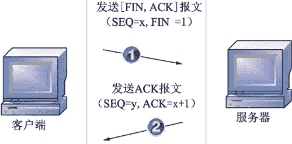
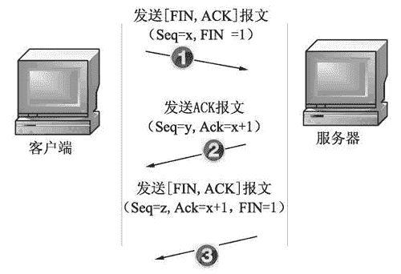
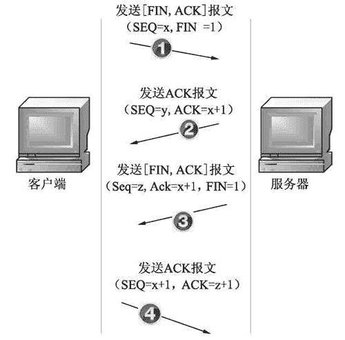
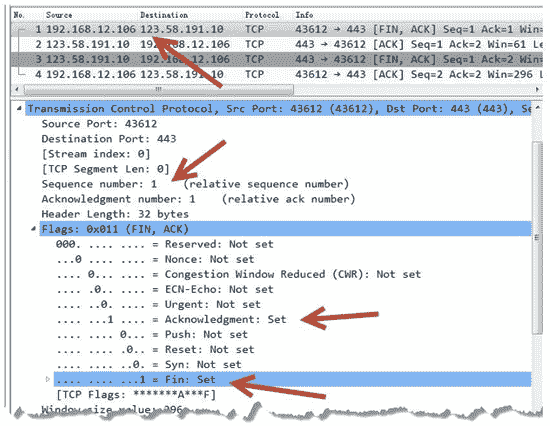
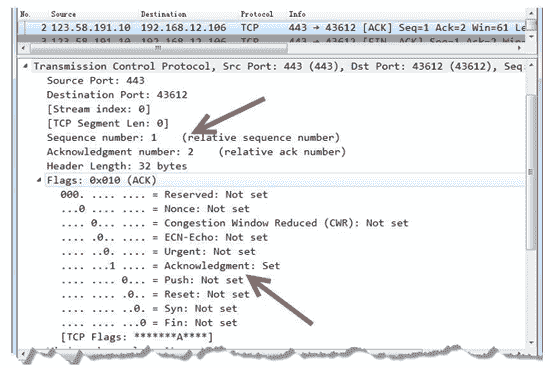
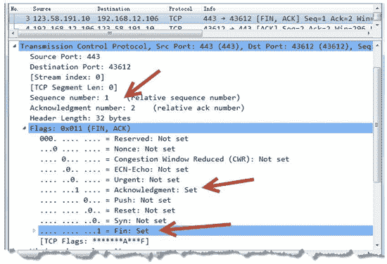
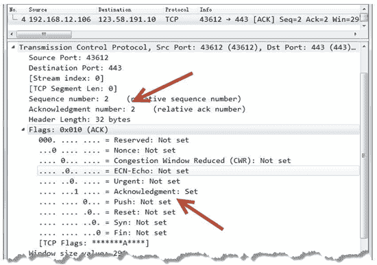

# TCP 四次挥手断开连接的过程

> 原文：[`c.biancheng.net/view/6428.html`](http://c.biancheng.net/view/6428.html)

当客户端与服务器不再进行通信时，都会以 4 次挥手的方式结束连接。本节将介绍 4 次挥手的过程。

## 第 1 次挥手

客户端向服务器端发送断开 TCP 连接请求的 [FIN，ACK] 报文，在报文中随机生成一个序列号 SEQ=x，表示要断开 TCP 连接，如图所示。

## 第 2 次挥手

当服务器端收到客户端发来的断开 TCP 连接的请求后，回复发送 ACK 报文，表示已经收到断开请求。回复时，随机生成一个序列号 SEQ=y。由于回复的是客户端发来的请求，所以在客户端请求序列号 SEQ=x 的基础上加 1，得到 ACK=x+1，如图所示。

## 第 3 次挥手

服务器端在回复完客户端的 TCP 断开请求后，不会马上进行 TCP 连接的断开。服务器端会先确认断开前，所有传输到客户端的数据是否已经传输完毕。确认数据传输完毕后才进行断开，向客户端发送 [FIN，ACK] 报文，设置字段值为 1。再次随机生成一个序列号 SEQ=z。由于还是对客户端发来的 TCP 断开请求序列号 SEQ=x 进行回复，因此 ACK 依然为 x+1，如图所示。

## 第 4 次挥手

客户端收到服务器发来的 TCP 断开连接数据包后将进行回复，表示收到断开 TCP 连接数据包。向服务器发送 ACK 报文，生成一个序列号 SEQ=x+1。由于回复的是服务器，所以 ACK 字段的值在服务器发来断开 TCP 连接请求序列号 SEQ=z 的基础上加 1，得到 ACK=z+1，如图所示。

## 分析挥手过程字段的变化

在进行 4 次挥手时，TCP 报文中标志位的值是不断变化的。为了更好地分析 4 次挥手标志位的变化，下面以抓包方式分析每个数据包的信息。

【实例】使用 Wireshark 捕获 TCP 断开连接数据包并进行分析。

1) 捕获到 4 次挥手包，如图所示。

图中第 1 个数据包源 IP 地址为 192.168.12.106，目标 IP 地址为 123.58.191.10。

在 Transmission Control Protocol 中可以看到，Sequence number 的值为 1，该值是主机 192.168.12.106 随机生成的请求序列号 SEQ 的值；Acknowledgment number 的值为 1，也就是确认号 ACK 的值。

在 Flags 部分可以看到（FIN，ACK），表示该数据包是主机 192.168.12.106 向主机 123.58.191.10 发送的请求断开 TCP 连接的数据包。在该部分中可以看到 Acknowledgment 的值被设置为 1，也就是报文字段中 ACK 的值；Fin 的值也被设置为 1，也就是报文字段中 FIN 的值。

2) 选择第 2 个数据包，如图所示。

其中，源 IP 地址为 123.58.191.10，目标 IP 地址为 192.168.12.106。

在 Transmission Control Protocol 中可以看到，Sequence number 的值也为 1，该值是由主机 123.58.191.10 随机生成的请求序列号 SEQ。

Acknowledgment number 的值为 2，该值是在主机 192.168.12.106 发过来的 SEQ 序列号基础上加 1 得到的。

在 Flags 部分可以看到（ACK），表示该数据包是主机 123.58.191.10 回复主机 192.168.12.106 发来的 TCP 断开请求的确认包。在该部分中可以看到 Acknowledgment 的值被设置为 1，也就是报文字段中 ACK 的值。

3) 选择第 3 个数据包，如图所示。

其中，源 IP 地址为 123.58.191.10，目标 IP 地址为 192.168.12.106。

在 Transmission Control Protocol 中可以看到，请求序列号的值为 1，确认号 ACK 的值为 2。

在 Flags 部分可以看到（FIN，ACK），表示该数据包是主机 123.58.191.10 向主机 192.168.12.106 发送的断开 TCP 连接的 FIN 包。在该部分中可以看到报文中的 ACK 值被设置为 1，FIN 值被设置为 1。

4) 选择第 4 个数据包，如图所示。

其中，源 IP 地址为 192.168.12.106，目标 IP 地址为 123.58.191.10。

在 Transmission Control Protocol 中可以看到，请求序列号的值为 2，该值是再次由主机 192.168.12.106 所产生的。确认号 ACK 的值为 2，该值是回复第 3 次挥手中主机 123.58.191.10 随机生成的请求序列号 SEQ 基础上加 1 所得的。

在 Flags 部分可以看到（ACK），表示该数据包是主机 192.168.12.106 回复主机 123.58.191.10 的断开请求。在该部分中可以看到报文中的 ACK 值被设置为 1。